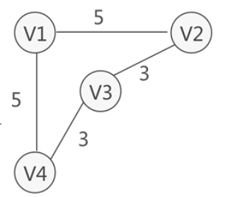
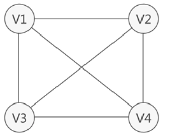
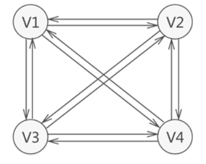

### 图

#### 路径

> 无论是无向图还是有向图，从一个顶点到另一顶点途径的所有顶点组成的序列（包含这两个顶点），称为一条路径。

#### 回路

> 如果路径中第一个顶点和最后一个顶点相同，则此路径称为"回路"或"环"。

#### 权和网

> 在某些实际场景中，图中的每条边（或弧）会赋予一个实数来表示一定的含义，这种与边（或弧）相匹配的实数被称为"权"，而带权的图通常称为网。

#### 有向图

> 全部由有向边构成图称为有向图。表示方式：<V1,V2>

> 狐头：箭头直线的顶点被称为"终端点"或"弧头"。
>
> 弧尾：无箭头一端的顶点通常被称为"初始点"或"弧尾"。
>
> 出度：对于有向图中的一个顶点 V 来说，箭头指向 V 的弧的数量为 V 的入度（InDegree，记为 ID(V)）。
>
> 入度：箭头远离 V 的弧的数量为 V 的出度（OutDegree，记为OD(V)）。

#### 无向图

> 边没有方向的图称为无向图。表示方式：(V1,V2)

#### 类型

* 完全图

  `若图中各个顶点都与除自身外的其他顶点有关系，这样的无向图称为完全图。同时，满足此条件的有向图则称为有向完全图。`

  * 完全无向图

  

  * 完全有向图

    

* 连通图

* 稀疏图

* 稠密图

#### 表示方式

###### 二维数组

###### 领接表

