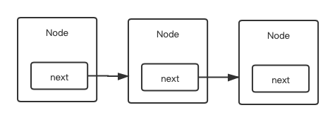

### 线性表

* 数组

  `内存中连续存储多个元素的结构，在内存中的分配也是连续的。`

  `频繁查询，对存储空间要求不大，很少增加和删除的情况。`

  > 按照索引查询元素速度快。
  >
  > 按照索引遍历数组方便。

  > 数组的大小固定后就无法扩容了。
  >
  > 数组只能存储一种类型的数据。
  >
  > 添加，删除的操作慢，因为要移动其他的元素。

* 链表
  
  `物理存储单元上非连续的、非顺序的存储结构，数据元素的逻辑顺序是通过链表的指针地址实现，每个元素包含两个结点，一个是存储元素的数据域 (内存空间)，另一个是指向下一个结点地址的指针域。根据指针的指向，链表能形成不同的结构，例如单链表，双向链表，循环链表等。`
  
  `数据量较小，需要频繁增加，删除操作的场景。`
  
  > 链表是很常用的一种数据结构，不需要初始化容量，可以任意加减元素。
  >
  > 添加或者删除元素时只需要改变前后两个元素结点的指针域指向地址即可，所以添加，删除很快。
  
  > 因为含有大量的指针域，占用空间较大。
  >
  > 查找元素需要遍历链表来查找，非常耗时。
  
  * 单向链表
  
    
  
  * 双向链表
  
    
  
  * 跳表
  
    
  
* 栈

  `栈是一种特殊的线性表，仅能在线性表的一端操作，栈顶允许操作，栈底不允许操作。`

  `应用于实现递归功能方面的场景，例如斐波那契数列。`

  > 先进后出，或者说是后进先出，从栈顶放入元素的操作叫入栈，取出元素叫出栈。

* 队列

  `是一种线性表，可以在一端添加元素，在另一端取出元素。`

  `因为队列先进先出的特点，在多线程阻塞队列管理中非常适用。`

  > 入队：从一端放入元素的操作。
  >
  > 出队：从一端取出元素的操作。

  ##### 双向队列

  > 可以在两端分别添加和取出。

