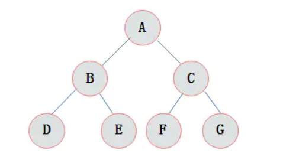
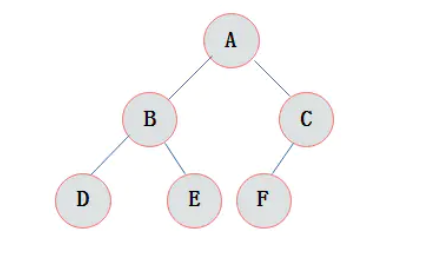
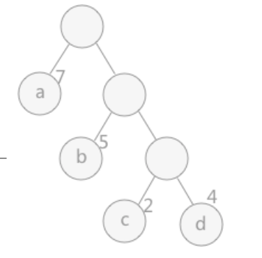
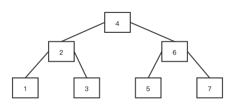
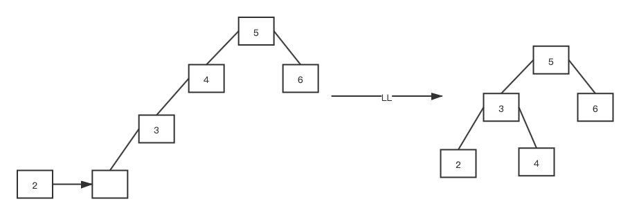
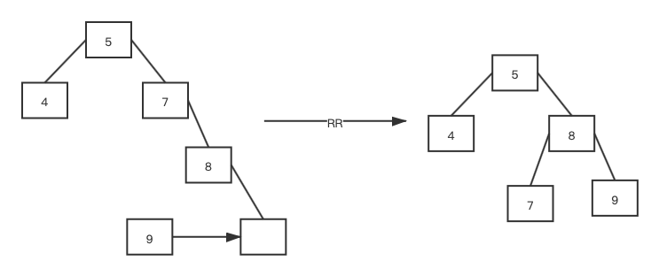
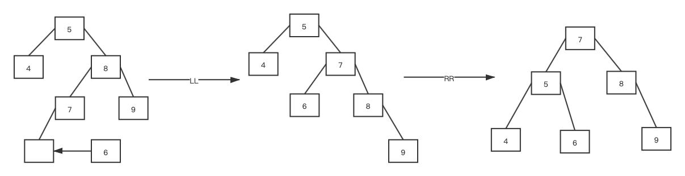

### 树

`它是由n（n>=1）个有限节点组成一个具有层次关系的集合。把它叫做 “树” 是因为它看起来像一棵倒挂的树，也就是说它是根朝上，而叶朝下的。`

> 1. 每个节点有零个或多个子节点。
> 2. 没有父节点的节点称为根节点。
> 3. 每一个非根节点有且只有一个父节点。
> 4. 除了根节点外，每个子节点可以分为多个不相交的子树。

#### 度

> 结点拥有的子树数目。

#### 二叉树

> 1. 每个结点最多有两颗子树，所以二叉树中不存在度大于2的结点。
> 2. 即使树中某结点只有一棵子树，也要区分它是左子树还是右子树。
> 3. 左子树和右子树是有顺序的，次序不能任意颠倒。

##### 性质

> 1. 在二叉树的第i层上最多有2i-1 个结点 （i>=1）。
> 2. 二叉树中如果深度为k,那么最多有2k-1个结点(k>=1）。
> 3. n0=n2+1 n0表示度数为0的节点数，n2表示度数为2的结点数。
> 4. 在完全二叉树中，具有n个节点的完全二叉树的深度为[log2n]+1，其中[log2n]是向下取整。
> 5. 若对含 n 个结点的完全二叉树从上到下且从左至右进行 1 至 n 的编号，则对完全二叉树中任意一个编号为 i 的结点有如下特性：
>    1. 若i=1，则该结点是二叉树的根，无双亲，否则编号为[i/2]的结点为其双亲结点。
>    2. 若2i>n，在该结点无左孩子，否则编号为2i的结点为其左孩子结点。
>    3. 若2i+1>2，则该结点无右孩子结点，否则编号为2i+1的结点为其右孩子的结点。

##### 满二叉树

> 在一棵二叉树中。如果所有分支结点都存在左子树和右子树，并且所有叶子都在同一层上，这样的二叉树称为满二叉树。

> 1. 叶子只能出现在最下一层。出现在其它层就不可能达成平衡。
> 2. 非叶子结点的度一定是2。
> 3. 在同样深度的二叉树中，满二叉树的结点个数最多，叶子数最多。

##### 完全二叉树

> 对一颗具有n个结点的二叉树按层编号，如果编号为i(1<=i<=n)的结点与同样深度的满二叉树中编号为i的结点在二叉树中位置完全相同，则这棵二叉树称为完全二叉树。

> 1. 叶子结点只能出现在最下层和次下层。
> 2. 最下层的叶子结点集中在树的左部。
> 3. 倒数第二层若存在叶子结点，一定在右部连续位置。
> 4. 如果结点度为1，则该结点只有左孩子，即没有右子树。
> 5. 同样结点数目的二叉树，完全二叉树深度最小。

##### 哈夫曼树

`WPL = 7 * 1 + 5 * 2 + 2 * 3 + 4 * 3`

> 当用 n 个结点（都做叶子结点且都有各自的权值）试图构建一棵树时，如果构建的这棵树的带权路径长度最小，称这棵树为“最优二叉树”，有时也叫“赫夫曼树”或者“哈夫曼树”。

> 路径：在一棵树中，一个结点到另一个结点之间的通路。
>
> 路径长度：在一条路径中，每经过一个结点，路径长度都要加 1。
>
> 结点的权：给每一个结点赋予一个新的数值，被称为这个结点的权。
>
> 结点的带权路径长度：指的是从根结点到该结点之间的路径长度与该结点的权的乘积。

> 1. 在 n 个权值中选出两个最小的权值，对应的两个结点组成一个新的二叉树，且新二叉树的根结点的权值为左右孩子权值的和。
> 2. 在原有的 n 个权值中删除那两个最小的权值，同时将新的权值加入到 n–2 个权值的行列中，以此类推。
> 3. 重复 1 和 2 ，直到所以的结点构建成了一棵二叉树为止，这棵树就是哈夫曼树。

##### 平衡二叉树

> 左右子树的高度差称之为平衡因子，树中每个节点的平衡因子绝对值不大于 1。

> 1. 非叶子节点最多拥有两个子节点。
> 2. 非叶子节值大于左边子节点、小于右边子节点。
> 3. 树的左右两边的层级数相差不会大于1。
> 4. 没有值相等重复的节点。

###### LL

> 结点4的左结点3的左节点2导致不平衡，发生4右旋。

###### RR

###### LR

###### RL

##### 红黑树

> 1. 每个节点或者是黑色，或者是红色。
> 2. 根节点是黑色。
> 3. 每个叶子节点（NIL）是黑色。
> 4. 如果一个节点是红色的，则它的子节点必须是黑色的。
> 5. 从一个节点到该节点的子孙节点的所有路径上包含相同数目的黑节点。

#### B树

#### B-树

#### B+树

#### B*树

