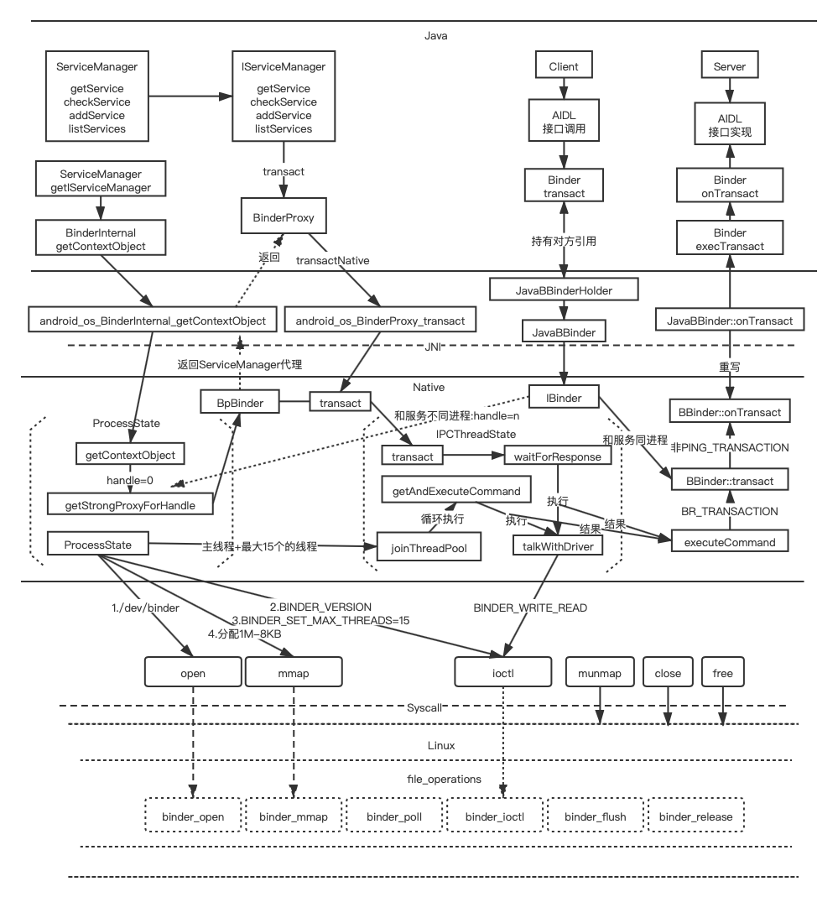

### Binder


#### 驱动

> Linux 将无法归类的设备归于misc，是一种特殊的字符设备，所有的设备共享一个主号MISC_MAJOR(10)。对外暴露的接口：
>
> 1. misc_register注册设备。
> 2. misc_deregister取消注册。

```c
//kernel/drivers/android/binder.c
//注册binder驱动
device_initcall(binder_init);
static int __init binder_init(void)
{
	int ret;
  //创建binder线程
	binder_deferred_workqueue = create_singlethread_workqueue("binder");
	if (!binder_deferred_workqueue)
		return -ENOMEM;
	//创建/binder/proc目录
	binder_debugfs_dir_entry_root = debugfs_create_dir("binder", NULL);
	if (binder_debugfs_dir_entry_root)
		binder_debugfs_dir_entry_proc = debugfs_create_dir("proc",binder_debugfs_dir_entry_root);
  //注册binder驱动操作函数
	ret = misc_register(&binder_miscdev);
	//...
	return ret;
}
static struct miscdevice binder_miscdev = {
	.minor = MISC_DYNAMIC_MINOR,
	.name = "binder",
	.fops = &binder_fops
};
static const struct file_operations binder_fops = {
	.owner = THIS_MODULE,
	.poll = binder_poll,
	.unlocked_ioctl = binder_ioctl,
	.compat_ioctl = binder_ioctl,
	.mmap = binder_mmap,
	.open = binder_open,
	.flush = binder_flush,
	.release = binder_release,
};
```

##### 操作函数

* binder_open
* binder_mmap
* binder_ioctl
* binder_poll
* binder_flush
* binder_release

##### BC

`binder_driver_command_protocol，表示向驱动发送命令。`

| BC                            |                                               |
| ----------------------------- | --------------------------------------------- | 
| BC_REGISTER_LOOPER            | _IO('c', 11)                                  |
| BC_ENTER_LOOPER               | _IO('c', 12)                                  |
| BC_EXIT_LOOPER                | _IO('c', 13)                                  |
| BC_INCREFS_DONE               | _IOW('c', 8, struct binder_ptr_cookie)        | 
| BC_ACQUIRE_DONE               | _IOW('c', 9, struct binder_ptr_cookie)        |
| BC_TRANSACTION                | _IOW('c', 0, struct binder_transaction_data)  |
| BC_FREE_BUFFER                | _IOW('c', 3, binder_uintptr_t),               | 
| BC_DEAD_BINDER_DONE           | _IOW('c', 16, binder_uintptr_t)               | 
| BC_REQUEST_DEATH_NOTIFICATION | _IOW('c', 14, struct binder_handle_cookie)    |
| BC_CLEAR_DEATH_NOTIFICATION   | _IOW('c', 15, struct binder_handle_cookie)    | 
| BC_INCREFS                    | _IOW('c', 4, __u32)                           |
| BC_ACQUIRE                    | _IOW('c', 5, __u32)                           |
| BC_RELEASE                    | _IOW('c', 6, __u32)                           | 
| BC_DECREFS                    | _IOW('c', 7, __u32)                           |
| BC_ATTEMPT_ACQUIRE            | _IOW('c', 10, struct binder_pri_desc)         |
| BC_ACQUIRE_RESULT             | _IOW('c', 2, __s32)                           |
| BC_REPLY                      | _IOW('c', 1, struct binder_transaction_data), |

> 包装在binder_write_read中buffer里的命令

##### BR

`binder_driver_return_protocol，表示驱动回复消息。`


| BR                               |                                              |
|-------------------------------- | -------------------------------------------- |
| BR_NOOP                          | _IO('r', 12)                                 |
| BR_SPAWN_LOOPER                  | _IO('r', 13)                                 |
| BR_FINISHED                      | _IO('r', 14),                                |
| BR_OK                            | _IO('r', 1)                                  |
| BR_ERROR                         | _IOR('r', 0, __s32)                          |
| BR_TRANSACTION                   | _IOR('r', 2, struct binder_transaction_data) |
| BR_TRANSACTION_COMPLETE          | _IO('r', 6),                                 |
| BR_DEAD_BINDER                   | _IOR('r', 15, binder_uintptr_t)              |
| BR_DEAD_REPLY                    | _IO('r', 5)                                  |
| BR_CLEAR_DEATH_NOTIFICATION_DONE | _IOR('r', 16, binder_uintptr_t)              |
| BR_INCREFS                       | _IOR('r', 7, struct binder_ptr_cookie)       |
| BR_ACQUIRE                       | _IOR('r', 8, struct binder_ptr_cookie)       |
| BR_RELEASE                       | _IOR('r', 9, struct binder_ptr_cookie)       |
| BR_DECREFS                       | _IOR('r', 10, struct binder_ptr_cookie)      |
| BR_ATTEMPT_ACQUIRE               | _IOR('r', 11, struct binder_pri_ptr_cookie)  |
| BR_ACQUIRE_RESULT                | _IOR('r', 4, __s32)                          |
| BR_REPLY                         | _IOR('r', 3, struct binder_transaction_data) |
| BR_FAILED_REPLY                  | _IO('r', 17)                                 |

##### 驱动命令

| 命令                     |                                         |
| ------------------------ | --------------------------------------- |
| BINDER_WRITE_READ        | _IOWR('b', 1, struct binder_write_read) |
| BINDER_SET_IDLE_TIMEOUT  | _IOW('b', 3, __s64)                     |
| BINDER_SET_MAX_THREADS   | _IOW('b', 5, __u32)                     |
| BINDER_SET_IDLE_PRIORITY | _IOW('b', 6, __s32)                     |
| BINDER_SET_CONTEXT_MGR   | _IOW('b', 7, __s32)                     |
| BINDER_THREAD_EXIT       | _IOW('b', 8, __s32)                     |
| BINDER_VERSION           | _IOWR('b', 9, struct binder_version)    |

> 打开驱动，通过ioctl发送的命令。

##### 数据结构

###### binder_write_read

```c
struct binder_write_read {
   binder_size_t     write_size;    /* bytes to write */
   binder_size_t     write_consumed;    /* bytes consumed by driver */
   binder_uintptr_t   write_buffer;
   binder_size_t     read_size; /* bytes to read */
   binder_size_t     read_consumed; /* bytes consumed by driver */
   binder_uintptr_t   read_buffer;
};
```

> 与binder驱动交互的数据格式。

###### binder_transaction_data

```c
struct binder_transaction_data {
   /* The first two are only used for bcTRANSACTION and brTRANSACTION,
    * identifying the target and contents of the transaction.
    */
   union {
      /* target descriptor of command transaction */
      __u32  handle;
      /* target descriptor of return transaction */
      binder_uintptr_t ptr;
   } target;
   binder_uintptr_t   cookie;    /* target object cookie */
   __u32     code;     /* transaction command */

   /* General information about the transaction. */
   __u32          flags;
   pid_t     sender_pid;
   uid_t     sender_euid;
   binder_size_t  data_size; /* number of bytes of data */
   binder_size_t  offsets_size;  /* number of bytes of offsets */

   /* If this transaction is inline, the data immediately
    * follows here; otherwise, it ends with a pointer to
    * the data buffer.
    */
   union {
      struct {
         /* transaction data */
         binder_uintptr_t   buffer;
         /* offsets from buffer to flat_binder_object structs */
         binder_uintptr_t   offsets;
      } ptr;
      __u8   buf[8];
   } data;
};
```

> binder事务传输的数据。

###### transaction_flags

```c
enum transaction_flags {
   TF_ONE_WAY = 0x01,    /* this is a one-way call: async, no return */
   TF_ROOT_OBJECT = 0x04,    /* contents are the component's root object */
   TF_STATUS_CODE = 0x08,    /* contents are a 32-bit status code */
   TF_ACCEPT_FDS  = 0x10,    /* allow replies with file descriptors */
};
```

> binder服务调用的方式。

###### binder_proc

```c
struct binder_proc {
   struct hlist_node proc_node;//进程结点
   struct rb_root threads;//binder_thread的红黑树根结点，处理用户请求的线程
   struct rb_root nodes;//binder_node红黑树的根节点,表示当前进程Binder服务集合
   struct rb_root refs_by_desc;//binder_ref红黑树的根节点(以 handle为 key)，binder引用
   struct rb_root refs_by_node;//binder_ref红黑树的根节点（以 ptr为 key），binder引用的地址
   int pid;//进程的ID
   struct vm_area_struct *vma;// 指向进程虚拟地址空间的指针
   struct mm_struct *vma_vm_mm;//相应进程的内存结构体
   struct task_struct *tsk;//相应进程的 task结构体
   struct files_struct *files;//相应进程的文件结构体
   struct hlist_node deferred_work_node;
   int deferred_work;
   void *buffer;//内核空间的起始地址
   ptrdiff_t user_buffer_offset;//内核空间与用户空间的地址偏移量

   struct list_head buffers;//所有的buffer
   struct rb_root free_buffers;//空闲的buffer
   struct rb_root allocated_buffers;//已分配的 buffer
   size_t free_async_space;// 异步的可用空闲空间大小

   struct page **pages;//指向物理内存页指针的指针
   size_t buffer_size;//映射的内核空间大小
   uint32_t buffer_free;//可用内存总大小
   struct list_head todo;//进程将要做的事
   wait_queue_head_t wait;// 等待队列
   struct binder_stats stats;//binder统计信息
   struct list_head delivered_death;//已分发的死亡通知
   int max_threads;//最大线程数
   int requested_threads;//请求的线程数
   int requested_threads_started;//已启动的请求线程数
   int ready_threads;//准备就绪的线程数
   long default_priority;// 默认优先级
   struct dentry *debugfs_entry;
};
```

```c
static int binder_open(struct inode *nodp, struct file *filp)
{
   struct binder_proc *proc;
   proc = kzalloc(sizeof(*proc), GFP_KERNEL);
   //...
   //将通过open打开binder驱动的进程构建一个binder_proc记录当前信息并添加到双端链表binder_procs中。
   hlist_add_head(&proc->proc_node, &binder_procs);
   //...
   return 0;
}
```

> 通过open()系统调用创建一个该结构表示记录当前进程Binder信息。

###### binder_thread

```c
struct binder_thread {
   struct binder_proc *proc;
   struct rb_node rb_node;
   int pid;
   int looper;
   struct binder_transaction *transaction_stack;
   struct list_head todo;
   uint32_t return_error; /* Write failed, return error code in read buf */
   uint32_t return_error2; /* Write failed, return error code in read */
      /* buffer. Used when sending a reply to a dead process that */
      /* we are also waiting on */
   wait_queue_head_t wait;
   struct binder_stats stats;
};
```

> 处理binder事务的线程。

###### binder_node

```c
struct binder_node {
   int debug_id;
   struct binder_work work;
   union {
      struct rb_node rb_node;
      struct hlist_node dead_node;
   };
   struct binder_proc *proc;
   struct hlist_head refs;
   int internal_strong_refs;
   int local_weak_refs;
   int local_strong_refs;
   binder_uintptr_t ptr;
   binder_uintptr_t cookie;
   unsigned has_strong_ref:1;
   unsigned pending_strong_ref:1;
   unsigned has_weak_ref:1;
   unsigned pending_weak_ref:1;
   unsigned has_async_transaction:1;
   unsigned accept_fds:1;
   unsigned min_priority:8;
   struct list_head async_todo;
};
```

> 该进程下的Binder服务。

###### binder_ref

```c
struct binder_ref {
   /* Lookups needed: */
   /*   node + proc => ref (transaction) */
   /*   desc + proc => ref (transaction, inc/dec ref) */
   /*   node => refs + procs (proc exit) */
   int debug_id;
   struct rb_node rb_node_desc;
   struct rb_node rb_node_node;
   struct hlist_node node_entry;
   struct binder_proc *proc;
   struct binder_node *node;
   uint32_t desc;
   int strong;
   int weak;
   struct binder_ref_death *death;
};
```

> 该进程所有引用的Binder服务。

###### binder_buffer

```c
struct binder_buffer {
   struct list_head entry; /* free and allocated entries by address */
   struct rb_node rb_node; /* free entry by size or allocated entry */
            /* by address */
   unsigned free:1;
   unsigned allow_user_free:1;
   unsigned async_transaction:1;
   unsigned debug_id:29;

   struct binder_transaction *transaction;

   struct binder_node *target_node;
   size_t data_size;
   size_t offsets_size;
   uint8_t data[0];
};
```

> 进程间传递数据的内核缓冲区。

###### binder_work

```c
struct binder_work {
   struct list_head entry;
   enum {
      BINDER_WORK_TRANSACTION = 1,
      BINDER_WORK_TRANSACTION_COMPLETE,
      BINDER_WORK_NODE,
      BINDER_WORK_DEAD_BINDER,
      BINDER_WORK_DEAD_BINDER_AND_CLEAR,
      BINDER_WORK_CLEAR_DEATH_NOTIFICATION,
   } type;
};
```

> 记录调用binder服务的工作。

###### binder_transaction

```c
struct binder_transaction {
   int debug_id;
   struct binder_work work;
   struct binder_thread *from;
   struct binder_transaction *from_parent;
   struct binder_proc *to_proc;
   struct binder_thread *to_thread;
   struct binder_transaction *to_parent;
   unsigned need_reply:1;
   /* unsigned is_dead:1; */  /* not used at the moment */

   struct binder_buffer *buffer;
   unsigned int   code;
   unsigned int   flags;
   long   priority;
   long   saved_priority;
   kuid_t sender_euid;
};
```

> 一次Binder服务调用的事务。

#### SM进程


##### 数据结构

###### binder_state

```c
struct binder_state
{
    int fd;//驱动服务管理者描述符
    void *mapped;//驱动服务管理者映射的内存地址
    size_t mapsize;//驱动服务管理者内存大小
};
```

> 代表驱动服务管理者

##### 启动流程

```ABAP
//frameworks/native/cmds/servicemanager/servicemanager.rc
service servicemanager /system/bin/servicemanager
    class core animation
    user system
    group system readproc
    critical
    onrestart restart healthd
    onrestart restart zygote
    onrestart restart audioserver
    onrestart restart media
    onrestart restart surfaceflinger
    onrestart restart inputflinger
    onrestart restart drm
    onrestart restart cameraserver
    writepid /dev/cpuset/system-background/tasks
```

```c
//frameworks/native/cmds/servicemanager/service_manager.c
int main(int argc, char** argv){
    struct binder_state *bs;
    //...
    char *driver;
    if (argc > 1) {
        driver = argv[1];
    } else {
        driver = "/dev/binder";
    }
  	//打开驱动，分配128K内存空间
    bs = binder_open(driver, 128*1024);
    //...
  	//设置Binder驱动的管理者
    if (binder_become_context_manager(bs)) {
        return -1;
    }
		//...
  	//进入loop
    binder_loop(bs, svcmgr_handler);
    return 0;
}
int svcmgr_handler(struct binder_state *bs,struct binder_transaction_data *txn,
                   struct binder_io *msg,struct binder_io *reply){
    //...
    switch(txn->code) {
    //查询Binder服务
    case SVC_MGR_GET_SERVICE:
    case SVC_MGR_CHECK_SERVICE:
        s = bio_get_string16(msg, &len);
        if (s == NULL) {
            return -1;
        }
        handle = do_find_service(s, len, txn->sender_euid, txn->sender_pid);
        if (!handle)
            break;
        bio_put_ref(reply, handle);
        return 0;
		//添加Binder服务
    case SVC_MGR_ADD_SERVICE:
        s = bio_get_string16(msg, &len);
        if (s == NULL) {
            return -1;
        }
        handle = bio_get_ref(msg);
        allow_isolated = bio_get_uint32(msg) ? 1 : 0;
        if (do_add_service(bs, s, len, handle, txn->sender_euid,
            allow_isolated, txn->sender_pid))
            return -1;
        break;
		//获取指定handle的服务名
    case SVC_MGR_LIST_SERVICES: {
        uint32_t n = bio_get_uint32(msg);
        if (!svc_can_list(txn->sender_pid, txn->sender_euid)) {
            return -1;
        }
        si = svclist;
        while ((n-- > 0) && si)
            si = si->next;
        if (si) {
            bio_put_string16(reply, si->name);
            return 0;
        }
        return -1;
    }
    default:
        return -1;
    }

    bio_put_uint32(reply, 0);
    return 0;
}
```

```c
//frameworks/native/cmds/servicemanager/binder.c
struct binder_state *binder_open(const char* driver, size_t mapsize){
    struct binder_state *bs;
    struct binder_version vers;
    bs = malloc(sizeof(*bs));
    if (!bs) {
        errno = ENOMEM;
        return NULL;
    }
  	//系统调用，打开/dev/binder驱动
    bs->fd = open(driver, O_RDWR | O_CLOEXEC);
    if (bs->fd < 0) {
        goto fail_open;
    }
  	//检查当前Binder驱动的版本
    if ((ioctl(bs->fd, BINDER_VERSION, &vers) == -1) ||
        (vers.protocol_version != BINDER_CURRENT_PROTOCOL_VERSION)) {
        goto fail_open;
    }
  	//分配内存空间
    bs->mapsize = mapsize;
    bs->mapped = mmap(NULL, mapsize, PROT_READ, MAP_PRIVATE, bs->fd, 0);
    if (bs->mapped == MAP_FAILED) {
        goto fail_map;
    }
    return bs;

fail_map:
    close(bs->fd);
fail_open:
    free(bs);
    return NULL;
}
int binder_become_context_manager(struct binder_state *bs){
  	//系统调用通知Binder驱动设置当前bs为管理者
    return ioctl(bs->fd, BINDER_SET_CONTEXT_MGR, 0);
}
void binder_loop(struct binder_state *bs, binder_handler func){
    int res;
    struct binder_write_read bwr;
    uint32_t readbuf[32];

    bwr.write_size = 0;
    bwr.write_consumed = 0;
    bwr.write_buffer = 0;
		//向驱动发送进入Looper状态的命令
    readbuf[0] = BC_ENTER_LOOPER;
    binder_write(bs, readbuf, sizeof(uint32_t));
		//进入死循环，不断从驱动获取消息并处理，如果驱动没有消息会挂起当前进程
    for (;;) {
        bwr.read_size = sizeof(readbuf);
        bwr.read_consumed = 0;
        bwr.read_buffer = (uintptr_t) readbuf;
        res = ioctl(bs->fd, BINDER_WRITE_READ, &bwr);
        if (res < 0) {
            break;
        }
				//处理从驱动获取的消息
        res = binder_parse(bs, 0, (uintptr_t) readbuf, bwr.read_consumed, func);
        if (res == 0) {
            break;
        }
        if (res < 0) {
            break;
        }
    }
}
```

#### SM进程服务



上图主要做了以下一些事情：

1. Java层获取Binder服务管理者ServiceManager的过程。
2. Client/Server通过Binder通信过程。

##### Native添加服务

通过添加MediaPlayerService服务为例，梳理添加服务的流程。


```ABAP
//frameworks/av/media/mediaserver/mediaserver.rc
service media /system/bin/mediaserver
    class main
    user media
    group audio camera inet net_bt net_bt_admin net_bw_acct drmrpc mediadrm
    ioprio rt 4
    writepid /dev/cpuset/foreground/tasks /dev/stune/foreground/tasks
```

```c
//frameworks/av/media/mediaserver/main_mediaserver.cpp
int main(int argc __unused, char **argv __unused)
{
    signal(SIGPIPE, SIG_IGN);
    sp<ProcessState> proc(ProcessState::self());
    sp<IServiceManager> sm(defaultServiceManager());
    InitializeIcuOrDie();
    MediaPlayerService::instantiate();
    ResourceManagerService::instantiate();
    registerExtensions();
    ProcessState::self()->startThreadPool();
    IPCThreadState::self()->joinThreadPool();
}
```

```c
//frameworks/av/media/libmediaplayerservice/MediaPlayerService.cpp
void MediaPlayerService::instantiate() {
    defaultServiceManager()->addService(
            String16("media.player"), new MediaPlayerService());
}
```

###### defaultServiceManager

```c
//frameworks/native/libs/binder/IServiceManager.cpp
sp<IServiceManager> defaultServiceManager()
{
    if (gDefaultServiceManager != NULL) return gDefaultServiceManager;
    {
        AutoMutex _l(gDefaultServiceManagerLock);
        while (gDefaultServiceManager == NULL) {
            gDefaultServiceManager = interface_cast<IServiceManager>(
                ProcessState::self()->getContextObject(NULL));
            if (gDefaultServiceManager == NULL)
                sleep(1);
        }
    }
    return gDefaultServiceManager;
}
```

```c++
//frameworks/native/libs/binder/ProcessState.cpp
sp<IBinder> ProcessState::getContextObject(const sp<IBinder>& /*caller*/)
{
    return getStrongProxyForHandle(0);
}
sp<IBinder> ProcessState::getStrongProxyForHandle(int32_t handle)
{
    sp<IBinder> result;
    AutoMutex _l(mLock);
    handle_entry* e = lookupHandleLocked(handle);
    if (e != NULL) {
        IBinder* b = e->binder;
        if (b == NULL || !e->refs->attemptIncWeak(this)) {
            //...
            b = new BpBinder(handle); 
            e->binder = b;
            if (b) e->refs = b->getWeakRefs();
            result = b;
        } 
      	//...
    }
    return result;
}
```

```c
//frameworks/native/libs/binder
template<typename INTERFACE>
inline sp<INTERFACE> interface_cast(const sp<IBinder>& obj)
{
    return INTERFACE::asInterface(obj);
}

#define DECLARE_META_INTERFACE(INTERFACE)                               \
    static ::android::sp<I##INTERFACE> asInterface(                     \
            const ::android::sp<::android::IBinder>& obj);              \
            
#define IMPLEMENT_META_INTERFACE(INTERFACE, NAME)                       \
    ::android::sp<I##INTERFACE> I##INTERFACE::asInterface(              \
            const ::android::sp<::android::IBinder>& obj)               \
    {                                                                   \
        ::android::sp<I##INTERFACE> intr;                               \
        if (obj != NULL) {                                              \
            intr = static_cast<I##INTERFACE*>(                          \
                obj->queryLocalInterface(                               \
                        I##INTERFACE::descriptor).get());               \
            if (intr == NULL) {                                         \
                intr = new Bp##INTERFACE(obj);                          \
            }                                                           \
        }                                                               \
        return intr;                                                    \
    }   
```

> gDefaultServiceManager = new BpServiceManager(BpBinder(0))

###### addService
```c++
//frameworks/native/include/binder/IServiceManager.h
virtual status_t addService( const String16& name,const sp<IBinder>& service,bool allowIsolated = false) = 0;
```

```c++
//frameworks/native/libs/binder/IServiceManager.cpp
//BpServiceManager
virtual status_t addService(const String16& name, const sp<IBinder>& service, bool allowIsolated){
    Parcel data, reply;
    data.writeInterfaceToken(IServiceManager::getInterfaceDescriptor());
    data.writeString16(name);
    data.writeStrongBinder(service);
    data.writeInt32(allowIsolated ? 1 : 0);
    status_t err = remote()->transact(ADD_SERVICE_TRANSACTION, data, &reply);
    return err == NO_ERROR ? reply.readExceptionCode() : err;
}
```

```c++
//frameworks/native/libs/binder/BpBinder.cpp
status_t BpBinder::transact(uint32_t code, const Parcel& data, Parcel* reply, uint32_t flags){
    // Once a binder has died, it will never come back to life.
    if (mAlive) {
        status_t status = IPCThreadState::self()->transact(mHandle, code, data, reply, flags);
        if (status == DEAD_OBJECT) mAlive = 0;
        return status;
    }
    return DEAD_OBJECT;
}
```

```C++
//frameworks/native/libs/binder/IPCThreadState.cpp
status_t IPCThreadState::transact(int32_t handle,uint32_t code, const Parcel& data,
                                  Parcel* reply, uint32_t flags){
    status_t err = data.errorCheck();
    flags |= TF_ACCEPT_FDS;
    if (err == NO_ERROR) {
      	//将从参数封装到Parcel mOut中
        err = writeTransactionData(BC_TRANSACTION, flags, handle, code, data, NULL);
    }
		//...
  	//TF_ONE_WAY异步标志
    if ((flags & TF_ONE_WAY) == 0) {//默认情况是同步
        //...
        if (reply) {
            err = waitForResponse(reply);
        } else {
            Parcel fakeReply;
            err = waitForResponse(&fakeReply);
        }
    }
    return err;
}

status_t IPCThreadState::writeTransactionData(int32_t cmd, uint32_t binderFlags,
    int32_t handle, uint32_t code, const Parcel& data, status_t* statusBuffer)
{
    binder_transaction_data tr;

    tr.target.ptr = 0; /* Don't pass uninitialized stack data to a remote process */
    tr.target.handle = handle;
    tr.code = code;
    tr.flags = binderFlags;
    tr.cookie = 0;
    tr.sender_pid = 0;
    tr.sender_euid = 0;
    const status_t err = data.errorCheck();
    if (err == NO_ERROR) {
        tr.data_size = data.ipcDataSize();
        tr.data.ptr.buffer = data.ipcData();
        tr.offsets_size = data.ipcObjectsCount()*sizeof(binder_size_t);
        tr.data.ptr.offsets = data.ipcObjects();
    }
		//...
    mOut.writeInt32(cmd);
    mOut.write(&tr, sizeof(tr));
    return NO_ERROR;
}

status_t IPCThreadState::waitForResponse(Parcel *reply, status_t *acquireResult)
{
    uint32_t cmd;
    int32_t err;
    while (1) {
        if ((err=talkWithDriver()) < NO_ERROR) break;
        //...
        cmd = (uint32_t)mIn.readInt32();
        switch (cmd) {
				//...
        case BR_REPLY:
            {
                binder_transaction_data tr;
                err = mIn.read(&tr, sizeof(tr));
                if (reply) {
                    if ((tr.flags & TF_STATUS_CODE) == 0) {
                        reply->ipcSetDataReference(
                            reinterpret_cast<const uint8_t*>(tr.data.ptr.buffer),
                            tr.data_size,
                            reinterpret_cast<const binder_size_t*>(tr.data.ptr.offsets),
                            tr.offsets_size/sizeof(binder_size_t),
                            freeBuffer, this);
                    } else {
                        //...
                    }
                } else {
                    //...
                }
            }
            goto finish;
				//...
        }
    }

finish:
		//...
    return err;
}

status_t IPCThreadState::talkWithDriver(bool doReceive)
{
    binder_write_read bwr;
    // Is the read buffer empty?
    const bool needRead = mIn.dataPosition() >= mIn.dataSize();
    // We don't want to write anything if we are still reading
    // from data left in the input buffer and the caller
    // has requested to read the next data.
    const size_t outAvail = (!doReceive || needRead) ? mOut.dataSize() : 0;

    bwr.write_size = outAvail;
    bwr.write_buffer = (uintptr_t)mOut.data();
    // This is what we'll read.
    if (doReceive && needRead) {
        bwr.read_size = mIn.dataCapacity();//256
        bwr.read_buffer = (uintptr_t)mIn.data();
    } else {
        bwr.read_size = 0;
        bwr.read_buffer = 0;
    }
    //...
    bwr.write_consumed = 0;
    bwr.read_consumed = 0;
    status_t err;
    do {
        if (ioctl(mProcess->mDriverFD, BINDER_WRITE_READ, &bwr) >= 0)
            err = NO_ERROR;
    } while (err == -EINTR);
    //...

    return err;
}
```

1. 将数据封装到binder_transaction_data中，并将BC_TRANSACTION命令和binder_transaction_data写到mOut。
2. 将mOut封装到binder_write_read中，将数据通过ioctl发送BINDER_WRITE_READ命令到驱动。

###### 驱动处理

```c
//驱动binder.c
static long binder_ioctl(struct file *filp, unsigned int cmd, unsigned long arg)
{
   int ret;
   struct binder_proc *proc = filp->private_data;
   struct binder_thread *thread;
	 //...
   thread = binder_get_thread(proc);
	//...
   switch (cmd) {
   case BINDER_WRITE_READ:
      ret = binder_ioctl_write_read(filp, cmd, arg, thread);
   //...
   }
   if (thread)
      thread->looper &= ~BINDER_LOOPER_STATE_NEED_RETURN;
   return ret;
}

static int binder_ioctl_write_read(struct file *filp,
				unsigned int cmd, unsigned long arg, struct binder_thread *thread)
{
	int ret = 0;
	struct binder_proc *proc = filp->private_data;
	unsigned int size = _IOC_SIZE(cmd);
	void __user *ubuf = (void __user *)arg;
	struct binder_write_read bwr;
  //...
	if (copy_from_user(&bwr, ubuf, sizeof(bwr))) {
		ret = -EFAULT;
		goto out;
	}
	//将客户端的数据写入到服务端
	if (bwr.write_size > 0) {
		ret = binder_thread_write(proc, thread,
					  bwr.write_buffer,
					  bwr.write_size,
					  &bwr.write_consumed);
		if (ret < 0) {
			bwr.read_consumed = 0;
			if (copy_to_user(ubuf, &bwr, sizeof(bwr)))
				ret = -EFAULT;
			goto out;
		}
	}
  //等待服务端响应
	if (bwr.read_size > 0) {
		ret = binder_thread_read(proc, thread, bwr.read_buffer,
					 bwr.read_size,
					 &bwr.read_consumed,
					 filp->f_flags & O_NONBLOCK);
		if (!list_empty(&proc->todo))
			wake_up_interruptible(&proc->wait);
		if (ret < 0) {
			if (copy_to_user(ubuf, &bwr, sizeof(bwr)))
				ret = -EFAULT;
			goto out;
		}
	}
	if (copy_to_user(ubuf, &bwr, sizeof(bwr))) {
		ret = -EFAULT;
		goto out;
	}
out:
	return ret;
}
```

1. 唤醒SM进程并发送数据。
2. 挂起客户端。

```c
static int binder_thread_write(struct binder_proc *proc,
         struct binder_thread *thread,
         binder_uintptr_t binder_buffer, size_t size,
         binder_size_t *consumed)
{
   uint32_t cmd;
   void __user *buffer = (void __user *)(uintptr_t)binder_buffer;
   void __user *ptr = buffer + *consumed;
   void __user *end = buffer + size;

   while (ptr < end && thread->return_error == BR_OK) {
      if (get_user(cmd, (uint32_t __user *)ptr))
         return -EFAULT;
      ptr += sizeof(uint32_t);
      //...
      switch (cmd) {
      case BC_TRANSACTION:
      case BC_REPLY: {
         struct binder_transaction_data tr;
         if (copy_from_user(&tr, ptr, sizeof(tr)))
            return -EFAULT;
         ptr += sizeof(tr);
         binder_transaction(proc, thread, &tr, cmd == BC_REPLY);
         break;
      }
      }
      *consumed = ptr - buffer;
   }
   return 0;
}
```

```c
//reply = false
static void binder_transaction(struct binder_proc *proc,
                struct binder_thread *thread,
                struct binder_transaction_data *tr, int reply)
{
   struct binder_transaction *t;
   struct binder_work *tcomplete;
   //...
   struct binder_proc *target_proc;
   struct binder_thread *target_thread = NULL;
   struct binder_node *target_node = NULL;
   struct list_head *target_list;
   wait_queue_head_t *target_wait;

   //...
   if (target_thread) {
      target_list = &target_thread->todo;
		  target_wait = &target_thread->wait;
   } else {
      target_list = &target_proc->todo;
      target_wait = &target_proc->wait;
   }
   //构建binder_transaction记录本次客户端调用服务记录，便于服务端返回数据，添加到目标服务进程的todo
   t = kzalloc(sizeof(*t), GFP_KERNEL);
   //构建一个binder_work记录当前调用者线程有一条未完成的transaction，添加到本线程的todo
   tcomplete = kzalloc(sizeof(*tcomplete), GFP_KERNEL);
   //...
   if (reply) {
      //...
   } else if (!(t->flags & TF_ONE_WAY)) {
      t->need_reply = 1;
      t->from_parent = thread->transaction_stack;
      thread->transaction_stack = t;
   } 
   t->work.type = BINDER_WORK_TRANSACTION;
   list_add_tail(&t->work.entry, target_list);
   tcomplete->type = BINDER_WORK_TRANSACTION_COMPLETE;
   list_add_tail(&tcomplete->entry, &thread->todo);
   //唤醒目标进程的todo阻塞队列
   if (target_wait)
      wake_up_interruptible(target_wait);
   return;
//...
}
```

###### 唤醒SM进程

当前一个Binder服务打开一个Binder驱动时，Binder驱动会通知Binder服务开启一个子线程并挂起Binder服务的主线程。

```c
static int binder_thread_read(struct binder_proc *proc,
               struct binder_thread *thread,
               binder_uintptr_t binder_buffer, size_t size,
               binder_size_t *consumed, int non_block)
{
   //...
   int wait_for_proc_work;

retry:
   wait_for_proc_work = thread->transaction_stack == NULL && list_empty(&thread->todo);
   thread->looper |= BINDER_LOOPER_STATE_WAITING;
   if (wait_for_proc_work)
      proc->ready_threads++;
   if (wait_for_proc_work) {
      //...
      if (non_block) {
         //...
      } else
         //会挂起当前进程的除了当前线程的所有与Binder驱动交换的线程。
         ret = wait_event_freezable_exclusive(proc->wait, binder_has_proc_work(proc, thread));
   }
	 //...
  while (1) {
    uint32_t cmd;
    struct binder_transaction_data tr;
    struct binder_work *w;
    struct binder_transaction *t = NULL;

    if (!list_empty(&thread->todo)) {
      w = list_first_entry(&thread->todo, struct binder_work,entry);
    } else if (!list_empty(&proc->todo) && wait_for_proc_work) {
      w = list_first_entry(&proc->todo, struct binder_work,ntry);
    } 
    //...
    switch (w->type) {
      case BINDER_WORK_TRANSACTION: {
        t = container_of(w, struct binder_transaction, work);
      } break;
      //...
    }

    if (!t)
      continue;
    if (t->buffer->target_node) {
      struct binder_node *target_node = t->buffer->target_node;
      tr.target.ptr = target_node->ptr;
      tr.cookie =  target_node->cookie;
      //...
      cmd = BR_TRANSACTION;
    } else {
      //...
    }
    //...
		//写入BR_TRANSACTION命令
    if (put_user(cmd, (uint32_t __user *)ptr))
      return -EFAULT;
    ptr += sizeof(uint32_t);
    //驱动回复消息
    if (copy_to_user(ptr, &tr, sizeof(tr)))
      return -EFAULT;
    ptr += sizeof(tr);
		//...
    list_del(&t->work.entry);
    t->buffer->allow_user_free = 1;
    if (cmd == BR_TRANSACTION && !(t->flags & TF_ONE_WAY)) {
      t->to_parent = thread->transaction_stack;
      t->to_thread = thread;
      thread->transaction_stack = t;
    } else {
      //...
    }
    break;
  }
   return 0;
}
```

上面wake_up_interruptible唤醒ServiceManager进程要处理addService服务调用的挂起线程。由writeTransactionData可知addService参数被封装到binder_transaction_data中。

```c
//frameworks/native/cmds/servicemanager/binder.c
//func = svcmgr_handler
int binder_parse(struct binder_state *bs, struct binder_io *bio,
                 uintptr_t ptr, size_t size, binder_handler func)
{
    int r = 1;
    uintptr_t end = ptr + (uintptr_t) size;

    while (ptr < end) {
        uint32_t cmd = *(uint32_t *) ptr;
        ptr += sizeof(uint32_t);
        switch(cmd) {
        //...
        //驱动响应ServiceManager消息
        case BR_TRANSACTION: {
            struct binder_transaction_data *txn = (struct binder_transaction_data *) ptr;
            //...
            binder_dump_txn(txn);
            if (func) {
                unsigned rdata[256/4];
                struct binder_io msg;
                struct binder_io reply;
                int res;
                bio_init(&reply, rdata, sizeof(rdata), 4);
                bio_init_from_txn(&msg, txn);
                res = func(bs, txn, &msg, &reply);
                if (txn->flags & TF_ONE_WAY) {
                    //..
                } else {
                    //res = 0 向驱动发送回复消息
                    binder_send_reply(bs, &reply, txn->data.ptr.buffer, res);
                }
            }
            ptr += sizeof(*txn);
            break;
        }
        //...
    }

    return r;
}
//frameworks/native/cmds/servicemanager/service_manager.c
int svcmgr_handler(struct binder_state *bs,
                   struct binder_transaction_data *txn,
                   struct binder_io *msg,
                   struct binder_io *reply)
{
    struct svcinfo *si;
    uint16_t *s;
    size_t len;
    uint32_t handle;
    uint32_t strict_policy;
    int allow_isolated;
		//...
    switch(txn->code) {
    //...
    case SVC_MGR_ADD_SERVICE:
        s = bio_get_string16(msg, &len);
        if (s == NULL) {
            return -1;
        }
        handle = bio_get_ref(msg);
        allow_isolated = bio_get_uint32(msg) ? 1 : 0;
        if (do_add_service(bs, s, len, handle, txn->sender_euid, allow_isolated, txn->sender_pid))
            return -1;
        break;

    //...
    }

    bio_put_uint32(reply, 0);
    return 0;
}
```

###### SM回复

到此MediaPlayerService添加到ServiceManager中了，现在深入理解ServiceManager的消息回复。

```c
//frameworks/native/cmds/servicemanager/binder.c
void binder_send_reply(struct binder_state *bs,
                       struct binder_io *reply,
                       binder_uintptr_t buffer_to_free,
                       int status)
{
    struct {
        uint32_t cmd_free;
        binder_uintptr_t buffer;
        uint32_t cmd_reply;
        struct binder_transaction_data txn;
    } __attribute__((packed)) data;
		//合并BC_FREE_BUFFER 和 BC_REPLY(回复调用addService)
    data.cmd_free = BC_FREE_BUFFER;
    data.buffer = buffer_to_free;
    data.cmd_reply = BC_REPLY;
    data.txn.target.ptr = 0;
    data.txn.cookie = 0;
    data.txn.code = 0;
    if (status) {
        //status = 0
    } else {
        data.txn.flags = 0;
        data.txn.data_size = reply->data - reply->data0;
        data.txn.offsets_size = ((char*) reply->offs) - ((char*) reply->offs0);
        data.txn.data.ptr.buffer = (uintptr_t)reply->data0;
        data.txn.data.ptr.offsets = (uintptr_t)reply->offs0;
    }
    binder_write(bs, &data, sizeof(data));
}
int binder_write(struct binder_state *bs, void *data, size_t len)
{
    struct binder_write_read bwr;
    int res;

    bwr.write_size = len;
    bwr.write_consumed = 0;
    bwr.write_buffer = (uintptr_t) data;
    //不要求回复消息
    bwr.read_size = 0;
    bwr.read_consumed = 0;
    bwr.read_buffer = 0;
    res = ioctl(bs->fd, BINDER_WRITE_READ, &bwr);
    return res;
}
```

```c
static long binder_ioctl(struct file *filp, unsigned int cmd, unsigned long arg)
{
   int ret;
   struct binder_proc *proc = filp->private_data;
   struct binder_thread *thread;
   unsigned int size = _IOC_SIZE(cmd);
   void __user *ubuf = (void __user *)arg;
   //...
   thread = binder_get_thread(proc);
   //...
   switch (cmd) {
   case BINDER_WRITE_READ:
      ret = binder_ioctl_write_read(filp, cmd, arg, thread);
      if (ret)
         goto err;
      break;
      //...
   }
   //...
   return ret;
}
static int binder_ioctl_write_read(struct file *filp,
				unsigned int cmd, unsigned long arg,
				struct binder_thread *thread)
{
	int ret = 0;
	struct binder_proc *proc = filp->private_data;
	unsigned int size = _IOC_SIZE(cmd);
	void __user *ubuf = (void __user *)arg;
	struct binder_write_read bwr;
  //...
	if (bwr.write_size > 0) {
		ret = binder_thread_write(proc, thread,
					  bwr.write_buffer,
					  bwr.write_size,
					  &bwr.write_consumed);
		if (ret < 0) {
			bwr.read_consumed = 0;
			if (copy_to_user(ubuf, &bwr, sizeof(bwr)))
				ret = -EFAULT;
			goto out;
		}
	}
	//...
	return ret;
}
static int binder_thread_write(struct binder_proc *proc,
			struct binder_thread *thread,
			binder_uintptr_t binder_buffer, size_t size,
			binder_size_t *consumed)
{
	uint32_t cmd;
	void __user *buffer = (void __user *)(uintptr_t)binder_buffer;
	void __user *ptr = buffer + *consumed;
	void __user *end = buffer + size;

	while (ptr < end && thread->return_error == BR_OK) {
		if (get_user(cmd, (uint32_t __user *)ptr))
			return -EFAULT;
		ptr += sizeof(uint32_t);
		if (_IOC_NR(cmd) < ARRAY_SIZE(binder_stats.bc)) {
			binder_stats.bc[_IOC_NR(cmd)]++;
			proc->stats.bc[_IOC_NR(cmd)]++;
			thread->stats.bc[_IOC_NR(cmd)]++;
		}
		switch (cmd) {
		//...
		case BC_FREE_BUFFER: {
			binder_uintptr_t data_ptr;
			//释放相关资源
			break;
		}
		case BC_TRANSACTION:
		case BC_REPLY: {
			struct binder_transaction_data tr;
			if (copy_from_user(&tr, ptr, sizeof(tr)))
				return -EFAULT;
			ptr += sizeof(tr);
			binder_transaction(proc, thread, &tr, cmd == BC_REPLY);
			break;
		}
		//...
		}
		*consumed = ptr - buffer;
	}
	return 0;
}
//reply = true
static void binder_transaction(struct binder_proc *proc,
			       struct binder_thread *thread,
			       struct binder_transaction_data *tr, int reply)
{
	struct binder_transaction *t;
	struct binder_work *tcomplete;
	binder_size_t *offp, *off_end;
	binder_size_t off_min;
	struct binder_proc *target_proc;
	struct binder_thread *target_thread = NULL;
	struct binder_node *target_node = NULL;
	struct list_head *target_list;
	wait_queue_head_t *target_wait;
	struct binder_transaction *in_reply_to = NULL;
  //...
	if (reply) {
		in_reply_to = thread->transaction_stack;
		//..
		thread->transaction_stack = in_reply_to->to_parent;
		target_thread = in_reply_to->from;
		if (target_thread == NULL) {
			return_error = BR_DEAD_REPLY;
			goto err_dead_binder;
		}
		//...
		target_proc = target_thread->proc;
	} else {
	//...
	}
	if (target_thread) {
		target_list = &target_thread->todo;
		target_wait = &target_thread->wait;
	} else {
		target_list = &target_proc->todo;
		target_wait = &target_proc->wait;
	}

	/* TODO: reuse incoming transaction for reply */
	t = kzalloc(sizeof(*t), GFP_KERNEL);
	//...

	tcomplete = kzalloc(sizeof(*tcomplete), GFP_KERNEL);
	//..
	if (!reply && !(tr->flags & TF_ONE_WAY))
		//...
	else
		t->from = NULL;
	//...
	if (reply) {
		binder_pop_transaction(target_thread, in_reply_to);
	} 
  //...
	t->work.type = BINDER_WORK_TRANSACTION;
	list_add_tail(&t->work.entry, target_list);
	tcomplete->type = BINDER_WORK_TRANSACTION_COMPLETE;
	list_add_tail(&tcomplete->entry, &thread->todo);
	if (target_wait)
		wake_up_interruptible(target_wait);
	return;
//...
}
```

MediaPlayerService执行addService等待binder_thread_read返回。

```c
tatic int binder_thread_read(struct binder_proc *proc,
               struct binder_thread *thread,
               binder_uintptr_t binder_buffer, size_t size,
               binder_size_t *consumed, int non_block)
{
   //...
   int ret = 0;
   int wait_for_proc_work;
   //...
   wait_for_proc_work = thread->transaction_stack == NULL &&
            list_empty(&thread->todo);
   if (wait_for_proc_work) {
      //...
   } else {
      if (non_block) {
         //...
      } else
         ret = wait_event_freezable(thread->wait, binder_has_thread_work(thread));
   }
   //...
   while (1) {
      uint32_t cmd;
      struct binder_transaction_data tr;
      struct binder_work *w;
      struct binder_transaction *t = NULL;
      //...
      if (t->buffer->target_node) {
         //...
      } else {
         tr.target.ptr = 0;
         tr.cookie = 0;
         cmd = BR_REPLY;
      }
      //...
      break;
   }
	 //...
   return 0;
}
```

waitForResponse向驱动发送数据后，当前线程被驱动挂起，等再次被唤醒后，回复数据从mIn读出，此时回复命令BR_REPLY，其他数据被填充到reply里。

##### Java添加服务

以添加window服务为例。

```java
//frameworks/base/services/java/com/android/server/SystemServer.java
public final class SystemServer {
		public static void main(String[] args) {
        new SystemServer().run();
    }
  	private void run() {
      	//...  
       try {
     			  wm = WindowManagerService.main(context, inputManager,
                    mFactoryTestMode != FactoryTest.FACTORY_TEST_LOW_LEVEL,
                    !mFirstBoot, mOnlyCore, new PhoneWindowManager());
            ServiceManager.addService(Context.WINDOW_SERVICE, wm);
        }
        //...
    }
}
```

###### BinderProxy

```java
//frameworks/base/core/java/android/os/ServiceManager.java
/** @hide */
public final class ServiceManager {
    private static IServiceManager getIServiceManager() {
        if (sServiceManager != null) {
            return sServiceManager;
        }

        // Find the service manager
        sServiceManager = ServiceManagerNative
                .asInterface(Binder.allowBlocking(BinderInternal.getContextObject()));
        return sServiceManager;
    }
    public static void addService(String name, IBinder service) {
        try {
            getIServiceManager().addService(name, service, false);
        } catch (RemoteException e) {
            Log.e(TAG, "error in addService", e);
        }
    }
}
```

```java
public abstract class ServiceManagerNative extends Binder implements IServiceManager{
    static public IServiceManager asInterface(IBinder obj){
        //...
        return new ServiceManagerProxy(obj);
    }
}

class ServiceManagerProxy implements IServiceManager {
    	public void addService(String name, IBinder service, boolean allowIsolated)
              throws RemoteException {
          Parcel data = Parcel.obtain();
          Parcel reply = Parcel.obtain();
          data.writeInterfaceToken(IServiceManager.descriptor);
          data.writeString(name);
          data.writeStrongBinder(service);
          data.writeInt(allowIsolated ? 1 : 0);
          mRemote.transact(ADD_SERVICE_TRANSACTION, data, reply, 0);
          reply.recycle();
          data.recycle();
      }
}
```

```java
//frameworks/base/core/java/com/android/internal/os/BinderInternal.java
public class BinderInternal {
		public static final native IBinder getContextObject();
}
```

```c++
//frameworks/base/core/jni/android_util_Binder.cpp
static jobject android_os_BinderInternal_getContextObject(JNIEnv* env, jobject clazz)
{
    sp<IBinder> b = ProcessState::self()->getContextObject(NULL);//BpBinder(0)
    return javaObjectForIBinder(env, b);
}
jobject javaObjectForIBinder(JNIEnv* env, const sp<IBinder>& val)
{
    //...
    // gBinderProxyOffsets.mClass = android/os/BinderProxy
    object = env->NewObject(gBinderProxyOffsets.mClass, gBinderProxyOffsets.mConstructor);
    if (object != NULL) {
        // The proxy holds a reference to the native object.
        env->SetLongField(object, gBinderProxyOffsets.mObject, (jlong)val.get());
        val->incStrong((void*)javaObjectForIBinder);

        // The native object needs to hold a weak reference back to the
        // proxy, so we can retrieve the same proxy if it is still active.
        jobject refObject = env->NewGlobalRef(env->GetObjectField(object, gBinderProxyOffsets.mSelf));
        val->attachObject(&gBinderProxyOffsets, refObject, jnienv_to_javavm(env), proxy_cleanup);

        // Also remember the death recipients registered on this proxy
        sp<DeathRecipientList> drl = new DeathRecipientList;
        drl->incStrong((void*)javaObjectForIBinder);
        env->SetLongField(object, gBinderProxyOffsets.mOrgue, reinterpret_cast<jlong>(drl.get()));

        // Note that a new object reference has been created.
        android_atomic_inc(&gNumProxyRefs);
        incRefsCreated(env);
    }

    return object;
}
```

最终BinderInternal.getContextObject()返回BinderProxy对象，而BinderProxy.mObject = BpBinder(0)。

###### addService

```java
//frameworks/base/core/java/android/os/Binder.java
final class BinderProxy implements IBinder {
    public boolean transact(int code, Parcel data, Parcel reply, int flags) throws RemoteException {
        //...
        try {
            return transactNative(code, data, reply, flags);
        } finally {
            //...
        }
    }
    public native boolean transactNative(int code, Parcel data, Parcel reply, int flags) throws RemoteException;
}
```

```c++
//frameworks/base/core/jni/android_util_Binder.cpp
//{"transactNative", "(ILandroid/os/Parcel;Landroid/os/Parcel;I)Z",(void*)android_os_BinderProxy_transact},
static jboolean android_os_BinderProxy_transact(JNIEnv* env, jobject obj,
        jint code, jobject dataObj, jobject replyObj, jint flags){
    //...
    IBinder* target = (IBinder*)env->GetLongField(obj, gBinderProxyOffsets.mObject);
		//...
    status_t err = target->transact(code, *data, reply, flags);
  	//...  
  return JNI_FALSE;
}
```

```c++
//frameworks/native/libs/binder/BpBinder.cpp
status_t BpBinder::transact(uint32_t code, const Parcel& data, Parcel* reply, uint32_t flags)
{
    // Once a binder has died, it will never come back to life.
    if (mAlive) {
        status_t status = IPCThreadState::self()->transact(
            mHandle, code, data, reply, flags);
        if (status == DEAD_OBJECT) mAlive = 0;
        return status;
    }
    return DEAD_OBJECT;
}
```

下面的流程和Native添加服务中addService的流程一样。

##### 两者区别


native和java层都是通过BpBinder与SM进程交互。

#### 客户端调用服务过程


```java
interface ITest {
    void test(IBinder binder);
}
```

> aidl接口。

```java
public interface ITest extends android.os.IInterface
{
  /** Default implementation for ITest. */
  public static class Default implements com.cmq.coroutines.ITest
  {
    @Override public void test(android.os.IBinder binder) throws android.os.RemoteException
    {
    }
    @Override
    public android.os.IBinder asBinder() {
      return null;
    }
  }
  /** Local-side IPC implementation stub class. */
  public static abstract class Stub extends android.os.Binder implements com.cmq.coroutines.ITest
  {
    private static final java.lang.String DESCRIPTOR = "com.cmq.coroutines.ITest";
    /** Construct the stub at attach it to the interface. */
    public Stub()
    {
      this.attachInterface(this, DESCRIPTOR);
    }
    /**
     * Cast an IBinder object into an com.cmq.coroutines.ITest interface,
     * generating a proxy if needed.
     */
    public static com.cmq.coroutines.ITest asInterface(android.os.IBinder obj)
    {
      if ((obj==null)) {
        return null;
      }
      android.os.IInterface iin = obj.queryLocalInterface(DESCRIPTOR);
      if (((iin!=null)&&(iin instanceof com.cmq.coroutines.ITest))) {
        return ((com.cmq.coroutines.ITest)iin);
      }
      return new com.cmq.coroutines.ITest.Stub.Proxy(obj);
    }
    @Override public android.os.IBinder asBinder()
    {
      return this;
    }
    @Override public boolean onTransact(int code, android.os.Parcel data, android.os.Parcel reply, int flags) throws android.os.RemoteException
    {
      java.lang.String descriptor = DESCRIPTOR;
      switch (code)
      {
        case INTERFACE_TRANSACTION:
        {
          reply.writeString(descriptor);
          return true;
        }
        case TRANSACTION_test:
        {
          data.enforceInterface(descriptor);
          android.os.IBinder _arg0;
          _arg0 = data.readStrongBinder();
          this.test(_arg0);
          reply.writeNoException();
          return true;
        }
        default:
        {
          return super.onTransact(code, data, reply, flags);
        }
      }
    }
    private static class Proxy implements com.cmq.coroutines.ITest
    {
      private android.os.IBinder mRemote;
      Proxy(android.os.IBinder remote)
      {
        mRemote = remote;
      }
      @Override public android.os.IBinder asBinder()
      {
        return mRemote;
      }
      public java.lang.String getInterfaceDescriptor()
      {
        return DESCRIPTOR;
      }
      @Override public void test(android.os.IBinder binder) throws android.os.RemoteException
      {
        android.os.Parcel _data = android.os.Parcel.obtain();
        android.os.Parcel _reply = android.os.Parcel.obtain();
        try {
          _data.writeInterfaceToken(DESCRIPTOR);
          _data.writeStrongBinder(binder);
          boolean _status = mRemote.transact(Stub.TRANSACTION_test, _data, _reply, 0);
          if (!_status && getDefaultImpl() != null) {
            getDefaultImpl().test(binder);
            return;
          }
          _reply.readException();
        }
        finally {
          _reply.recycle();
          _data.recycle();
        }
      }
      public static com.cmq.coroutines.ITest sDefaultImpl;
    }
    static final int TRANSACTION_test = (android.os.IBinder.FIRST_CALL_TRANSACTION + 0);
    public static boolean setDefaultImpl(com.cmq.coroutines.ITest impl) {
      // Only one user of this interface can use this function
      // at a time. This is a heuristic to detect if two different
      // users in the same process use this function.
      if (Stub.Proxy.sDefaultImpl != null) {
        throw new IllegalStateException("setDefaultImpl() called twice");
      }
      if (impl != null) {
        Stub.Proxy.sDefaultImpl = impl;
        return true;
      }
      return false;
    }
    public static com.cmq.coroutines.ITest getDefaultImpl() {
      return Stub.Proxy.sDefaultImpl;
    }
  }
  public void test(android.os.IBinder binder) throws android.os.RemoteException;
}
```

> aidl接口编译成java的文件。

###### Binder Server

```kotlin
val service = object:Service(){
    override fun onBind(intent: Intent?): IBinder? {
       return object: ITest.Stub(){
           override fun test(binder: IBinder?) {
               Log.i("binder service","服务实现")
           }
       }
    }
}
```

```java
//frameworks/base/core/java/android/os/Binder.java
public class Binder implements IBinder {
  	public Binder() {
        this(null);
    }
   public Binder(@Nullable String descriptor)  {
        mObject = getNativeBBinderHolder();
        //...
    }
   private static native long getNativeBBinderHolder();
}
```

```c
//frameworks/base/core/jni/android_util_Binder.cpp
static jlong android_os_Binder_getNativeBBinderHolder(JNIEnv* env, jobject clazz)
{
    JavaBBinderHolder* jbh = new JavaBBinderHolder();
    return (jlong) jbh;
}
```

继承Service重写onBind方法，返回aidl服务的实现。

###### Binder Client

```kotlin
val sc = object:ServiceConnection{
    override fun onServiceConnected(name: ComponentName?, service: IBinder?) {
        ITest.Stub.asInterface(service)
    }
    override fun onServiceDisconnected(name: ComponentName?) {
    }
}
```

客户端通过bindService绑定服务。

```java
//frameworks/base/core/java/android/app/ContextImpl.java
class ContextImpl extends Context 
		@Override
    public boolean bindService(Intent service, ServiceConnection conn, int flags) {
        return bindServiceCommon(service, conn, flags, mMainThread.getHandler(),
                Process.myUserHandle());
    }
   private boolean bindServiceCommon(Intent service, ServiceConnection conn, int flags, Handler
            handler, UserHandle user) {
        // Keep this in sync with DevicePolicyManager.bindDeviceAdminServiceAsUser.
        IServiceConnection sd;
        //...
        try {
            //...
            //调用AMS
            int res = ActivityManager.getService().bindService(
                mMainThread.getApplicationThread(), getActivityToken(), service,
                service.resolveTypeIfNeeded(getContentResolver()),
                sd, flags, getOpPackageName(), user.getIdentifier());
            //...
            return res != 0;
        } catch (RemoteException e) {
            throw e.rethrowFromSystemServer();
        }
    }
}
```

```java
//frameworks/base/services/core/java/com/android/server/am/ActivityManagerService.java
public class ActivityManagerService extends IActivityManager.Stub
        implements Watchdog.Monitor, BatteryStatsImpl.BatteryCallback {
		public int bindService(IApplicationThread caller, IBinder token, Intent service,
            String resolvedType, IServiceConnection connection, int flags, String callingPackage,
            int userId) throws TransactionTooLargeException {
        //...
        synchronized(this) {
            return mServices.bindServiceLocked(caller, token, service,
                    resolvedType, connection, flags, callingPackage, userId);
        }
    }
  	
}
```

```java
//frameworks/base/services/core/java/com/android/server/am/ActiveServices.java
public final class ActiveServices {
  int bindServiceLocked(IApplicationThread caller, IBinder token, Intent service,
            String resolvedType, final IServiceConnection connection, int flags,
            String callingPackage, final int userId) throws TransactionTooLargeException {
        try {           
            //...
            if ((flags&Context.BIND_AUTO_CREATE) != 0) {
                s.lastActivity = SystemClock.uptimeMillis();
                if (bringUpServiceLocked(s, service.getFlags(), callerFg, false,
                        permissionsReviewRequired) != null) {
                    return 0;
                }
            }
						//...
        } finally {
        }
        return 1;
    }
  	private String bringUpServiceLocked(ServiceRecord r, int intentFlags, boolean execInFg,
            boolean whileRestarting, boolean permissionsReviewRequired)
            throws TransactionTooLargeException {
        //...
        if (!isolated) {
            //...
            if (app != null && app.thread != null) {
                try {
                  	realStartServiceLocked(r, app, execInFg);
                    return null;
                }
              	//...
            }
        } else {
            //...
        }
        //...
        return null;
    }
  	private final void realStartServiceLocked(ServiceRecord r,
            ProcessRecord app, boolean execInFg) throws RemoteException {
        //...
        requestServiceBindingsLocked(r, execInFg);
				//...
    }
     private final void requestServiceBindingsLocked(ServiceRecord r, boolean execInFg)
            throws TransactionTooLargeException {
        for (int i=r.bindings.size()-1; i>=0; i--) {
            IntentBindRecord ibr = r.bindings.valueAt(i);
            if (!requestServiceBindingLocked(r, ibr, execInFg, false)) {
                break;
            }
        }
    }
  	private final boolean requestServiceBindingLocked(ServiceRecord r, IntentBindRecord i,
            boolean execInFg, boolean rebind) throws TransactionTooLargeException {
        //...
        if ((!i.requested || rebind) && i.apps.size() > 0) {
            try {
                //...
                r.app.thread.scheduleBindService(r, i.intent.getIntent(), rebind,
                        r.app.getReportedProcState());
                //...
            } 
            //...
        }
        return true;
    }
}
```

AMS处理绑定服务完成。

```java
public final class ActivityThread extends ClientTransactionHandler {
    private class ApplicationThread extends IApplicationThread.Stub {
      public final void scheduleBindService(IBinder token, Intent intent,
                    boolean rebind, int processState) {
                updateProcessState(processState, false);
                BindServiceData s = new BindServiceData();
                s.token = token;
                s.intent = intent;
                s.rebind = rebind;
                sendMessage(H.BIND_SERVICE, s);
            }
    }
  	class H extends Handler {
      	public void handleMessage(Message msg) {
          	case BIND_SERVICE:
                    handleBindService((BindServiceData)msg.obj);
                    break;
        }
    }
  	private void handleBindService(BindServiceData data) {
        Service s = mServices.get(data.token);
        if (s != null) {
            try {
                data.intent.setExtrasClassLoader(s.getClassLoader());
                data.intent.prepareToEnterProcess();
                try {
                    if (!data.rebind) {
                        IBinder binder = s.onBind(data.intent);
                        ActivityManager.getService().publishService(
                                data.token, data.intent, binder);
                    }
                  	//..
                } catch (RemoteException ex) {
                    throw ex.rethrowFromSystemServer();
                }
            } 
          	//...
        }
    }
}
```

Binder服务进程完成Service的onbind返回Binder服务。

```java
public class ActivityManagerService extends IActivityManager.Stub
        implements Watchdog.Monitor, BatteryStatsImpl.BatteryCallback {		
		public void publishService(IBinder token, Intent intent, IBinder service) {
        //...
        synchronized(this) {
            //...
            mServices.publishServiceLocked((ServiceRecord)token, intent, service);
        }
    }
}
```

```java
public final class ActiveServices {
    void publishServiceLocked(ServiceRecord r, Intent intent, IBinder service) {
        final long origId = Binder.clearCallingIdentity();
        try {
            if (r != null) {
                  //...
                if (b != null && !b.received) {
                    //...
                    for (int conni=r.connections.size()-1; conni>=0; conni--) {
                        ArrayList<ConnectionRecord> clist = r.connections.valueAt(conni);
                        for (int i=0; i<clist.size(); i++) {
                            ConnectionRecord c = clist.get(i);
                            //...
                            try {
                                c.conn.connected(r.name, service, false);
                            } catch (Exception e) {
                            }
                        }
                    }
                }
                //...
            }
        } finally {
        }
    }
}
```

经过一系列流程最终调用Client的ServiceConnection的onServiceConnected函数，将Binder服务的代理service(IBinder)传给Client。

###### Binder内部流程

Client与Server之间通过Binder与AMS分别跨进程通信。当Server返回Binder服务对象时，是AMS的publishService将Binder服务对象以参数的形式传到AMS，所以必要通过Parcel传递数据。

```java
//frameworks/base/core/java/android/os/Parcel.java
public final class Parcel {
    public final void writeStrongBinder(IBinder val) {
        nativeWriteStrongBinder(mNativePtr, val);
    }
  	private static native void nativeWriteStrongBinder(long nativePtr, IBinder val);
}
```

```c
//frameworks/base/core/jni/android_os_Parcel.cpp
//{"nativeWriteStrongBinder",   "(JLandroid/os/IBinder;)V", (void*)android_os_Parcel_writeStrongBinder},
static void android_os_Parcel_writeStrongBinder(JNIEnv* env, jclass clazz, jlong nativePtr, jobject object)
{
    Parcel* parcel = reinterpret_cast<Parcel*>(nativePtr);
    if (parcel != NULL) {
        const status_t err = parcel->writeStrongBinder(ibinderForJavaObject(env, object));
        if (err != NO_ERROR) {
            signalExceptionForError(env, clazz, err);
        }
    }
}
```

```c++
//frameworks/base/core/jni/android_util_Binder.cpp
sp<IBinder> ibinderForJavaObject(JNIEnv* env, jobject obj)
{
    // Instance of Binder?
    if (env->IsInstanceOf(obj, gBinderOffsets.mClass)) {
        JavaBBinderHolder* jbh = (JavaBBinderHolder*) env->GetLongField(obj, gBinderOffsets.mObject);
        return jbh->get(env, obj);
    }
    return NULL;
}

class JavaBBinderHolder
{
public:
    sp<JavaBBinder> get(JNIEnv* env, jobject obj)
    {
        AutoMutex _l(mLock);
        sp<JavaBBinder> b = mBinder.promote();
        if (b == NULL) {
            b = new JavaBBinder(env, obj);
            //...
            mBinder = b;
        }
        return b;
    }

private:
    Mutex           mLock;
    wp<JavaBBinder> mBinder;
};
class JavaBBinder : public BBinder
{
   bool checkSubclass(const void* subclassID) const
    {   //比较subclassID 与gBinderOffsets地址是否相同
        return subclassID == &gBinderOffsets;
    }
    jobject object() const
    {
        return mObject;
    }
private:
    JavaVM* const   mVM;
    jobject const   mObject;  // GlobalRef to Java Binder
}
```

```c++
//frameworks/native/libs/binder/Binder.cpp
BBinder* BBinder::localBinder()
{
    return this;
}
```

writeStrongBinder写入Binder服务对象时，将Binder服务对象包装成JavaBBinder写入Parcel里。

```c++
//frameworks/native/libs/binder/Parcel.cpp
//val = JavaBBinder
status_t Parcel::writeStrongBinder(const sp<IBinder>& val)
{
    return flatten_binder(ProcessState::self(), val, this);
}
status_t flatten_binder(const sp<ProcessState>& /*proc*/,
    const sp<IBinder>& binder, Parcel* out)
{
    flat_binder_object obj;

    if (IPCThreadState::self()->backgroundSchedulingDisabled()) {
        /* minimum priority for all nodes is nice 0 */
        obj.flags = FLAT_BINDER_FLAG_ACCEPTS_FDS;
    } else {
        /* minimum priority for all nodes is MAX_NICE(19) */
        obj.flags = 0x13 | FLAT_BINDER_FLAG_ACCEPTS_FDS;
    }

    if (binder != NULL) {
        IBinder *local = binder->localBinder();
        if (!local) {
            //...
        } else {
            obj.type = BINDER_TYPE_BINDER;
            obj.binder = reinterpret_cast<uintptr_t>(local->getWeakRefs());
            obj.cookie = reinterpret_cast<uintptr_t>(local);
        }
    } else {
        //...
    }

    return finish_flatten_binder(binder, obj, out);
}
inline static status_t finish_flatten_binder(
    const sp<IBinder>& /*binder*/, const flat_binder_object& flat, Parcel* out)
{
    return out->writeObject(flat, false);
}
```

在AMS中将Binder服务对象读取出来传给Client。

```java
//frameworks/base/core/java/android/os/Parcel.java
public final class Parcel {
    public final IBinder readStrongBinder() {
        return nativeReadStrongBinder(mNativePtr);
    }
  	private static native IBinder nativeReadStrongBinder(long nativePtr);
}
```

```c++
//frameworks/base/core/jni/android_os_Parcel.cpp
//{"nativeReadStrongBinder",    "(J)Landroid/os/IBinder;", (void*)android_os_Parcel_readStrongBinder},
static jobject android_os_Parcel_readStrongBinder(JNIEnv* env, jclass clazz, jlong nativePtr)
{
    Parcel* parcel = reinterpret_cast<Parcel*>(nativePtr);
    if (parcel != NULL) {
        return javaObjectForIBinder(env, parcel->readStrongBinder());
    }
    return NULL;
}
//frameworks/native/libs/binder/Parcel.cpp
sp<IBinder> Parcel::readStrongBinder() const
{
    sp<IBinder> val;
    // Note that a lot of code in Android reads binders by hand with this
    // method, and that code has historically been ok with getting nullptr
    // back (while ignoring error codes).
    readNullableStrongBinder(&val);
    return val;
}
status_t Parcel::readNullableStrongBinder(sp<IBinder>* val) const
{
    return unflatten_binder(ProcessState::self(), *this, val);
}
status_t unflatten_binder(const sp<ProcessState>& proc,
    const Parcel& in, sp<IBinder>* out)
{
    const flat_binder_object* flat = in.readObject(false);
    if (flat) {
        switch (flat->type) {
            case BINDER_TYPE_BINDER://client和server在同一个进程
                *out = reinterpret_cast<IBinder*>(flat->cookie);
                return finish_unflatten_binder(NULL, *flat, in);
            case BINDER_TYPE_HANDLE://client和server不在同一个进程
                *out = proc->getStrongProxyForHandle(flat->handle);
                return finish_unflatten_binder(
                    static_cast<BpBinder*>(out->get()), *flat, in);
        }
    }
    return BAD_TYPE;
}
inline static status_t finish_unflatten_binder(
    BpBinder* /*proxy*/, const flat_binder_object& /*flat*/,
    const Parcel& /*in*/)
{
    return NO_ERROR;
}
```

```c++
//frameworks/base/core/jni/android_util_Binder.cpp
// client和server同一个进程： 		val = BBinder
// client和server不是同一个进程： val = BpBinder
jobject javaObjectForIBinder(JNIEnv* env, const sp<IBinder>& val)
{
		//val = JavaBBinder
  	//如果Binder的Client和Server在同一个进程，返回true；不在同一个进程返回false。
    if (val->checkSubclass(&gBinderOffsets)) {
        // One of our own!
        jobject object = static_cast<JavaBBinder*>(val.get())->object();
        return object;
    }

    // For the rest of the function we will hold this lock, to serialize
    // looking/creation/destruction of Java proxies for native Binder proxies.
    AutoMutex _l(mProxyLock);

    // Someone else's...  do we know about it?
    jobject object = (jobject)val->findObject(&gBinderProxyOffsets);
    if (object != NULL) {
        jobject res = jniGetReferent(env, object);
        if (res != NULL) {
            return res;
        }
        android_atomic_dec(&gNumProxyRefs);
        val->detachObject(&gBinderProxyOffsets);
        env->DeleteGlobalRef(object);
    }

    object = env->NewObject(gBinderProxyOffsets.mClass, gBinderProxyOffsets.mConstructor);
    if (object != NULL) {
        // The proxy holds a reference to the native object.
        env->SetLongField(object, gBinderProxyOffsets.mObject, (jlong)val.get());
        val->incStrong((void*)javaObjectForIBinder);

        // The native object needs to hold a weak reference back to the
        // proxy, so we can retrieve the same proxy if it is still active.
        jobject refObject = env->NewGlobalRef(
                env->GetObjectField(object, gBinderProxyOffsets.mSelf));
        val->attachObject(&gBinderProxyOffsets, refObject,
                jnienv_to_javavm(env), proxy_cleanup);

        // Also remember the death recipients registered on this proxy
        sp<DeathRecipientList> drl = new DeathRecipientList;
        drl->incStrong((void*)javaObjectForIBinder);
        env->SetLongField(object, gBinderProxyOffsets.mOrgue, reinterpret_cast<jlong>(drl.get()));

        // Note that a new object reference has been created.
        android_atomic_inc(&gNumProxyRefs);
        incRefsCreated(env);
    }

    return object;
}
```

1. 在同一个进程中，取出的是被JavaBBinder包装的Binder服务对象(Java层)。

2. 在不同的进程中，取出的是代理对象BinderProxy：

   ```java
   //frameworks/base/core/java/android/os/Binder.java
   final class BinderProxy implements IBinder {
       //...
       public boolean transact(int code, Parcel data, Parcel reply, int flags) throws RemoteException {
          //...
           try {
               return transactNative(code, data, reply, flags);
           } finally {
             //...
           }
       }
     	public native boolean transactNative(int code, Parcel data, Parcel reply,
               int flags) throws RemoteException;
       //...
       BinderProxy() {
           mSelf = new WeakReference(this);
       }
       
       final private WeakReference mSelf;
       private long mObject;
       private long mOrgue;
   }
   ```

Client通过asInterface(IBinder)将readStrongBinder()读出的Binder服务对象转为接口。

```java
public static abstract class Stub extends android.os.Binder implements com.cmq.coroutines.ITest
{
  private static final java.lang.String DESCRIPTOR = "com.cmq.coroutines.ITest";
  /** Construct the stub at attach it to the interface. */
  public Stub()
  {
    this.attachInterface(this, DESCRIPTOR);
  }
  /**
   * Cast an IBinder object into an com.cmq.coroutines.ITest interface,
   * generating a proxy if needed.
   */
  public static com.cmq.coroutines.ITest asInterface(android.os.IBinder obj)
  {
    if ((obj==null)) {
      return null;
    }
    //Client和Server在同一个进程，obj == Binder服务对象；不在同一个进程obj = BinderProxy
    android.os.IInterface iin = obj.queryLocalInterface(DESCRIPTOR);
    if (((iin!=null)&&(iin instanceof com.cmq.coroutines.ITest))) {
      return ((com.cmq.coroutines.ITest)iin);
    }
    return new com.cmq.coroutines.ITest.Stub.Proxy(obj);
  }
}
```

###### Binder代理

1. Binder服务与其调用者在同一个进程，obj即是Binder服务对象，queryLocalInterface会返回Binder服务对象。

   ```java
   public class Binder implements IBinder {
       public @Nullable IInterface queryLocalInterface(@NonNull String descriptor) {
           if (mDescriptor != null && mDescriptor.equals(descriptor)) {
               return mOwner;
           }
           return null;
       }
   }
   ```

   > 这种情况调用Binder服务，是直接的接口调用。

2. Binder服务与其调用者不在同一个进程，obj是BinderProxy，queryLocalInterface返回空。

   ```java
   final class BinderProxy implements IBinder {
       public IInterface queryLocalInterface(String descriptor) {
           return null;
       }
   }
   ```

   ```java
   private static class Proxy implements com.cmq.coroutines.ITest
   {
       private android.os.IBinder mRemote;
       Proxy(android.os.IBinder remote)
       {
         mRemote = remote;
       }
       @Override public android.os.IBinder asBinder()
       {
         return mRemote;
       }
       public java.lang.String getInterfaceDescriptor()
       {
         return DESCRIPTOR;
       }
       @Override public void test(android.os.IBinder binder) throws android.os.RemoteException
       {
         android.os.Parcel _data = android.os.Parcel.obtain();
         android.os.Parcel _reply = android.os.Parcel.obtain();
         try {
           _data.writeInterfaceToken(DESCRIPTOR);
           _data.writeStrongBinder(binder);
           boolean _status = mRemote.transact(Stub.TRANSACTION_test, _data, _reply, 0);
           if (!_status && getDefaultImpl() != null) {
             getDefaultImpl().test(binder);
             return;
           }
           _reply.readException();
         }
         finally {
           _reply.recycle();
           _data.recycle();
         }
       }
     	public static com.cmq.coroutines.ITest sDefaultImpl;
   }
   ```

   > 这种情况的调用Binder服务，需要通过Binder驱动传递。
   >
   > mRemote = BinderProxy

   通过Binder服务调用

   ```java
   //frameworks/base/core/jni/android_util_Binder.cpp
   //{"transactNative", "(ILandroid/os/Parcel;Landroid/os/Parcel;I)Z",(void*)android_os_BinderProxy_transact},
   static jboolean android_os_BinderProxy_transact(JNIEnv* env, jobject obj,
           jint code, jobject dataObj, jobject replyObj, jint flags){
       //...
       IBinder* target = (IBinder*)env->GetLongField(obj, gBinderProxyOffsets.mObject);
   		//...
       status_t err = target->transact(code, *data, reply, flags);
     	//...  
     return JNI_FALSE;
   }
   ```

   target = BpBinder

   ```c++
   status_t BpBinder::transact(
       uint32_t code, const Parcel& data, Parcel* reply, uint32_t flags)
   {
       // Once a binder has died, it will never come back to life.
       if (mAlive) {
           status_t status = IPCThreadState::self()->transact(
               mHandle, code, data, reply, flags);
           if (status == DEAD_OBJECT) mAlive = 0;
           return status;
       }
   
       return DEAD_OBJECT;
   }
   ```

