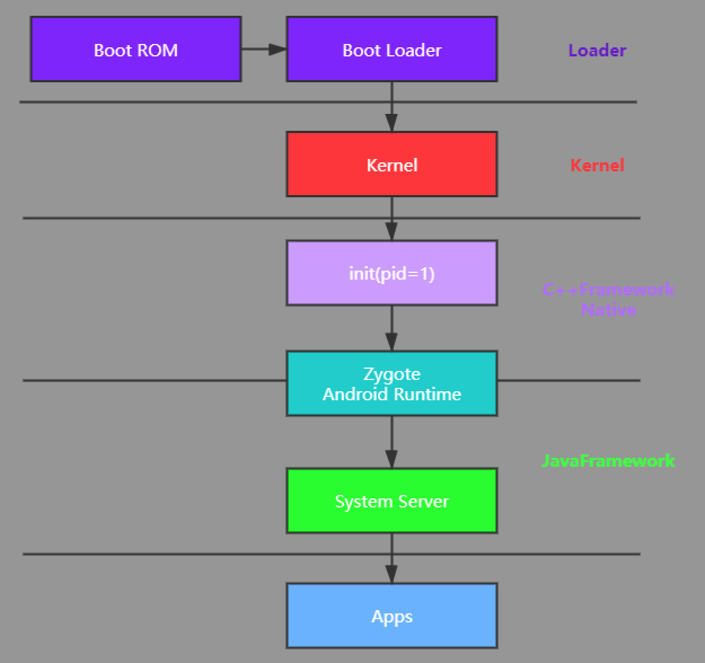
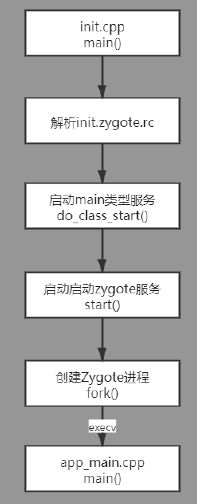
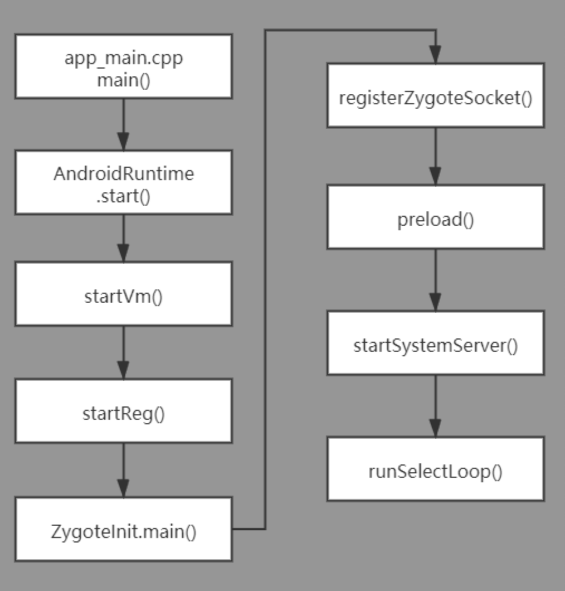
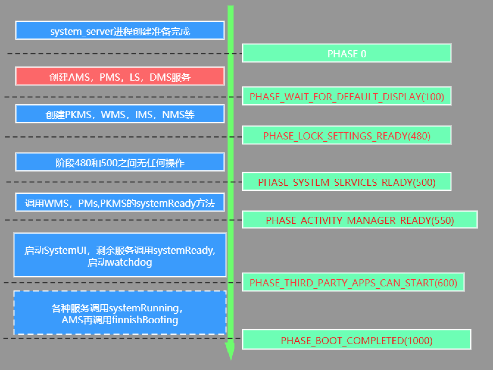

### Android启动流程

#### init

#### zygote

##### 启动方式

*  一种是zygote模式，也就是初始化zygote进程，传递的参数有--start-system-server --socket

  name=zygote，前者表示启动SystemServer，后者指定socket的名称。

* 一种是application模式，也就是启动普通应用程序，传递的参数有class名字以及class带的参数。

#### systemServer

