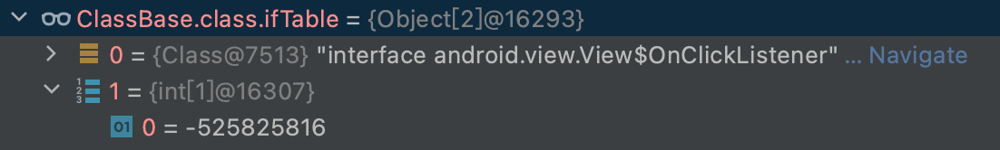

### 字节码知识点目录

* [类文件结构](#struct)
* [字节码指令](#instruction)

* [方法分派](#dispatch)

* [MethodHandle](#methodHandle)

#### <span id="struct">类文件结构</spna>

* 魔数
* 版本号
* 常量池
* 访问标志
* 类索引、父类索引、接口索引集合
* 字段表集合
* 方法表集合
* 属性表集合

#### <span id="instruction">字节码指令</span>

###### 方法调用

* invokeStatic

  > 调用静态方法

* invokeSpecial

  > 调用构造方法、私有方法、父类方法

* invokeVirtual

  > 调用对象的实例方法，根据对象的实际类型进行分派(虚方法分派)。把实列方法的符号引用解析成直接引用，所生成的直接引用很可能是方法表中的偏移量，从此以后很可能都使用相同的偏移量。

* invokeInterface

  > 调用接口方法，在运行时搜索一个实现了该接口方法的对象，找出合适的方法调用。每次都不得不重写搜索一下方法表，因为虚拟机不能假设这一次的偏移量与上一次的偏移量相同(因为接口可以被不同的类实现，请见方法分派接口实现)。

* invokeDynamic

  > Java语言本身用不到该指令，是为了支持其他动态语言的。用于在运行时动态解析出调用点限定符所引用的方法并执行该方法。前面4条指令的分派逻辑都固化在JVM内部，该指令的分派逻辑由用户所设定的引导方法决定

> 虚拟机调用invokeStatic、invokeSpecial指令的符号引用时，将符号引用解析成直接引用，所生成的直接引用包含一个指向实际操作的指针，所以执行速度较快。invokeVirtual速度次之，invokeInterface每次调用都有查找所以速度较慢，因此接口引用比对象引用速度较慢。

#### <span id="dispatch">方法分派</span>

###### 宗量

> 方法的接收者

> 方法的参数

* 根据宗量多少分类

> 多分派。

> 单分派。

* 根据分派时期分类

> 静态分派：重载，编译时绑定方法，类加载解析时完成分派。不仅要考虑方法的接收者，还要考虑方法的参数，所以静态分派属于多分派。

> 动态分派：重写，运行时根据对象类型完成分派。因为方法已确定，只根据方法的接收者来调用，所以动态分派属于单分派。

###### 实现

```java
public abstract class ClassBase implements View.OnClickListener {
    public abstract void Test();
    public void Test2(){}

    @Override
    public void onClick(View v) {

    }
}
public interface ClassDemoInterface {
    void one();
    void two();
}
public abstract class ClassDemo extends ClassBase implements View.OnLongClickListener, ClassDemoInterface {
    @Override
    public void one() {}

    @Override
    public void two() {}

    @Override
    public void Test() {}

    @Override
    public void Test2() {
        super.Test2();
    }

    @Override
    public String toString() {
        return "ClassDemo{" +
                "filed='" + filed + '\'' +
                '}';
    }

    @Override
    public boolean onLongClick(View v) {
        return false;
    }
}
```

* 类虚方法表(vTable)

  

   

  

  `具有相同签名的方法名，父类和子类的虚方法表的方法索引也应相同。`

  > ClassBase默认继承Object，同时也继承了其vtable，即0-10的方法索引和地址相同

  `子类继承父类虚方法表，如果没重写，方法入口地址指向父类；否则指向子类重写方法入口地址。`

  > ClassDemo虽然继承自ClassBase，但通过ClassBase同时继承了Object的vtable，重新toString()方法后，其虚方法表中的地址指向了自身的实现，即vtable中索引7。

  > 类链接阶段初始化

  > 其他优化手段
  >
  > * 继承关系分析CHA
  > * 守护内联
  > * 内联缓存

* 接口IfTable(所实现接口的集合)
  
  


`IfTable是以偶数位置存放接口类信息，奇数存放接口虚方法表的数据结构。`

> 类的IfTable继承父类的IfTable，同时包括接口继承的接口。

#### <span id="methodHandle">MethodHandle</span>

> 模拟字节码层次的方法调用，没有类、方法、字段的描述符信息。

```java
//demo
public class MethodHandleDemo {
    public int test(String name){
        System.out.println("test --> "+name);
        return 1 ;
    }
    public static void main(String[] args) throws Throwable {
        MethodHandles.Lookup lookup = MethodHandles.lookup();
        MethodType methodType = MethodType.methodType(int.class, String.class);
        MethodHandle lookupVirtual = lookup.findVirtual(MethodHandleDemo.class, "test", methodType);
        lookupVirtual.invoke(new MethodHandleDemo(),"this is success");
    }
}
```