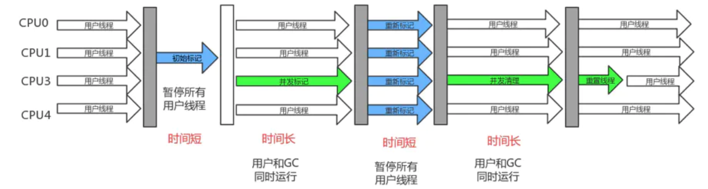

### GC

* [GCRoots](#roots)
* [GC时机](#time)
* [分代收集](#generation)
* [空间担保](#space)
* [标记算法](#label)
* [回收算法](#recycle)
* [收集器](#collect)

#### GCRoots

`标记对象的根节点`

> 虚拟机栈中引用的对象(局部变量表)。

> 本地方法栈中引用的对象，通过JNI引用的java对象。

> 类静态变量引用的对象。

> 常量池中引用的对象。

> 同步锁(synchronized)持有的对象。

> 虚拟机内部的引用，基本类型对象的Class对象，常驻的异常对象。

#### GC时机

`为了优化STW的时间，发生GC的时机也很重要。`

###### 安全点

> 抢占式中断，虚拟机会中断所以线程，如果发现用户线程不在安全点上，会恢复线程继续运行直到到达安全点。几乎没有虚拟机采用。

> 主动式中断，线程执行到安全点时去轮询GC标志决定是否中断。

###### 安全区域

> 用户线程声明自己进入安全区域，GC线程就不管该线程了,当用户线程要离开安全区域时，会检查虚拟机是否完成GC Roots枚举。
>
> 如果完成了，就继续执行；
>
> 如果没有，需要等待完成后才能离开安全区域

#### 分代收集

> 弱分代假说，绝大多数对象都是朝生夕灭。

> 强分代假说，熬过越多次数垃圾收集过程的对象就越难以消亡。

> 跨代引用假说，跨代引用相对于同代引用来说仅占极少数。

#### 空间担保

> 当Eden区存活对象过大无法复制到From区，或From区的存活对象到达一定时机时，如发生几次GC后仍然存活，这个上线是15，不同的虚拟机次数要求不一样。该存活对象将会移到老年代。
>
> 如果老年代最大连续空间大于新生代所有对象的总空间，那么Minor GC是安全的。
>
> 否则继续检查老年代最大连续空间是否大于历次晋升到老年代的对象的平均大小。如果大于，尝试Minor GC。如果尝试失败或者小于，则会发生一次Full GC。

#### 标记算法

* 引用计数法

  >1. 及时性，当对象变成垃圾后，程序可以立刻感知，马上回收；而在可达性分析算法中，直到执行 GC 才能感知。
  >2. 最大暂停时间短，GC 可与应用交替运行。

  > 1. 计数器值更新频繁，大多数情况下，对象的引用状态会频繁更新，更新计数器值的任务会变得繁重。
  > 2. 堆利用率降低，计数器至少占用 32 位空间（取决于机器位数），导致堆的利用率降低。
  > 3. 实现复杂。
  > 4. 无法回收循环引用对象（致命缺陷）。

* 可达性分析

  >1. 可回收循环引用对象。
  >2. 实现简单。

  >1. 最大停顿时间长，在 GC 期间，整个应用停顿(stop-the-world)。
  >2. 回收不及时，直到执行 GC 才能感知垃圾对象。

#### 回收算法

* 复制

  `新生代发生Minor/Young GC时采用的回收算法`

  > 1. 快速分配对象，空闲分块是一个连续内存空间，不需要向标记-清理算法那样遍历空闲列表。
  > 2. 避免内存碎片化，存活对象会被复制到From区，避免出现很多不连续的小内存。

  > 堆利用率低，Eden区最多可利用90%。

* 清除

  `老年代发生Majar/Old GC 或者Full GC时可能采用的回收算法`

  > 实现简单

  > 1. 执行效率不稳定，Java 堆中对象越多，标记和清理的过程可能会越耗时。
  > 2. 内存碎片化（fragmentation），回收过程会逐渐产生很多不连续的小内存，当小内存不足以分配对象内存时，又会触发一次垃圾回收动作（GC for Alloc）.

* 整理

  ` 老年代发生Majar/Old GC 或者Full GC时可能采用的回收算法。`

  > 1. 避免内存碎片化，堆利用率高，吞吐量更高。
  >
  > 2. 快速分配对象，空闲分块是一个连续内存空间，不需要向标记-清理算法那样遍历空闲列表。

  > 移动对象比清理对象更耗时，导致 GC 停顿时间（Stop-the-world）时间更长。

#### 收集器

<table>
  <head>
    <tr>
    	<th></th>
      <th>新生代</th>
      <th>新生代</th>
    </tr>
    <tr>
    	<td>单线程</td>
      <td>Serial</td>
      <td>Serial Old</td>
    </tr>
    <tr>
    	<td rowspan="2">多线程</td>
      <td>ParNew</td>
      <td>Parallel Old</td>
    </tr>
     <tr>
      <td>Parallel Scavenge</td>
      <td>CMS</td>
    </tr>
   </head>
</table>

`单线程收集器会STW。多线程可以和用户线程一起或交替工作，只有短暂的STW。`

##### CMS

> 缩短了系统STW时间，提高了吞吐量。

> 1. CPU敏感，采用了并发策略，系统整体上会占用更多CPU资源。
>
> 2. 浮动垃圾，由于并发清理的过程中用户线程还在运行，CMS 无法回收这个阶段中用户线程产生的垃圾，这一部分垃圾称为 “浮动垃圾”。由于浮动垃圾的存在，垃圾收集器需要预留出一部分空间来允许浮动垃圾的产生，如果预留的空间还不足以存放浮动垃圾，就会出现 Concurrent Mode Failure，此时需要临时启动非并发清理方案来代替 CMS。
>
> 3. 内存碎片， 采用标记 - 清理算法，会产生内存碎片。

* 初始标记

  > 短暂的STW，仅仅标记被 GC Root 直接引用的对象，由于 GC Root 相对较少，这个过程速度很块。

* 并发标记

  >  继续遍历 GC Root 引用链上的对象，这个过程比较耗时，所以采用并发处理。

  ###### 预清理

  > 在并发标记阶段，发现新生代对象引用老年代未标记对象，则标记老年代该对象为活跃对象。

  > 在并发标记阶段，如果老年代内部有引用关系发生改变，会在所在Card(其实这里并非使用 CardTable，而是一个类似的数据结构， 叫 ModUnionTalble）)标记为dirty，通过扫描Table重新标记在并发标记阶段引用更新的对象。

  ###### 并发可中断预清理

  `Eden内存达到阈值，默认2M。`

  中断条件

  * 最大循环次数
  * 时限阈值
  * Eden区内存达到阈值，默认50%

  > 在并发标记阶段，处理From和To区域的对象，标记可达的老年代对象，类似于预处理。

  > 在并发标记阶段，如果老年代内部有引用关系发生改变，会在所在Card(其实这里并非使用 CardTable，而是一个类似的数据结构， 叫 ModUnionTalble）)标记为dirty，通过扫描Table重新标记在并发标记阶段引用更新的对象。

* 重新标记

  > 短暂的STW，为了修正并发标记期间用户线程导致的引用关系变化，需要暂停用户线程重新标记。

* 并发清除

  > 并发清除（耗时） 由于清除对象的过程比较耗时，所以采用并发处理。
