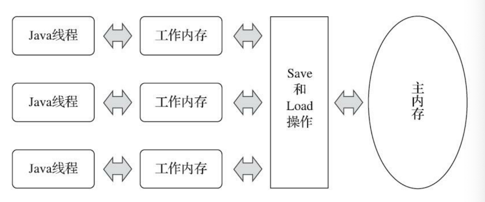

### JMM(Java内存模型)

#### 模型图

> 上图是主内存与线程及其工作内存的关系。

> 所以变量存储在主内存中。
>
> 工作内存保存了该线程使用主内存的变量的副本。读写操作必须在工作内存中进行；不能直接读写主内存的数据。
>
> 不同线程间无法直接访问对方的工作内存中的变量，需要通过主内存完成。

`内存模型和运行时数据区是不同的概念，Java内存模型是JVM规范定义程序中各种变量的访问规则，屏蔽硬件和操作系统的内存访问操作。运行时数据区是Java内存管理的实现。主内存可以勉强对应方法区和堆的大部分，工作内存勉强对应虚拟机栈和线程本地分配缓冲区(TLAB)。`

#### 交互指令

* lock，作用于主内存变量，把一个变量标识为一条线程独占的状态。

* unlock，作用于主内存变量，把一个处于锁定状态的变量释放出来，释放后的变量才可以被其他线程锁定。

* read，作用于主内存变量，把一个变量的值从主内存传输到线程的工作内存中，以便随后的load动作使用。

* load，作用于工作内存变量，把read操作从主内存中得到的变量值放入工作内存的变量副本中。

* use ，作用于工作内存变量，把工作内存中一个变量的值传递给执行引擎，每当虚拟机遇到一个需要使用变量的值的字节码指令时将会执行这个操作。

* assign，作用于工作内存变量，把一个从执行引擎接收的值赋给工作内存的变量,每当虚拟机遇到一个给变量赋值的字节码指令时执行这个操作。

* store，作用于工作内存变量，把工作内存中一个变量的值传送到主内存中，以便随后的write操作使用。

* write ，作用于主内存变量，把store操作从工作内存中得到的变量的值放入主内存的变量中。

> 如果把一个主内存的变量复制到工作内存，需要先read在load，同样如果把工作内存的变量写回主内存，需要先store在write。不允许上述指令单独出现。

> 如果一个线程执行了assign操作，必须把这种变化同步回主内存。如果没有发生assign操作，是不允许将工作内存的数据同步回主内存。

> 只能再主内存中创建对象，不允许在工作内存中直接使用一个未被初始化的变量，即在use、store之前必须assign或load。

> 一个变量在同一时刻只允许被一条线程lock，但可以被该线程lock多次，当然必须相同次数的unlock才能解锁。同时lock操作会清空工作内存该变量的副本，需要重新load或assign。线程只能unlock被自己lock的变量。unlock之前，必须把变量同步回主内存。

