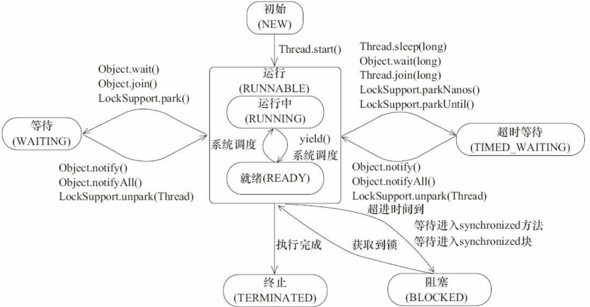
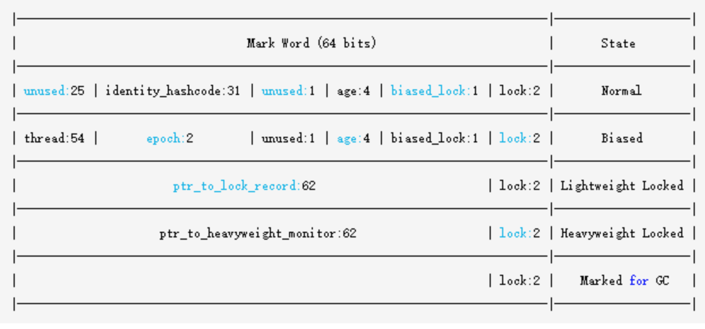
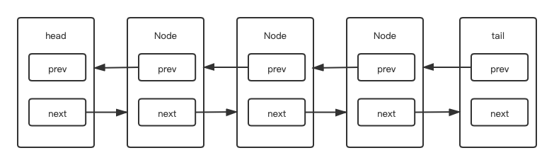
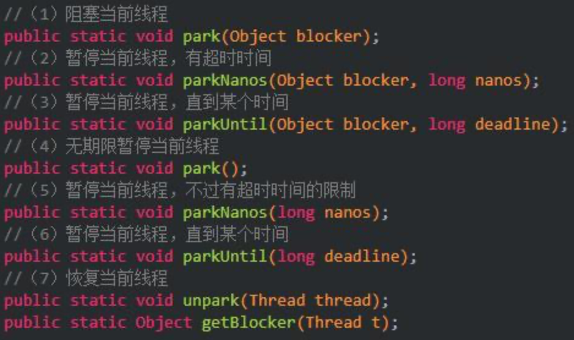

### 并发

* [线程](#thread)
  * [创建方式](#thread-create)
  * [线程类型](#thread-type)
  * [线程优先级](#thread-prority)
  * [线程优状态](#thread-status)
  * [线程中断](#thread-interrupt)
  * [线程变量](#thread-local)
  * [常用函数](#thread-func)
* [线程池](#executor)
  * [继承关系](#executor-inhert)
  * [ThreadPoolExecutor](#executor-threadpoolexecutor)
  * [ForkJoin](#executor-forkjoin)
* [锁](#lock)
  * [并发特性](#lock-property)
  * [分类](#lock-type)
  * [Object](#lock-object)
  * [volatile](#lock-volatile)
  * [synchronized](#lock-synchroized)
  * [CMS](#lock-cms)
  * [AQS](#lock-aqs)
  * [LatchDownCount](#lock-latchdowncount)
  * [LockSupport](#lock-locksupport)

#### <span id="thread">线程</span>

###### <span id="thread-create">创建方式</span>

* 重写Thread的run方法。

* 实现Runnable接口，作为参数传递给Thread。

###### <span id="thread-type">线程类型</span>

* 用户线程

* 守护线程

  > 可以通过setDaemon(true)在start之前来设置。在后台提供一种通用服务的线程。
  >
  > GC也是守护线程。

###### <span id="thread-prority">线程优先级</span>

> 1~10级，默认5级。

###### <span id="thread-status">线程状态</span>



* NEW

  > 创建线程对象，但此时并未分配资源和开启线程。

* RUNNING

  > 通过start()开启线程。
  >
  > Java层的运行态，在linux层分为RUNNING和READY两种状态。通过yield()方法使线程让出CPU执行权，但CPU可能随时再次调度该线程。

* WAITING

  > 调用wait()、join()、park()使线程主动等待；通过notify、notifyAll、unpark主动唤醒线程。如生产者-消费者模式。

* TIMED_WAITING

  > 调用sleep(long)、wait(long)、join(long)、parkNanos(long)、parkUntil(long)使线程主动在时限内等待；通过notify、notifyAll、unpark主动唤醒。

* BLOCKED

  > 通常进入synchronized方法或代码块，因为等待monitor锁而被动等待。需要等待其他线程释放monitor锁而被动唤醒。

* TERMINATED

  > 线程执行完毕。

###### <span id="thread-interrupt">线程中断</span>

> Java线程无法强制中断，只能等待线程任务完成而退出，所以需要不断轮询中断标记主动退出。

* 检查中断标志

  > 1. isInterrupted()成员方法，返回线程中断状态。
  >
  > 2. interrupted()类方法，返回线程中断状态，调用一次后清除标志位。

* 中断线程

  > interrupt()
  >
  > 1. 如果线程因为wait、join、sleep处于等待状态，而此时中断线程，会抛出InterruptedException异常。当捕获该异常后会清除中断标志位。
  > 2. 如果该线程被nio InterruptibleChannel的I/O阻塞，这个InterruptibleChannel会被关闭，然后被设置标志位，InterruptibleChannel会收到中断关闭异常。
  > 3. 如果该线程被nio selector阻塞，会被设置标志位，然后立马返回一个值(就像调用了selector的wakeup方法一样)，可能是一个非零值。
  > 4. 处于死锁状态的线程无法被中断。无法获取中断消息。

  > 其他中断线程的方式：
  >
  > 设置标志标识线程中断，但是如果线程处于阻塞状态，便无法及时收到消息。

###### <span id="thread-local">线程变量</span>

```java
//java.lang.Thread
/* ThreadLocal values pertaining to this thread. This map is maintained
 * by the ThreadLocal class. */
ThreadLocal.ThreadLocalMap threadLocals = null;
//java.lang.ThreadLocal
public class ThreadLocal<T> {
  static class ThreadLocalMap {
    //线程变量作为key，引用关联的值
    static class Entry extends WeakReference<ThreadLocal<?>> {
      /** The value associated with this ThreadLocal. */
      Object value;
      Entry(ThreadLocal<?> k, Object v) {
        super(k);
        value = v;
      }
    }
		//初始容量
    private static final int INITIAL_CAPACITY = 16;
    //线程变量存放数组
    private Entry[] table;
  }
}
```

* 初始值

  ```java
  //java.lang.ThreadLocal
  protected T initialValue() {
      return null;
  }
  ```

  > 当第一次获取线程变量的值时，调用该方法。

* 获取线程变量值

  ```java
  //java.lang.ThreadLocal
  public T get() {
      Thread t = Thread.currentThread();
    	//第一次获取map为null
      ThreadLocalMap map = getMap(t);
    	//1.未创建map或者第一次获取线程变量
      if (map != null) {
          ThreadLocalMap.Entry e = map.getEntry(this);
          if (e != null) {
              @SuppressWarnings("unchecked")
              T result = (T)e.value;
              return result;
          }
      }
      return setInitialValue();
  }
  ThreadLocalMap getMap(Thread t) {
    	return t.threadLocals;
  }
  //2.如果map没有创建，创建map。存放线程变量和其关联的值
  private T setInitialValue() {
      T value = initialValue();
      Thread t = Thread.currentThread();
      ThreadLocalMap map = getMap(t);
      if (map != null)
        map.set(this, value);
      else
        createMap(t, value);
      return value;
  }
  ```

  > 1. 未创建map或者第一次获取线程变量。
  > 2. 如果map没有创建，创建map。存放线程变量和其关联的值。

* 设置线程变量值

  ```java
  //java.lang.ThreadLocal
  public void set(T value) {
      Thread t = Thread.currentThread();
      ThreadLocalMap map = getMap(t);
    	//如果map存在，设置线程变量的值；否则创建map并存放线程变量和其关联的值
      if (map != null)
          map.set(this, value);
      else
          createMap(t, value);
  }
  //java.lang.ThreadLocal.ThreadLocalMap
  private void set(ThreadLocal<?> key, Object value) {
      // We don't use a fast path as with get() because it is at
      // least as common to use set() to create new entries as
      // it is to replace existing ones, in which case, a fast
      // path would fail more often than not.
      Entry[] tab = table;
      int len = tab.length;
    	//专为ThreadLocal设置的哈希值，
      int i = key.threadLocalHashCode & (len-1);
    	//遍历指定位置i开直到元素为空。这是因为哈希值可能相同，重复的ThreadLocal会依次下移直到该位置未存放元素，然后存放该ThreadLocal，如果在这个过程查找到与该ThreadLocal相同的变量，更新该值，如果发现该位置ThreadLocal已经释放，替换该ThreadLocal。
      for (Entry e = tab[i]; e != null;e = tab[i = nextIndex(i, len)]) {
        ThreadLocal<?> k = e.get();
        if (k == key) {
          e.value = value;
          return;
        }
        if (k == null) {//k已经释放，但是其关联的值未释放，
          replaceStaleEntry(key, value, i);
          return;
        }
      }
      tab[i] = new Entry(key, value);
      int sz = ++size;
    	//如果存放的个数达到阈值，扩容数组。
      if (!cleanSomeSlots(i, sz) && sz >= threshold)
        rehash();
  }
  ```

  > 1. 如果map为空，创建map并存放ThreadLocal和其关联的值。
  > 2. 如果不为空，搜索ThreadLocal的哈希值(一个特殊的线程变量的哈希值)直到某位置的元素为空：
  >    1. 如果当前位置的ThreadLocal与要存放的ThreadLocal相同，则更新其值。
  >    2. 如果当前位置的ThreadLocal已经释放，则替换该元素。
  >    3. 插入空元素位置。
  > 3. 如果线程变量的个数达到阈值，扩容。

* 内存泄漏

  > 如果ThreadLocal不再使用，应该是remove释放；否则会造成其关联的值内存泄漏。如果内存泄漏后，只能等待下次操作(get、set)才有可能会被释放。

  ```java
  private Entry getEntry(ThreadLocal<?> key) {
      int i = key.threadLocalHashCode & (table.length - 1);
      Entry e = table[i];
      if (e != null && e.get() == key)
          return e;
      else
          return getEntryAfterMiss(key, i, e);
  }
  private Entry getEntryAfterMiss(ThreadLocal<?> key, int i, Entry e) {
      Entry[] tab = table;
      int len = tab.length;
  
      while (e != null) {
        ThreadLocal<?> k = e.get();
        if (k == key)
          return e;
        if (k == null)//如果已被释放，置空该元素，即可释放value
          expungeStaleEntry(i);
        else
          i = nextIndex(i, len);
        e = tab[i];
      }
      return null;
  }
  ```

###### <span id="thread-func">常用函数</span>

* sleep

  > 使线程进入睡眠。不释放资源。

* join

  > 使多个线程有序运行。如果A线程join当前线程，则当前线程阻塞等待其他A线程完成，然后继续运行。

* yield

  > 使当前线程让出CPU执行权，不可设置时间，可能随时再次被调度。不释放资源。

#### <span id="executor">线程池</span>

##### <span id="executor-inhert">继承关系</span>

* Executor
  * ExecutorService
    * AbstractExecutorService
      * ThreadPoolExecutor
        * ScheduledThreadPoolExecutor
      * ForkJoinPool

##### <span id="executor-threadpoolexecutor">ThreadPoolExecutor</span>

###### 工作机制

> 1. 如果当前线程数小于核心线程数，会创建新线程来执行任务，创建过程需要加锁。
> 2. 如果线程数超过核心线程数，会将任务加入阻塞队列。
> 3. 如果阻塞队列已满，则会创建新的线程来处理任务。
> 4. 如果线程数超过最大线程数，则会根据拒绝执行机制来出来新任务

###### 参数解析

* corePoolSize,int

  > 1. 一般最多配置CPU核心数+1。Runtime.getRuntime().availableProcessors()获取核心数。
  > 2. allowCoreThreadTimeOut配置：
  >    1. False，核心线程一直活着，即便空闲。
  >    2. true，核心线程使用keepAliveTime来超时等待工作。
  > 3. 如果线程数小于核心线程数，会创建新线程。
  > 4. prestartAllCoreThreads()，创建核心线程。

* maximumPoolSize,int

  > 1. 线程池中允许的最大线程数。
  > 2. 如果阻塞队列满了，且当前线程数小于该数字，再提交任务会创建新的线程执行任务。

* keepAliveTime,long

  > 1. 线程空闲时存活的时间。
  > 2. 如果为0，当任务执行完后会立马中断。
  > 3. 默认情况下当线程数大于核心线程数时才有效。

* unit,TimeUnit

  > 超时单位

* workQueue,BlockingQueue<Runnable>

  > 当任务超过核心线程数时，会进入阻塞队列等待。
  >
  > 一般来说，尽量使用有界队列

  * threadFactory,ThreadFactory

  > 可以为每个线程设置具有辨识度的名字，比如默认的线程工厂是以pool-number-thread-number命名。
  >
  > 可以设置所有线程为守护线程。

* handler,RejectedExecutionHandler

  > 如果创建的线程数超过最大线程数：
  >
  > 1. AbortPolicy，直接抛出异常，默认策略。
  > 2. CallerRunsPolicy，调用者所在线程来执行任务。
  > 3. DiscardOldestPolicy，丢弃阻塞队列最靠前的任务，并执行当前任务。
  > 4. DiscardPolicy，直接丢弃任务。
  > 5. 可以实现该接口，自定义饱和策略。

###### 队列

* 无界队列

  * PriorityBlockingQueue

    > 一个支持优先级排序的无界阻塞队列。
    >
    > PriorityBlockingQueue是一个支持优先级的无界阻塞队列。默认情况下元素采取自然顺序升序排列。也可以自定义类实现compareTo()方法来指定元素排序规则，或者初始化PriorityBlockingQueue时，指定构造参数Comparator来对元素进行排序。需要注意的是不能保证同优先级元素的顺序。

  * DelayQueue

    > 一个支持优先级排序的超时无界阻塞队列。
    >
    > 一个支持延时获取元素的无界阻塞队列。队列使用PriorityQueue来实现。队列中的元素必须实现Delayed接口，在创建元素时可以指定多久才能从队列中获取当前元素。只有在延迟期满时才能从队列中提取元素。
    > DelayQueue非常有用，可以将DelayQueue运用在以下应用场景。
    > 缓存系统的设计：可以用DelayQueue保存缓存元素的有效期，使用一个线程循环查询DelayQueue，一旦能从DelayQueue中获取元素时，表示缓存有效期到了。

  * LinkedTransferQueue

    > 一个由链表结构组成的无界阻塞队列。多了tryTransfer和transfer方法:
    >
    > 1. transfer方法
    >    如果当前有消费者正在等待接收元素（消费者使用take()方法或带时间限制的poll()方法时），transfer方法可以把生产者传入的元素立刻transfer（传输）给消费者。如果没有消费者在等待接收元素，transfer方法会将元素存放在队列的tail节点，并等到该元素被消费者消费了才返回。
    > 2. tryTransfer方法
    >    tryTransfer方法是用来试探生产者传入的元素是否能直接传给消费者。如果没有消费者等待接收元素，则返回false。和transfer方法的区别是tryTransfer方法无论消费者是否接收，方法立即返回，而transfer方法是必须等到消费者消费了才返回。

  > 新任务将在无界队列中等待，所以线程池中线程数不会超过核心线程数。
  >
  > 如果不超过核心线程数，则不会创建新线程，则最大线程数参数将无效。
  >
  > 如果线程池中线程数不超过核心线程数，保活时间也可能将无效。
  >
  > 会尽可能消耗系统资源。

* 有界队列

  * ArrayBlockingQueue

    > 一个由数组结构组成的有界阻塞队列。
    >
    > 是一个用数组实现的有界阻塞队列。此队列按照先进先出（FIFO）的原则对元素进行排序。默认情况下不保证线程公平的访问队列，所谓公平访问队列是指阻塞的线程，可以按照阻塞的先后顺序访问队列，即先阻塞线程先访问队列。非公平性是对先等待的线程是非公平的，当队列可用时，阻塞的线程都可以争夺访问队列的资格，有可能先阻塞的线程最后才访问队列。初始化时有参数可以设置。

  * LinkedBlockingQueue

    > 一个以链表结构组成的有界阻塞队列。
    >
    > 是一个用链表实现的有界阻塞队列。此队列的默认和最大长度为Integer.MAX_VALUE。此队列按照先进先出的原则对元素进行排序。

  * SynchronousQueue

    > 一个不存储元素的阻塞队列。
    >
    > 是一个不存储元素的阻塞队列。每一个put操作必须等待一个take操作，否则不能继续添加元素。SynchronousQueue可以看成是一个传球手，负责把生产者线程处理的数据直接传递给消费者线程。队列本身并不存储任何元素，非常适合传递性场景。SynchronousQueue的吞吐量高于LinkedBlockingQueue和ArrayBlockingQueue。

  * LinkedBlockingDeque

    > 一个由链表结构组成的双端阻塞队列。
    >
    > LinkedBlockingDeque是一个由链表结构组成的双向阻塞队列。所谓双向队列指的是可以从队列的两端插入和移出元素。双向队列因为多了一个操作队列的入口，在多线程同时入队时，也就减少了一半的竞争。
    > 多了addFirst、addLast、offerFirst、offerLast、peekFirst和peekLast等方法，以First单词结尾的方法，表示插入、获取（peek）或移除双端队列的第一个元素。以Last单词结尾的方法，表示插入、获取或移除双端队列的最后一个元素。另外，插入方法add等同于addLast，移除方法remove等效于removeFirst。但是take方法却等同于takeFirst，不知道是不是JDK的bug，使用时还是用带有First和Last后缀的方法更清楚。在初始化LinkedBlockingDeque时可以设置容量防止其过度膨胀。另外，双向阻塞队列可以运用在“工作窃取”模式中。

  ###### ArrayBlockingQueue和LinkedBlockingQueue的不通

  > 1. 队列中锁的实现不同
  >    ArrayBlockingQueue实现的队列中的锁是没有分离的，即生产和消费用的是同一个锁；
  >    LinkedBlockingQueue实现的队列中的锁是分离的，即生产用的是putLock，消费是takeLock
  > 2. 在生产或消费时操作不同
  >    ArrayBlockingQueue实现的队列中在生产和消费的时候，是直接将枚举对象插入或移除的；
  >    LinkedBlockingQueue实现的队列中在生产和消费的时候，需要把枚举对象转换为Node<E>进行插入或移除，会影响性能
  > 3. 队列大小初始化方式不同
  >    ArrayBlockingQueue实现的队列中必须指定队列的大小；
  >    LinkedBlockingQueue实现的队列中可以不指定队列的大小，但是默认是Integer.MAX_VALUE

###### 类型

* I/O读写密集型

  > 由于I/O密集型任务并不是一直执行任务，可能尽可能多的线程，可以配置2 * CPU个核心线程。

* CPU计算密集型

  > 密集型任务应配置尽可能小的线程，如CPU+1个核心线程。

* 混合型任务

  > 如果两种任务执行的时间相差不大，则没必要拆分。
  >
  > 如果两种任务的执行时间相差很大，拆分可以提高串行执行的吞吐量。

###### 创建方式

* 构造函数

* Executors

  > 1. newFixedThreadPool，创建一个核心数和最大线程数相同的线程池。
  > 2. newWorkStealingPool，创建一个并行线程池，由ForkJoinPool实现。
  > 3. newSingleThreadExecutor，创建一个核心数和最大线程数为1的线程池。
  > 4. newSingleThreadScheduledExecutor，创建一个核心数为1的调度线程池。
  > 5. newCachedThreadPool，创建一个核心数为0，最大线程数为最大整数的线程池，保活时间为60秒。
  > 6. ScheduledExecutorService，创建一个调度线程池。

###### 任务提交

* execute

  > 提交后没有返回值，所以无法判断是否被线程池执行成功。

* submit

  > 返回一个Future对象，可以根据这个来判断任务是否完成。

###### 关闭

> 遍历线程池中工作线程，调用interrupt方法，无法响应中断的任务可能永远无法终止。

* shutdown

  > 只是将线程池状态设置成SHUTDOWN。
  >
  > 中断所有正在执行任务线程。

* shutdownNow

  > 先将线程池状态设置STOP。
  >
  > 尝试停止所有正在执行或暂停任务的线程。
  >
  > 返回等待执行的任务列表，调用一次后，会清空阻塞队列。

###### 影响因素

* 任务的优先级
* 任务的执行时间
* 任务的依赖性，如其他系统资源，如数据库连接。

##### <span id="executor-forkjoin">ForkJoin</span>

`实现通过分治思想分解子问题的并发类。`


#### <span id="lock">锁</span>

##### <span id="lock-property">并发特性</span>

* 原子性

  > 一个操作或多个操作，要么全部成功，要么全部失败，中途不可中断。

* 有序性

  > 多个线程共同访问共享变量时，某个线程修改了此变量，其他线程能立即看到修改后的值。

* 可见性

  > 程序执行的顺序按照代码的先后顺序执行。

  > 由于JMM模型中允许编译器和处理器为了效率，进行指令重排序的优化。指令重排序在单线程内表现为串行语义，在多线程中会表现为无序。那么多线程并发编程中，就要考虑如何在多线程环境下可以允许部分指令重排，又要保证有序性。

##### <span id="lock-type">分类</span>

* 多个线程能不能共享一把锁

  * 共享锁
  * 排它锁

* 多个线程竞争时要不要排队

  * 公平锁

  * 非公平锁

    > 先尝试插队，失败后在排队

* 线程要不要锁住同步资源

  * 悲观锁
  * 乐观锁

* 锁住同步资源失败要不要阻塞

  * 阻塞
  * 不阻塞
    * 自旋锁
    * 适应性自旋锁

* 一个线程中的多个流程能不能获得同一把锁

  * 可重入锁
  * 不可重入锁

##### 锁相关问题

* 死锁

  `指多个线程或进程由于竞争资源或彼此通信而造成的一种阻塞现象，若无外力作用，它们都将无法继续下去。`

  ###### 条件

  > 1. 互斥条件。
  > 2. 请求与保持。
  > 3. 不可剥夺。
  > 4. 环路等待。

  ###### 解决思路

  `保证拿锁顺序一致。`

  > 1. 通过内部比较确定拿锁顺序。
  > 2. 采用尝试拿锁机制。

  > 1. 银行家算法。
  > 2. 有序资源分配法。

* 活锁

  `多个线程尝试拿锁过程中发生谦让，一个线程总是拿到同一把锁，在尝试获取另一把锁时失败而释放已获得的锁。`

  > 让线程随机休眠，错开拿锁时间。

##### <span id="lock-object">Object</span>

`wait、notify、notifyAll是Object的方法，所以所有java对象默认继承该方法。`

* wait

  > 阻塞当前线程，可以设置一个超时时间。

  > 1. 会释放调用者的锁。
  > 2. 假唤醒(概率极低)。

* notify/notifyAll

  > 唤醒或者唤醒所有被该对象阻塞的线程。

##### <span id="lock-volatile">volatile</span>

`是一种最简单的同步机制，保证了原子性和可见性。`

> JVM提供的最轻量级的同步机制。
>
> 只保证了可见性和有序性，并没有保证原子性。
>
> 在生产字节码时，添加了内存屏障，来禁止指令重排。
>
> 只有内存一份存储，只能保证读同步。

##### <span id="lock-synchronized">synchronized</span>

`JVM内置的一种对象锁。`

###### 使用方式

* 声明在方法上

  > 锁住当前类对象，通过再方法accessFlag上添加ACC_SYNCHRONIZED标志实现。

* 代码块

  > 是通过对象的监视器锁实现。monitorenter、monitorexit。

  > 锁粗化，如果有多个同步代码块，jvm会考虑优化将他们合并。
  >
  > 锁消除，在编译阶段如果发现当前方法或同步代码块是安全，会将锁消除。

###### 对象布局

`字节对齐，寻址优化，如果不是8字节的整数倍，也会分配8字节的整数倍。`

* 对象头(64位虚拟机)

  * markword，8字节。

    

  * kClass point，8字节，开启指针压缩后4字节。

  * 数组对象的length，4字节。

* 实例数据

  > 如果是基本类型，存放基本类型值。
  >
  > 如果是引用类型，存放对象指针。

###### 优化

* 无锁

  > 不锁住资源，只有一个线程能修改资源，其他线程重试。

* 偏向锁

  > 同一个线程执行同步资源时自动获取该锁。

* 适应性自旋锁

  > 多个线程竞争同步资源时，没有获得资源的线程自旋等待锁释放。

* 重量锁

  > 多个线程竞争同步资源时，没有获得资源的线程阻塞等待唤醒。

##### <span id="lock-cms">CMS</span>

`Compare And Swap。CPU提供的特殊指令。`

###### 原理

> 更新一个内存的值，只有当内存的值与预定的旧值相等，才会更新新值，否则什么都不做。

###### 缺点

* 循环时间长，开销大。

* ABA问题。

  > 例如一个线程将A改成B，然后又改回A，其他线程无法知道这个操作。
  >
  > 对于每次操作都加个版本号来标识。

* 只能保证一个共享变量的原子操作。

##### <span id="lock-aqs">AQS</span>

`同步器基于模板方法的设计模式，定义了一套算法骨架，将拿锁逻辑延迟到子类。`

> 是实现的锁的关键，两者是聚合关系。
>
> 锁是面向使用者的，定义了与使用者交互的接口，隐藏了实现细节；同步器面向的是锁的实现者，它简化了锁的实现方式，屏蔽了同步状态管理、线程的排队、等待与唤醒等底层操作。锁和同步器很好地隔离了使用者和实现者所需关注的领域。
>
> 实现者需要继承同步器并重写指定的方法，随后将同步器组合在自定义同步组件的实现中，并调用同步器提供的模板方法，而这些模板方法将会调用使用者重写的方法。

###### 继承关系

* AbstractOwnableSynchronizer
  * AbstractQueuedSynchronizer
  * AbstractQueuedLongSynchronizer

> 两者的区别，前者是int类型的cms变量，后者是long类型的cms变量。

###### CLH



> 是一个自旋锁，能确保无饥饿性，提供先来先服务的公平性。
>
> 是一种基于链表的可扩展、高性能、公平的自旋锁，申请线程只在本地变量上自旋，它不断轮询前驱的状态，如果发现前驱释放了锁就结束自旋。

```java
new AbstractQueuedSynchronizer(){
  	//实现尝试获取排它锁逻辑
    @Override
    protected boolean tryAcquire(int arg) {
        return super.tryAcquire(arg);
    }
		//实现尝试释放排它锁逻辑
    @Override
    protected boolean tryRelease(int arg) {
        return super.tryRelease(arg);
    }
		//实现尝试获取共享锁逻辑
    @Override
    protected int tryAcquireShared(int arg) {
        return super.tryAcquireShared(arg);
    }
		//实现尝试释放共享锁逻辑
    @Override
    protected boolean tryReleaseShared(int arg) {
        return super.tryReleaseShared(arg);
    }
		//返回是否拥有锁
    @Override
    protected boolean isHeldExclusively() {
        return super.isHeldExclusively();
    }
};
//排它锁相关接口
public final void acquire(int arg) {
  if (!tryAcquire(arg) &&
      acquireQueued(addWaiter(Node.EXCLUSIVE), arg))
    selfInterrupt();
}
public final void acquireInterruptibly(int arg)throws InterruptedException {
  if (Thread.interrupted())
    throw new InterruptedException();
  if (!tryAcquire(arg))
    doAcquireInterruptibly(arg);
}

public final boolean tryAcquireNanos(int arg, long nanosTimeout)
  throws InterruptedException {
  if (Thread.interrupted())
    throw new InterruptedException();
  return tryAcquire(arg) ||
    doAcquireNanos(arg, nanosTimeout);
}

public final boolean release(int arg) {
  if (tryRelease(arg)) {
    Node h = head;
    if (h != null && h.waitStatus != 0)
      unparkSuccessor(h);
    return true;
  }
  return false;
}
//设置拥锁线程
protected final void setExclusiveOwnerThread(Thread thread) {
  exclusiveOwnerThread = thread;
}
//状态相关
protected final int getState() {
  return state;
}
protected final void setState(int newState) {
  state = newState;
}
protected final boolean compareAndSetState(int expect, int update) {
  return U.compareAndSwapInt(this, STATE, expect, update);
}
//共享锁相关接口
public final void acquireShared(int arg) {
  if (tryAcquireShared(arg) < 0)
    doAcquireShared(arg);
}
public final void acquireSharedInterruptibly(int arg)
  throws InterruptedException {
  if (Thread.interrupted())
    throw new InterruptedException();
  if (tryAcquireShared(arg) < 0)
    doAcquireSharedInterruptibly(arg);
}
public final boolean tryAcquireSharedNanos(int arg, long nanosTimeout)
  throws InterruptedException {
  if (Thread.interrupted())
    throw new InterruptedException();
  return tryAcquireShared(arg) >= 0 ||
    doAcquireSharedNanos(arg, nanosTimeout);
}
public final boolean releaseShared(int arg) {
  if (tryReleaseShared(arg)) {
    doReleaseShared();
    return true;
  }
  return false;
}

```

###### Condition

* await()

  > 阻塞当前线程，直到信号或者中断到来。

* awaitUninterruptibly()

  > 阻塞当前线程，直到信号到来，忽略中断。

* awaitNanos(long nanosTimeout) 

* await(long time, TimeUnit unit) 

* awaitUntil(Date deadline) 

* signal()

* signalAll()

###### ReentrantLock

`可重入的排它锁。实现了公平锁和非公平锁。`

* FairSync，公平锁
* NonfairSync，非公平锁

> 构造时根据传入参数fair决定采用那种锁，fair为true，使用公平锁，false或者默认使用非公平锁。

###### ReentrantReadWriteLock

`读写锁，读实现了共享锁，写实现了公平锁和非公平锁。`

* WriteLock 写锁
* ReadLock 读锁

##### StampedLock

> 类似ReentrantReadWriteLock，只是优化了可重入锁的性能。

##### <span id="lock-latchdowncount">LatchDownCount</span>

```java
CountDownLatch cdl = new CountDownLatch(3);
try {
    cdl.await();
} catch (InterruptedException e) {
    e.printStackTrace();
}
//其他线程调用3次函数即可唤醒上述流程
cdl.countDown();
```

##### <span id="lock-locksupport">LockSupport</span>

`可以不获得锁而锁定和解锁线程。`



