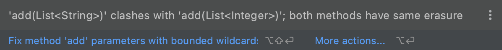

### 泛型

* 类型擦除
* 泛型声明

* 逆变与协变

#### 类型擦除

`出于兼容性的考虑，Java泛型采用了一种简单的实现方式，即在编译时将类型擦除。但保留在Signature属性中，仍然可以通过反射获取。`

```java
public class Generic {
    private List<String> list  =new LinkedList<>();
    public void add(List<String> l){}
    public void add(List<Integer> l){}
}
```



> 重载add方法无法通过编译，提示如上图，List里的泛型信息编译时会被擦除，这样重载add的参数就一样了，即签名信息一致，无法重载。

```java
public class com/cmq/dex/Generic {
  // compiled from: Generic.java

  // access flags 0x2
  // signature Ljava/util/List<Ljava/lang/String;>;
  // declaration: list extends java.util.List<java.lang.String>
  private Ljava/util/List; list

  // access flags 0x1
  public <init>()V
   L0
    LINENUMBER 6 L0
    ALOAD 0
    INVOKESPECIAL java/lang/Object.<init> ()V
   L1
    LINENUMBER 7 L1
    ALOAD 0
    NEW java/util/LinkedList
    DUP
    INVOKESPECIAL java/util/LinkedList.<init> ()V
    PUTFIELD com/cmq/dex/Generic.list : Ljava/util/List;
    RETURN
   L2
    LOCALVARIABLE this Lcom/cmq/dex/Generic; L0 L2 0
    MAXSTACK = 3
    MAXLOCALS = 1
}
```

``` java
Field field = Generic.class.getDeclaredField("list");
Type genericType = field.getGenericType();
Log.i("--Generic--",field.getType().getName());
if(genericType instanceof ParameterizedType){
  Type[] types = ((ParameterizedType) genericType).getActualTypeArguments();
  for(Type type : types){
    Log.i("--Generic-->",type.toString());
  }
}
//--Generic--: java.util.List
//--Generic-->: class java.lang.String
```

> 可以从反编译中看出，定义的泛型在编译时被擦除，但保留在signature中。可以通过反射的方式获取泛型类型。

#### 泛型声明

```java
public static class One {
    public void print() {
        Log.i("---print", "one");
    }
}
public static class Two extends One {
    @Override
    public void print() {
        Log.i("---print", "two");
    }
}
public static class Three extends Two {
    @Override
    public void print() {
        Log.i("---print", "three");
    }
}
public static class Demo<T extends String> {
    private T data;
  	//协变
    private List<? extends Two> param1;
  	//逆变
    private List<? super Two> param2;
    public <E extends Two, H extends Two> E get(H h) {
        h.print();
        return (E) h;
    }

    public void add(List<? extends Two> p1, List<? super Two> p2) {

    }
}
//测试用例
 new Demo<String>().get(new Three());
//---print: three
```

###### extends

`在这里的extends区别于类继承关键字，在泛型中表示类型的上边界，即extends后的类以及其子类。`

> 1. 可以作用在类上。
> 2. 可以作用在属性类型上
> 3. 可以作用在返回类型上。
> 4. 可以作用的参数类型上。

###### super

`这里的super区别于表示父类，在泛型中表示类型的下边界，即super后的类以及其父类。`

> 1. 可以作用在属性类型上。
> 2. 可以作用在参数类型上。

#### 逆变与协变

`通过？泛型通配符实现逆变与协变。`

> 如果泛型传入？，那么代表Object类型。

> PECS: producer-extends, consumer-super。

###### 逆变

> <? super class> 

> 生产者模式，只能修改(变量)或添加(集合)该类(Two)及其父类(One)元素。

> 如果非要获取元素，该元素是Object类型。

###### 协变

> <? extends class>

> 消费者模式，只能获取元素(Two类型)，不能添加或修改。

