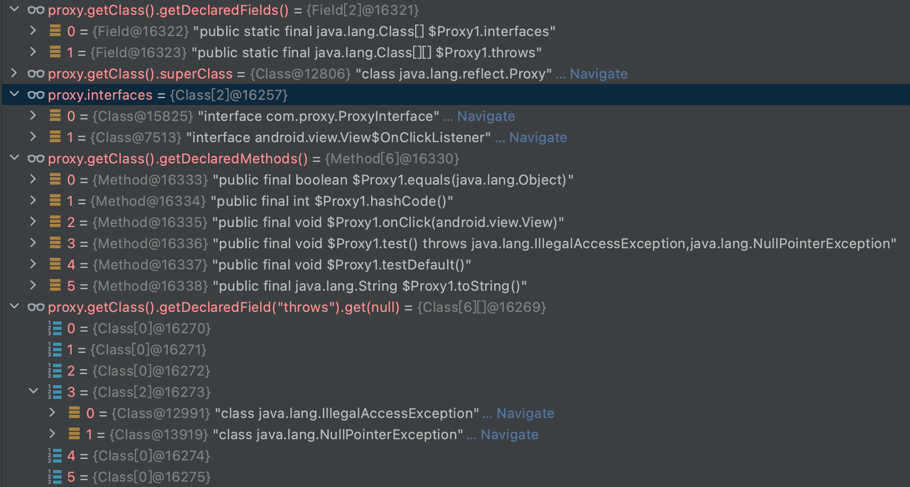

### 动态代理

```java
//java.lang.reflect.Proxy
/**
* a cache of proxy classes
*/
protected InvocationHandler h;
private static final Class<?>[] constructorParams = { InvocationHandler.class }
//1.缓存代理类，如果要代理的集合接口已经有代理类，直接返回，如果没有就动态生成。
private static final WeakCache<ClassLoader, Class<?>[], Class<?>>
        proxyClassCache = new WeakCache<>(new KeyFactory(), new ProxyClassFactory());
protected Proxy(InvocationHandler h) {
  Objects.requireNonNull(h);
  this.h = h;
}
public static Object newProxyInstance(ClassLoader loader,Class<?>[] interfaces,
                       InvocationHandler h) throws IllegalArgumentException{
		//数组类默认实现Cloneable和Serializable
    final Class<?>[] intfs = interfaces.clone();
  
    Class<?> cl = getProxyClass0(loader, intfs);
    try {
      	//2.根据动态生成的代理类构造实例。
        final Constructor<?> cons = cl.getConstructor(constructorParams);
        final InvocationHandler ih = h;
        if (!Modifier.isPublic(cl.getModifiers())) {
            cons.setAccessible(true);
        }
        return cons.newInstance(new Object[]{h});
    } catch (Exception e) {
        //...异常
    }
}
private static Class<?> getProxyClass0(ClassLoader loader,Class<?>... interfaces) {
    if (interfaces.length > 65535) {
      throw new IllegalArgumentException("interface limit exceeded");
    }
    // If the proxy class defined by the given loader implementing
    // the given interfaces exists, this will simply return the cached copy;
    // otherwise, it will create the proxy class via the ProxyClassFactory
    return proxyClassCache.get(loader, interfaces);
}
```

```java
//java.lang.reflect.WeakCache
//key是classloader，value是<接口集合算出的唯一标识,代理类>
private final ConcurrentMap<Object, ConcurrentMap<Object, Supplier<V>>> map
        = new ConcurrentHashMap<>();
public V get(K key, P parameter) {
  Object cacheKey = CacheKey.valueOf(key, refQueue);
  // lazily install the 2nd level valuesMap for the particular cacheKey
  //1.1获取关联到ClassLoader缓存
  ConcurrentMap<Object, Supplier<V>> valuesMap = map.get(cacheKey);
  if (valuesMap == null) {
    ConcurrentMap<Object, Supplier<V>> oldValuesMap
      = map.putIfAbsent(cacheKey,valuesMap = new ConcurrentHashMap<>());
    if (oldValuesMap != null) {
      valuesMap = oldValuesMap;
    }
  }
  // create subKey and retrieve the possible Supplier<V> stored by that
  // subKey from valuesMap
  //1.2根据接口集合算出唯一的代理类的subKey,
  Object subKey = Objects.requireNonNull(subKeyFactory.apply(key, parameter));
  Supplier<V> supplier = valuesMap.get(subKey);
  Factory factory = null;
  //1.3 以下是从缓存中获取代理类，如果获取不到便生成代理类
  while (true) {
    if (supplier != null) {
      // supplier might be a Factory or a CacheValue<V> instance
      V value = supplier.get();
      if (value != null) {
        return value;
      }
    }
    // else no supplier in cache
    // or a supplier that returned null (could be a cleared CacheValue
    // or a Factory that wasn't successful in installing the CacheValue)

    // lazily construct a Factory
    if (factory == null) {
      factory = new Factory(key, parameter, subKey, valuesMap);
    }

    if (supplier == null) {
      supplier = valuesMap.putIfAbsent(subKey, factory);
      if (supplier == null) {
        // successfully installed Factory
        supplier = factory;
      }
      // else retry with winning supplier
    } else {
      if (valuesMap.replace(subKey, supplier, factory)) {
        // successfully replaced
        // cleared CacheEntry / unsuccessful Factory
        // with our Factory
        supplier = factory;
      } else {
        // retry with current supplier
        supplier = valuesMap.get(subKey);
      }
    }
  }
}
```

```java
//java.lang.reflect.Proxy内部类
private static final class ProxyClassFactory
    implements BiFunction<ClassLoader, Class<?>[], Class<?>>
{
    // prefix for all proxy class names
    private static final String proxyClassNamePrefix = "$Proxy";

    // next number to use for generation of unique proxy class names
    private static final AtomicLong nextUniqueNumber = new AtomicLong();
		//3.生成代理类
    @Override
    public Class<?> apply(ClassLoader loader, Class<?>[] interfaces) {

        Map<Class<?>, Boolean> interfaceSet = new IdentityHashMap<>(interfaces.length);
        for (Class<?> intf : interfaces) {
            /*
             * Verify that the class loader resolves the name of this
             * interface to the same Class object.
             */
            Class<?> interfaceClass = null;
            try {
                interfaceClass = Class.forName(intf.getName(), false, loader);
            } catch (ClassNotFoundException e) {
            }
        }

        String proxyPkg = null;     // package to define proxy class in
        int accessFlags = Modifier.PUBLIC | Modifier.FINAL;

        /*
         * Record the package of a non-public proxy interface so that the
         * proxy class will be defined in the same package.  Verify that
         * all non-public proxy interfaces are in the same package.
         */
        for (Class<?> intf : interfaces) {
            int flags = intf.getModifiers();
            if (!Modifier.isPublic(flags)) {
                accessFlags = Modifier.FINAL;
                String name = intf.getName();
                int n = name.lastIndexOf('.');
                String pkg = ((n == -1) ? "" : name.substring(0, n + 1));
                if (proxyPkg == null) {
                    proxyPkg = pkg;
                } else if (!pkg.equals(proxyPkg)) {
                    throw new IllegalArgumentException(
                        "non-public interfaces from different packages");
                }
            }
        }
        {
            // Android-changed: Generate the proxy directly instead of calling
            // through to ProxyGenerator.
            List<Method> methods = getMethods(interfaces);
            Collections.sort(methods, ORDER_BY_SIGNATURE_AND_SUBTYPE);
            validateReturnTypes(methods);
            List<Class<?>[]> exceptions = deduplicateAndGetExceptions(methods);

            Method[] methodsArray = methods.toArray(new Method[methods.size()]);
            Class<?>[][] exceptionsArray = exceptions.toArray(new Class<?>[exceptions.size()][]);

            /*
             * Choose a name for the proxy class to generate.
             */
            long num = nextUniqueNumber.getAndIncrement();
            String proxyName = proxyPkg + proxyClassNamePrefix + num;

            return generateProxy(proxyName, interfaces, loader, methodsArray,
                                 exceptionsArray);
        }
    }
}
private static native Class<?> generateProxy(String name, Class<?>[] interfaces,
                                                 ClassLoader loader, Method[] methods,
                                                 Class<?>[][] exceptions);
```

> 1. 查找缓存中是否存在接口集合的代理类，如果不存在就生成。
>    1. 获取关联到传入的ClassLoader的缓存集合。
>    2. 根据接口集合生成代理类的key。
>    3. 根据key查找ClassLoader的缓存集合是否存在代理类，如果不存在则创建。
> 2. 通过构造函数创建代理类的实例。
> 3. 创建代理类。
>    1. 获取所以接口的方法并排序。
>    2. 验证返回值类型。
>    3. 搜集所有异常类型。
>    4. 构建代理类的类名(包括包名)。
>    5. 生成代理类。

```c
//art/runtime/native/java_lang_reflect_Proxy.cc
static jclass Proxy_generateProxy(JNIEnv* env, jclass, jstring name, jobjectArray interfaces,jobject loader, jobjectArray methods, jobjectArray throws) {
  ScopedFastNativeObjectAccess soa(env);
  ClassLinker* class_linker = Runtime::Current()->GetClassLinker();
  return soa.AddLocalReference<jclass>(class_linker->CreateProxyClass(
      soa, name, interfaces, loader, methods, throws));
}
```

```c++
//art/runtime/class_linker.cc
ObjPtr<mirror::Class> ClassLinker::CreateProxyClass(ScopedObjectAccessAlreadyRunnable& soa,
    jstring name,jobjectArray interfaces,jobject loader,jobjectArray methods,jobjectArray throws) {
  Thread* self = soa.Self();
	//...
  StackHandleScope<12> hs(self);
  MutableHandle<mirror::Class> temp_klass(hs.NewHandle(
      AllocClass(self, GetClassRoot<mirror::Class>(this), sizeof(mirror::Class))));
  //...设置类信息
  const char* descriptor = temp_klass->GetDescriptor(&storage);
  const size_t hash = ComputeModifiedUtf8Hash(descriptor);

  // Needs to be before we insert the class so that the allocator field is set.
  LinearAlloc* const allocator = GetOrCreateAllocatorForClassLoader(temp_klass->GetClassLoader());

  // Insert the class before loading the fields as the field roots
  // (ArtField::declaring_class_) are only visited from the class
  // table. There can't be any suspend points between inserting the
  // class and setting the field arrays below.
  ObjPtr<mirror::Class> existing = InsertClass(descriptor, temp_klass.Get(), hash);

  // Instance fields are inherited, but we add a couple of static fields...
  const size_t num_fields = 2;
  LengthPrefixedArray<ArtField>* sfields = AllocArtFieldArray(self, allocator, num_fields);
  temp_klass->SetSFieldsPtr(sfields);

  // 1. Create a static field 'interfaces' that holds the _declared_ interfaces implemented by
  // our proxy, so Class.getInterfaces doesn't return the flattened set.
  ArtField& interfaces_sfield = sfields->At(0);
  interfaces_sfield.SetDexFieldIndex(0);
  interfaces_sfield.SetDeclaringClass(temp_klass.Get());
  interfaces_sfield.SetAccessFlags(kAccStatic | kAccPublic | kAccFinal);

  // 2. Create a static field 'throws' that holds exceptions thrown by our methods.
  ArtField& throws_sfield = sfields->At(1);
  throws_sfield.SetDexFieldIndex(1);
  throws_sfield.SetDeclaringClass(temp_klass.Get());
  throws_sfield.SetAccessFlags(kAccStatic | kAccPublic | kAccFinal);

  // Proxies have 1 direct method, the constructor
  const size_t num_direct_methods = 1;

  // The array we get passed contains all methods, including private and static
  // ones that aren't proxied. We need to filter those out since only interface
  // methods (non-private & virtual) are actually proxied.
  Handle<mirror::ObjectArray<mirror::Method>> h_methods =
      hs.NewHandle(soa.Decode<mirror::ObjectArray<mirror::Method>>(methods));

  // List of the actual virtual methods this class will have.
  std::vector<ArtMethod*> proxied_methods;
  std::vector<size_t> proxied_throws_idx;
  proxied_methods.reserve(h_methods->GetLength());
  proxied_throws_idx.reserve(h_methods->GetLength());
  // Filter out to only the non-private virtual methods.
  for (auto [mirror, idx] : ZipCount(h_methods.Iterate<mirror::Method>())) {
    ArtMethod* m = mirror->GetArtMethod();
    if (!m->IsPrivate() && !m->IsStatic()) {
      proxied_methods.push_back(m);
      proxied_throws_idx.push_back(idx);
    }
  }
  const size_t num_virtual_methods = proxied_methods.size();
  // We also need to filter out the 'throws'. The 'throws' are a Class[][] that
  // contains an array of all the classes each function is declared to throw.
  // This is used to wrap unexpected exceptions in a
  // UndeclaredThrowableException exception. This array is in the same order as
  // the methods array and like the methods array must be filtered to remove any
  // non-proxied methods.
  const bool has_filtered_methods =
      static_cast<int32_t>(num_virtual_methods) != h_methods->GetLength();
  MutableHandle<mirror::ObjectArray<mirror::ObjectArray<mirror::Class>>> original_proxied_throws(
      hs.NewHandle(soa.Decode<mirror::ObjectArray<mirror::ObjectArray<mirror::Class>>>(throws)));
  MutableHandle<mirror::ObjectArray<mirror::ObjectArray<mirror::Class>>> proxied_throws(
      hs.NewHandle<mirror::ObjectArray<mirror::ObjectArray<mirror::Class>>>(
          (has_filtered_methods)
              ? mirror::ObjectArray<mirror::ObjectArray<mirror::Class>>::Alloc(
                    self, original_proxied_throws->GetClass(), num_virtual_methods)
              : original_proxied_throws.Get()));
  if (proxied_throws.IsNull() && !original_proxied_throws.IsNull()) {
    self->AssertPendingOOMException();
    return nullptr;
  }
  if (has_filtered_methods) {
    for (auto [orig_idx, new_idx] : ZipCount(MakeIterationRange(proxied_throws_idx))) {
      proxied_throws->Set(new_idx, original_proxied_throws->Get(orig_idx));
    }
  }

  // Create the methods array.
  LengthPrefixedArray<ArtMethod>* proxy_class_methods = AllocArtMethodArray(
        self, allocator, num_direct_methods + num_virtual_methods);

  temp_klass->SetMethodsPtr(proxy_class_methods, num_direct_methods, num_virtual_methods);

  // Create the single direct method.
  CreateProxyConstructor(temp_klass, temp_klass->GetDirectMethodUnchecked(0, image_pointer_size_));

  // Create virtual method using specified prototypes.
  // TODO These should really use the iterators.
  for (size_t i = 0; i < num_virtual_methods; ++i) {
    auto* virtual_method = temp_klass->GetVirtualMethodUnchecked(i, image_pointer_size_);
    auto* prototype = proxied_methods[i];
    CreateProxyMethod(temp_klass, prototype, virtual_method);
  }

  // The super class is java.lang.reflect.Proxy
  temp_klass->SetSuperClass(GetClassRoot<mirror::Proxy>(this));
  // Now effectively in the loaded state.
  mirror::Class::SetStatus(temp_klass, ClassStatus::kLoaded, self);
  self->AssertNoPendingException();

  // At this point the class is loaded. Publish a ClassLoad event.
  // Note: this may be a temporary class. It is a listener's responsibility to handle this.
  Runtime::Current()->GetRuntimeCallbacks()->ClassLoad(temp_klass);

  MutableHandle<mirror::Class> klass = hs.NewHandle<mirror::Class>(nullptr);
  {
    // Must hold lock on object when resolved.
    ObjectLock<mirror::Class> resolution_lock(self, temp_klass);
    // Link the fields and virtual methods, creating vtable and iftables.
    // The new class will replace the old one in the class table.
    Handle<mirror::ObjectArray<mirror::Class>> h_interfaces(
        hs.NewHandle(soa.Decode<mirror::ObjectArray<mirror::Class>>(interfaces)));
    if (!LinkClass(self, descriptor, temp_klass, h_interfaces, &klass)) {
      mirror::Class::SetStatus(temp_klass, ClassStatus::kErrorUnresolved, self);
      return nullptr;
    }
  }

  interfaces_sfield.SetObject<false>(klass.Get(),soa.Decode<mirror::ObjectArray<mirror::Class>>(interfaces));
  throws_sfield.SetObject<false>(klass.Get(),proxied_throws.Get());

  Runtime::Current()->GetRuntimeCallbacks()->ClassPrepare(temp_klass, klass);

  // SubtypeCheckInfo::Initialized must happen-before any new-instance for that type.
  // See also ClassLinker::EnsureInitialized().
  if (kBitstringSubtypeCheckEnabled) {
    MutexLock subtype_check_lock(Thread::Current(), *Locks::subtype_check_lock_);
    SubtypeCheck<ObjPtr<mirror::Class>>::EnsureInitialized(klass.Get());
    // TODO: Avoid taking subtype_check_lock_ if SubtypeCheck for j.l.r.Proxy is already assigned.
  }

  VisiblyInitializedCallback* callback = nullptr;
  {
    // Lock on klass is released. Lock new class object.
    ObjectLock<mirror::Class> initialization_lock(self, klass);
    EnsureSkipAccessChecksMethods(klass, image_pointer_size_);
    // Conservatively go through the ClassStatus::kInitialized state.
    callback = MarkClassInitialized(self, klass);
  }
  if (callback != nullptr) {
    callback->MakeVisible(self);
  }
  return klass.Get();
}
```

> 动态生成类信息：
>
> 1. 额外生成静态interfaces字段记录代理类所实现的接口。
> 2. 额外生成静态throws字段记录所有方法所抛出的异常。
> 3. 生成构造函数，参数为InvocationHandler。
> 4. 实现所有方法。
> 5. 完成加载类的正常流程。

```java
public interface ProxyInterface {
    void test()throws IllegalAccessException,NullPointerException;
    default void testDefault(){
        Log.i("proxy","testDefault");
    }
}
```



```java
//java平台生成Proxy代理类
byte[] bytes = ProxyGenerator.generateProxyClass(ProxyInterface.class.getName()+"$Proxy0", new Class[]{ProxyInterface.class});
try {
    FileOutputStream fos = new FileOutputStream(new File(".","proxy.class"));
    fos.write(bytes);
    fos.flush();
} catch (Exception e) {
    e.printStackTrace();
}
```

```java
public final class ProxyInterface$Proxy0 extends Proxy implements ProxyInterface {
    private static Method m1;
    private static Method m3;
    private static Method m4;
    private static Method m2;
    private static Method m0;

    public ProxyInterface$Proxy0(InvocationHandler var1) throws  {
        super(var1);
    }

    public final boolean equals(Object var1) throws  {
        try {
            //h = InvocationHandler
            return (Boolean)super.h.invoke(this, m1, new Object[]{var1});
        } catch (RuntimeException | Error var3) {
            throw var3;
        } catch (Throwable var4) {
            throw new UndeclaredThrowableException(var4);
        }
    }

    public final void testDefault() throws  {
        try {
            super.h.invoke(this, m3, (Object[])null);
        } catch (RuntimeException | Error var2) {
            throw var2;
        } catch (Throwable var3) {
            throw new UndeclaredThrowableException(var3);
        }
    }

    public final void test() throws IllegalAccessException, NullPointerException {
        try {
            super.h.invoke(this, m4, (Object[])null);
        } catch (RuntimeException | IllegalAccessException | Error var2) {
            throw var2;
        } catch (Throwable var3) {
            throw new UndeclaredThrowableException(var3);
        }
    }

    public final String toString() throws  {
        try {
            return (String)super.h.invoke(this, m2, (Object[])null);
        } catch (RuntimeException | Error var2) {
            throw var2;
        } catch (Throwable var3) {
            throw new UndeclaredThrowableException(var3);
        }
    }

    public final int hashCode() throws  {
        try {
            return (Integer)super.h.invoke(this, m0, (Object[])null);
        } catch (RuntimeException | Error var2) {
            throw var2;
        } catch (Throwable var3) {
            throw new UndeclaredThrowableException(var3);
        }
    }

    static {
        try {
            m1 = Class.forName("java.lang.Object").getMethod("equals", Class.forName("java.lang.Object"));
            m3 = Class.forName("com.proxy.ProxyInterface").getMethod("testDefault");
            m4 = Class.forName("com.proxy.ProxyInterface").getMethod("test");
            m2 = Class.forName("java.lang.Object").getMethod("toString");
            m0 = Class.forName("java.lang.Object").getMethod("hashCode");
        } catch (NoSuchMethodException var2) {
            throw new NoSuchMethodError(var2.getMessage());
        } catch (ClassNotFoundException var3) {
            throw new NoClassDefFoundError(var3.getMessage());
        }
    }
}
```

