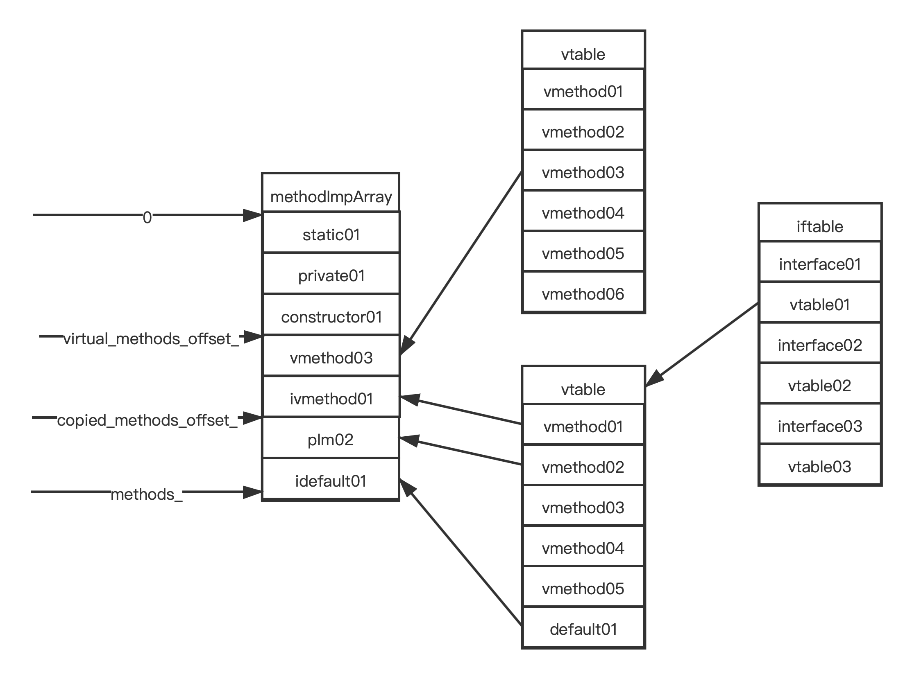
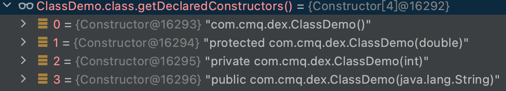
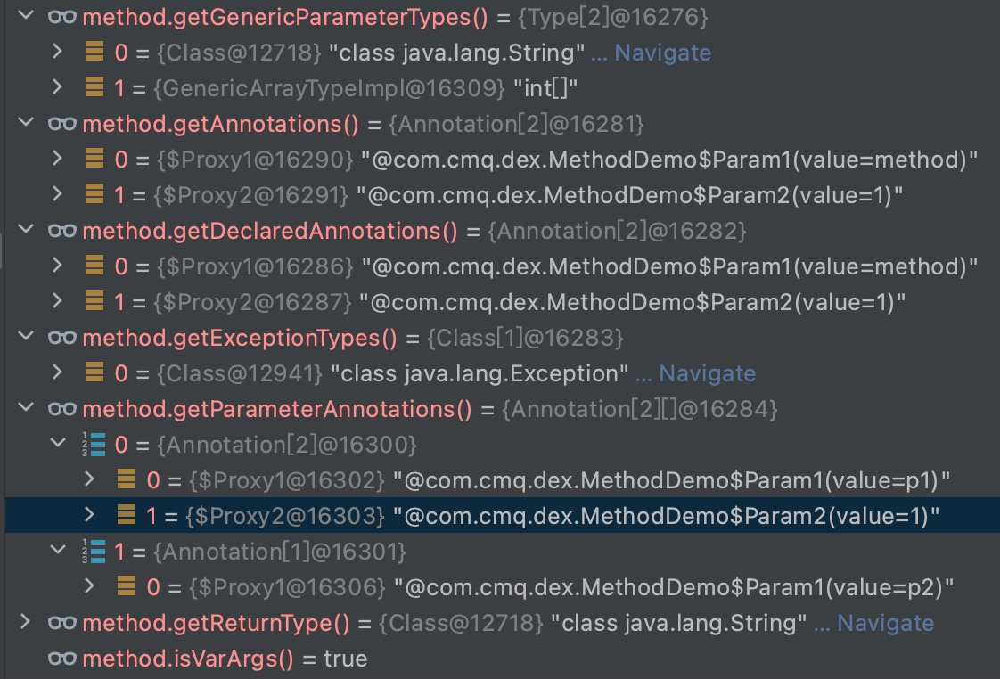
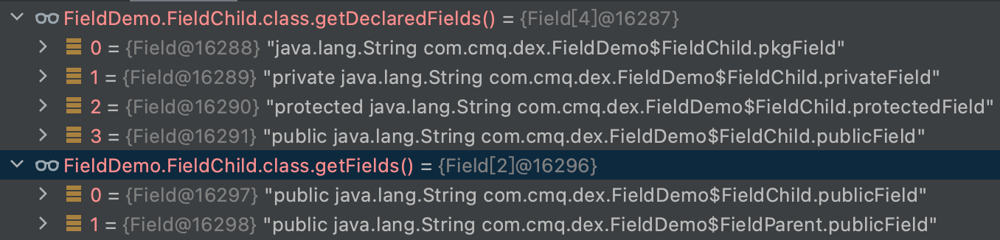
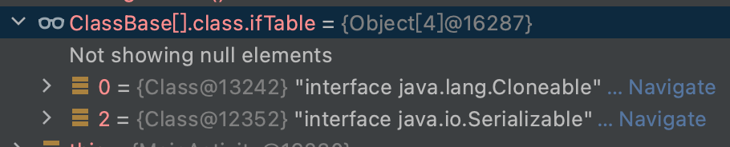

### 反射

> 反射分析基于Android 8.0

* [Class](#class)
* [Constructor](#constructor)
* [Method](#method)
* [方法调用](methodcall)
* [Field](#field)
* [Android反射限制](android/Android.md)

#### 结论

> 在类中声明的方法排列顺序：直接方法(静态方法、私有方法、构造函数)、虚方法、复制方法(父类实现的接口方法，接口的默认方法)。
>
> 在类中声明的字段排列顺序：静态字段和成员字段分别两个数组，都是按照名称升序排列。

> 获取声明方法集合，直接方法和虚方法区域，但不包含构造函数。
>
> 获取方法集合，遍历继承链和接口集合，获取声明方法集合，过滤出public函数。

>获取指定声明方法，现在虚方法区间查找，再从直接方法区间查找。
>
>获取指定方法，先遍历继承链，再从接口集合中查找，获取当前类的指定声明方法，过滤出public函数。

> 获取Java方法对应的ArtMethod的入口地址，并检查合法性，然后通过函数指针调用。

> 获取声明字段集合，将自身成员字段和静态字段添加到数组中返回。
>
> 获取字段集合，遍历继承链、接口集合，过滤出public字段添加到数组中返回。

>获取指定声明字段，通过name在升序排列的成员字段和类字段中二分查找。
>
>获取指定字段，遍历继承链，在当前类以及其直接实现的接口中查找指定声明的public字段。<font color="red">数组类型默认实现Cloneable和Serializable接口</font>。

> 获取字段的值，如果是基本类型，返回其包装对象；如果是引用类型，根据对象以及字段偏移地址计算其堆内地址，转换成对象引用。
>
> 设置字段的值，如果是基本类型，直接更新其内存值；如果是引用类型，更新其指针地址。
>
> <font color="red">以上两个过程通过JMM来实现</font>。

#### <span id="class">Class</span>

```c
//1.art/runtime/mirror/class.cc
//2.art/runtime/native/java_lang_Class.cc
//3.java.lang.Class
//4.art/runtime/mirror/class-inl.h class.h的部分实现。
//1与3互为镜像，1是native层类的实现，3是1在Java层的引用，2是3通过jni的方式实现功能的桥梁。
```

```c
//art/runtime/mirror/class.h
	//Pointer to an ArtMethod length-prefixed array. All the methods where this class is the //place where they are logically defined. This includes all private, static, final and //virtual methods as well as inherited default methods and miranda methods.
//
	//The slice methods_ [0, virtual_methods_offset_) are the direct (static, private, init) //methods declared by this class.
//
	// The slice methods_ [virtual_methods_offset_, copied_methods_offset_) are the virtual //methods declared by this class.
//
	// The slice methods_ [copied_methods_offset_, |methods_|) are the methods that are copied //from interfaces such as miranda or default methods. These are copied for resolution //purposes as this class is where they are (logically) declared as far as the virtual //dispatch is concerned.
//
	// Note that this field is used by the native debugger as the unique identifier for the //type.
  uint64_t methods_;

	// The offset of the first virtual method that is copied from an interface. This includes //miranda, default, and default-conflict methods. Having a hard limit of ((2 << 16) - 1) for //methods defined on a single class is well established in Java so we will use only //uint16_t's here.
  uint16_t copied_methods_offset_;

  // The offset of the first declared virtual methods in the methods_ array.
  uint16_t virtual_methods_offset_;
 // Virtual method table (vtable), for use by "invoke-virtual".  The vtable from the //superclass is
  // copied in, and virtual methods from our class either replace those from the super or //are
  // appended. For abstract classes, methods may be created in the vtable that aren't in
  // virtual_ methods_ for miranda methods.
  HeapReference<PointerArray> vtable_;
  // The interface table (iftable_) contains pairs of a interface class and an array of the
  // interface methods. There is one pair per interface supported by this class.  That means //one
  // pair for each interface we support directly, indirectly via superclass, or indirectly //via a
  // superinterface.  This will be null if neither we nor our superclass implement any //interfaces.
  //
  // Why we need this: given "class Foo implements Face", declare "Face faceObj = new //Foo()".
  // Invoke faceObj.blah(), where "blah" is part of the Face interface.  We can't easily use //a
  // single vtable.
  //
  // For every interface a concrete class implements, we create an array of the concrete //vtable_
  // methods for the methods in the interface.
  HeapReference<IfTable> iftable_;
```

`miranda method(米兰达方法)，指间接实现接口的方法，即该类未直接实现的方法，而是通过父类实现。`

> methods_，指直接在该类声明的方法，包括间接实现的接口方法和default接口方法。
>
> 1. [0,virtual_methods_offset_]是静态函数、私有函数、构造函数的区间。
> 2. [virtual_methods_offset__,copied_methods_offset___]是虚方法的区间。
> 3. [copied_methods_offset__,method___]是间接实现接口(由父类实现)或者default方法的区间。



* vtable

  > 从父类继承的虚方法表，所有非静态、私有、构造函数，通过invokeVirtual调用。

* iftable

  > 该类实现的接口表，包括父类实现，接口继承的。偶数存放接口类，奇数存放接口虚方法表。接口引用通过invokeInterface调用。

* 方法实现数组

  > 声明在该类中的方法以数组的形式排列。
  >
  > 1. vmethod03是重新了父类的vmethod03方法，vtable中vmethod03指向该类的实现地址。
  > 2. pIm02是父类实现interface01的vmethod02方法。
  > 3. idefault01是interface01的default方法。

###### isAssignableFrom

```java
public boolean isAssignableFrom(Class<?> cls) {
if (this == cls) {
    return true;  // Can always assign to things of the same type.
} else if (this == Object.class) {
    return !cls.isPrimitive();  // Can assign any reference to java.lang.Object.
} else if (isArray()) {
    return cls.isArray() && componentType.isAssignableFrom(cls.componentType);
} else if (isInterface()) {
    // Search iftable which has a flattened and uniqued list of interfaces.
    Object[] iftable = cls.ifTable;
    if (iftable != null) {
        for (int i = 0; i < iftable.length; i += 2) {
            if (iftable[i] == this) {
                return true;
            }
        }
    }
    return false;
} else {
    if (!cls.isInterface()) {
        for (cls = cls.superClass; cls != null; cls = cls.superClass) {
            if (cls == this) {
                return true;
            }
        }
    }
    return false;
}
```
`判断该类是否由目标类派生。`

> 1. 该类就是目标类。
>
> 2. 该类本身是Object，目标类不是原始类型(基本类型)。<font color="red" >Java的数据类型分为原始类型和引用类型，所有引用类型都是继承自Object。</font>
>
> 3. 该类是数组。
>
>    ```java
>        /**
>         * For array classes, the component class object for instanceof/checkcast (for String[][][],
>         * this will be String[][]). null for non-array classes.
>         */
>        private transient Class<?> componentType;
>    ```
>
> 4. 该类是接口，遍历目标类的ifTable。每次i+=2，在字节码方法分派实现中，有探索ifTable的实现，偶数存放接口类，奇数存放结构vtable。
>
> 5. 目标类不是接口，遍历目标类的继承链。

#### <span id="constructor">Constructor</span>

```java
public class ClassDemo {
    public ClassDemo(String filed) {
    }
    ClassDemo() {
    }
    protected ClassDemo(double i) {
    }
    private ClassDemo(int s) {
    }
}
```

* getConstructors

  

  > 只能获取本身public的构造函数。

  ```java
  public Constructor<?>[] getConstructors() throws SecurityException {
      return getDeclaredConstructorsInternal(true);
  }
  ```

* getDeclaredConstructors

  

  > 获取自身所有构造函数。

  ```java
  public Constructor<?>[] getDeclaredConstructors() throws SecurityException {
      return getDeclaredConstructorsInternal(false);
  }
  ```

###### 实现

```java
private native Constructor<?>[] getDeclaredConstructorsInternal(boolean publicOnly);
```

```c
//art/runtime/native/java_lang_Class.cc
static jobjectArray Class_getDeclaredConstructorsInternal(
    JNIEnv* env, jobject javaThis, jboolean publicOnly) {
  ScopedFastNativeObjectAccess soa(env);
  StackHandleScope<2> hs(soa.Self());
  Handle<mirror::Class> h_klass = hs.NewHandle(DecodeClass(soa, javaThis));
  size_t constructor_count = 0;
  // Two pass approach for speed.
  //1 获取包含静态、私有、构造函数的数组。
  //2.1计满足条件的构造函数的长度
  for (auto& m : h_klass->GetDirectMethods(kRuntimePointerSize)) {
    constructor_count += MethodMatchesConstructor(&m, publicOnly != JNI_FALSE) ? 1u : 0u;
  }
  //2.2构建数组
  auto h_constructors = hs.NewHandle(mirror::ObjectArray<mirror::Constructor>::Alloc(
      soa.Self(), mirror::Constructor::ArrayClass(), constructor_count));
  if (UNLIKELY(h_constructors == nullptr)) {
    soa.Self()->AssertPendingException();
    return nullptr;
  }
  constructor_count = 0;
  //3.满足条件的构造函数添加到数组
  for (auto& m : h_klass->GetDirectMethods(kRuntimePointerSize)) {
    if (MethodMatchesConstructor(&m, publicOnly != JNI_FALSE)) {
      DCHECK_EQ(Runtime::Current()->GetClassLinker()->GetImagePointerSize(), kRuntimePointerSize);
      DCHECK(!Runtime::Current()->IsActiveTransaction());
      auto* constructor = mirror::Constructor::CreateFromArtMethod<kRuntimePointerSize, false>(
          soa.Self(), &m);
      if (UNLIKELY(constructor == nullptr)) {
        soa.Self()->AssertPendingOOMException();
        return nullptr;
      }
      h_constructors->SetWithoutChecks<false>(constructor_count++, constructor);
    }
  }
  return soa.AddLocalReference<jobjectArray>(h_constructors.Get());
}

static ALWAYS_INLINE inline bool MethodMatchesConstructor(ArtMethod* m, bool public_only)
    REQUIRES_SHARED(Locks::mutator_lock_) {
  DCHECK(m != nullptr);
  return (!public_only || m->IsPublic()) && !m->IsStatic() && m->IsConstructor();
}
```

```c++
//art/runtime/mirror/class-inl.h
inline IterationRange<StrideIterator<ArtMethod>> Class::GetDirectMethods(PointerSize pointer_size) {
  CheckPointerSize(pointer_size);
  return GetDirectMethodsSliceUnchecked(pointer_size).AsRange();
}
//获取包含静态、私有、构造函数的数组
inline ArraySlice<ArtMethod> Class::GetDirectMethodsSliceUnchecked(PointerSize pointer_size) {
  return ArraySlice<ArtMethod>(GetMethodsPtr(),//函数数组指针地址，
                               GetDirectMethodsStartOffset(),//0
                               GetVirtualMethodsStartOffset(),//虚方法开始索引
                               ArtMethod::Size(pointer_size),//指针大小
                               ArtMethod::Alignment(pointer_size));//对齐
}
inline uint32_t Class::GetDirectMethodsStartOffset() {
  return 0;
}
inline uint32_t Class::GetVirtualMethodsStartOffset() {
  // Object::GetFieldShort returns an int16_t value, but
  // Class::virtual_method_offset_ is an uint16_t value; cast the
  // latter to int16_t before returning it as an uint32_t value, so
  // that uint16_t values between 2^15 and 2^16-1 are correctly
  // handled.
  return static_cast<uint16_t>(
      GetFieldShort(OFFSET_OF_OBJECT_MEMBER(Class, virtual_methods_offset_)));
}
```

`对齐指如果一个指针大小是8字节，而指针指向的内容不是8字节的倍数，将补齐至8字节的倍数，这样有利于指针偏移。`

> 1. GetDirectMethods(kRuntimePointerSize)。获取包含静态、私有、构造函数的数组。kRuntimePointerSize(art/runtime/base/enums.h)是虚拟机指针大小。
> 2. 先统计满足条件的构造函数的长度，构建数组。
> 3. 将满足条件的构造函数添加到数组。

#### <span id="method">Method</span>

```java
public class Base {
    private void isPrivate(){}
    protected void isProtected(){}
    public void isPublic(){}
    void isPackage(){}
}
public class Child extends Base{
    public void isChildPublic(){}
    protected void isChildProtected(){}
    private void isChildPrivate(){}
    void isChildPackage(){}
}
```

###### 方法集合

* getMethods

  ```java
   public static void main(String[] args) {
          Method[] methods = Child.class.getMethods();
          for (Method method:methods){
              //public标志
              int modifiers = method.getModifiers() & 0x0001;
              System.out.println(String.format("--method->%s--access->%d",method.getName(),modifiers));
          }
      }
  /*
  --method->isChildPublic--access->1
  --method->isPublic--access->1
  --method->wait--access->1
  --method->wait--access->1
  --method->wait--access->1
  --method->equals--access->1
  --method->toString--access->1
  --method->hashCode--access->1
  --method->getClass--access->1
  --method->notify--access->1
  --method->notifyAll--access->1
  */
  ```

  > getMethods只能获取所有public方法包括父类的。

  ```java
  public Method[] getMethods() throws SecurityException {
    List<Method> methods = new ArrayList<Method>();
    getPublicMethodsInternal(methods);
    /*
     * Remove duplicate methods defined by superclasses and
     * interfaces, preferring to keep methods declared by derived
     * types.
     */
    //4.去除重写方法。
    CollectionUtils.removeDuplicates(methods, Method.ORDER_BY_SIGNATURE);
    return methods.toArray(new Method[methods.size()]);
  }
  private void getPublicMethodsInternal(List<Method> result) {
    //1.获取自身所有public方法。
    Collections.addAll(result, getDeclaredMethodsUnchecked(true));
    if (!isInterface()) {
      // Search superclasses, for interfaces don't search java.lang.Object.
      //2.遍历父类，获取父类所有public方法。
      for (Class<?> c = superClass; c != null; c = c.superClass) {
        Collections.addAll(result, c.getDeclaredMethodsUnchecked(true));
      }
    }
    // Search iftable which has a flattened and uniqued list of interfaces.
    //3.遍历接口，获取接口中所有public方法。
    Object[] iftable = ifTable;
    if (iftable != null) {
      for (int i = 0; i < iftable.length; i += 2) {
        Class<?> ifc = (Class<?>) iftable[i];
        Collections.addAll(result, ifc.getDeclaredMethodsUnchecked(true));
      }
    }
  }
  public native Method[] getDeclaredMethodsUnchecked(boolean publicOnly);
  ```

  > 1. 获取本身所有public方法。
  > 2. 遍历父类，获取父类所有public的方法。
  > 3. 遍历接口表，获取接口所有public的方法。接口的方法默认是public。
  > 4. 去除因重写而重复方法。

* getDeclaredMethods

  ```java
  public static void main(String[] args) {
      Method[] methods = Child.class.getDeclaredMethods();
      for (Method method:methods){
          int modifiers = method.getModifiers();
          System.out.println(String.format("--method->%s--access->%d",method.getName(),modifiers));
      }
  }
  /*
  --method->isChildPublic--access->1
  --method->isChildProtected--access->4
  --method->isChildPrivate--access->2
  --method->isChildPackage--access->0
  */
  ```

  > getDeclaredMethods只能获取自身所有方法。不能获取父类的方法。
  >
  > 如果获取父类非public方法，子类遍历父类获取。

  ```java
  public Method[] getDeclaredMethods() throws SecurityException {
      Method[] result = getDeclaredMethodsUnchecked(false);
      for (Method m : result) {
          // Throw NoClassDefFoundError if types cannot be resolved.
          m.getReturnType();
          m.getParameterTypes();
      }
      return result;
  }
  public native Method[] getDeclaredMethodsUnchecked(boolean publicOnly);
  ```

  

* 反射方法集合实现

  ```c
  //art/runtime/native/java_lang_Class.cc
  static jobjectArray Class_getDeclaredMethodsUnchecked(JNIEnv* env, jobject javaThis,
                                                        jboolean publicOnly) {
    ScopedFastNativeObjectAccess soa(env);
    StackHandleScope<2> hs(soa.Self());
    Handle<mirror::Class> klass = hs.NewHandle(DecodeClass(soa, javaThis));
    size_t num_methods = 0;
    //1 获取自身所有方法。
    //2.1 统计满足条件的自身方法。
    for (auto& m : klass->GetDeclaredMethods(kRuntimePointerSize)) {
      auto modifiers = m.GetAccessFlags();
      // Add non-constructor declared methods.
      if ((publicOnly == JNI_FALSE || (modifiers & kAccPublic) != 0) &&
          (modifiers & kAccConstructor) == 0) {
        ++num_methods;
      }
    }
    //2.2构建数组
    auto ret = hs.NewHandle(mirror::ObjectArray<mirror::Method>::Alloc(
        soa.Self(), mirror::Method::ArrayClass(), num_methods));
    if (ret == nullptr) {
      soa.Self()->AssertPendingOOMException();
      return nullptr;
    }
    num_methods = 0;
    //3 将满足条件的函数添加到数组
    for (auto& m : klass->GetDeclaredMethods(kRuntimePointerSize)) {
      auto modifiers = m.GetAccessFlags();
      if ((publicOnly == JNI_FALSE || (modifiers & kAccPublic) != 0) &&
          (modifiers & kAccConstructor) == 0) {
        DCHECK_EQ(Runtime::Current()->GetClassLinker()->GetImagePointerSize(), kRuntimePointerSize);
        DCHECK(!Runtime::Current()->IsActiveTransaction());
        //将ArtMethod转换成java层Method
        auto* method =
            mirror::Method::CreateFromArtMethod<kRuntimePointerSize, false>(soa.Self(), &m);
        if (method == nullptr) {
          soa.Self()->AssertPendingException();
          return nullptr;
        }
        ret->SetWithoutChecks<false>(num_methods++, method);
      }
    }
    return soa.AddLocalReference<jobjectArray>(ret.Get());
  }
  ```

  ```c
  //art/runtime/mirror/class-inl.h
  inline IterationRange<StrideIterator<ArtMethod>> Class::GetDeclaredMethods(
        PointerSize pointer_size) {
    return GetDeclaredMethodsSliceUnchecked(pointer_size).AsRange();
  }
  //获取自身所有所有方法，包括静态、私有、构造函数、虚方法
  inline ArraySlice<ArtMethod> Class::GetDeclaredMethodsSliceUnchecked(PointerSize pointer_size) {
    return ArraySlice<ArtMethod>(GetMethodsPtr(),
                                 GetDirectMethodsStartOffset(),
                                 GetCopiedMethodsStartOffset(),
                                 ArtMethod::Size(pointer_size),
                                 ArtMethod::Alignment(pointer_size));
  }
  ```

  > 1. 获取自身所有方法，包括静态、私有、构造、重写父类和直接实现方法，但不包括接口default方法。
  > 2. 统计自身所有满足条件的函数个数，构建数组
  > 3. 将满足条件的函数由ArtMethod转换Java层Method结构，并添加到数组。

###### 指定方法

* getMethod

  ```java
  //获取指定描述信息的public方法
  public Method getMethod(String name, Class<?>... parameterTypes)
    throws NoSuchMethodException, SecurityException {
    	return getMethod(name, parameterTypes, true);
  }	
  
  private Method getMethod(String name, Class<?>[] parameterTypes, boolean recursivePublicMethods)throws NoSuchMethodException {
      //...
      Method result = recursivePublicMethods ? getPublicMethodRecursive(name, parameterTypes)
        : getDeclaredMethodInternal(name, parameterTypes);
      // Fail if we didn't find the method or it was expected to be public.
      //...
      return result;
  }
  //1.遍历父类和实现的接口
  private Method getPublicMethodRecursive(String name, Class<?>[] parameterTypes) {
    	// search superclasses
      for (Class<?> c = this; c != null; c = c.getSuperclass()) {
        Method result = c.getDeclaredMethodInternal(name, parameterTypes);
        if (result != null && Modifier.isPublic(result.getAccessFlags())) {
          return result;
        }
      }
      return findInterfaceMethod(name, parameterTypes);
  }
  //2.在接口中查找
  private Method findInterfaceMethod(String name, Class<?>[] parameterTypes) {
    Object[] iftable = ifTable;
    if (iftable != null) {
      // Search backwards so more specific interfaces are searched first. This ensures that
      // the method we return is not overridden by one of it's subtypes that this class also
      // implements.
      for (int i = iftable.length - 2; i >= 0; i -= 2) {
        Class<?> ifc = (Class<?>) iftable[i];
        Method result = ifc.getPublicMethodRecursive(name, parameterTypes);
        if (result != null && Modifier.isPublic(result.getAccessFlags())) {
          return result;
        }
      }
    }
    return null;
  }
  ```

  >1. 从自身开始遍历继承链，先获取描述方法，在判断是否为public；如果没找到符合条件的，在从接口中查询。
  >
  >2. 遍历接口以及接口的父类，查找目标方法。

* getDeclaredMethod

  ```java
  //获取自身指定描述信息的方法，
  public Method getDeclaredMethod(String name, Class<?>... parameterTypes)
    throws NoSuchMethodException, SecurityException {
    return getMethod(name, parameterTypes, false);
  }
  private Method getMethod(String name, Class<?>[] parameterTypes, boolean recursivePublicMethods)throws NoSuchMethodException {
      //...
      Method result = recursivePublicMethods ? getPublicMethodRecursive(name, parameterTypes)
        : getDeclaredMethodInternal(name, parameterTypes);
      // Fail if we didn't find the method or it was expected to be public.
      //...
      return result;
  }
  //getDeclaredMethod的实现
  private native Method getDeclaredMethodInternal(String name, Class<?>[] args);
  ```

* 反射指定方法的实现

  ```c++
  //art/runtime/native/java_lang_Class.cc
  static jobject Class_getDeclaredMethodInternal(JNIEnv* env, jobject javaThis,
                                                 jobject name, jobjectArray args) {
    ScopedFastNativeObjectAccess soa(env);
    DCHECK_EQ(Runtime::Current()->GetClassLinker()->GetImagePointerSize(), kRuntimePointerSize);
    DCHECK(!Runtime::Current()->IsActiveTransaction());
    ObjPtr<mirror::Method> result =
        mirror::Class::GetDeclaredMethodInternal<kRuntimePointerSize, false>(
            soa.Self(),
            DecodeClass(soa, javaThis),
            soa.Decode<mirror::String>(name),
            soa.Decode<mirror::ObjectArray<mirror::Class>>(args));
    return soa.AddLocalReference<jobject>(result);
  }
  //art/runtime/native/class.cc
  template <PointerSize kPointerSize, bool kTransactionActive>
  ObjPtr<Method> Class::GetDeclaredMethodInternal(
      Thread* self,
      ObjPtr<Class> klass,
      ObjPtr<String> name,
      ObjPtr<ObjectArray<Class>> args) {
    //...
    auto h_args = hs.NewHandle(args);
    Handle<Class> h_klass = hs.NewHandle(klass);
    ArtMethod* result = nullptr;
    //1.在虚方法区间查找
    for (auto& m : h_klass->GetDeclaredVirtualMethods(kPointerSize)) {
      auto* np_method = m.GetInterfaceMethodIfProxy(kPointerSize);
      // May cause thread suspension.
      ObjPtr<String> np_name = np_method->GetNameAsString(self);
      if (!np_name->Equals(h_method_name.Get()) || !np_method->EqualParameters(h_args)) {
        if (UNLIKELY(self->IsExceptionPending())) {
          return nullptr;
        }
        continue;
      }
      auto modifiers = m.GetAccessFlags();
      if ((modifiers & kSkipModifiers) == 0) {
        return Method::CreateFromArtMethod<kPointerSize, kTransactionActive>(self, &m);
      }
      if ((modifiers & kAccMiranda) == 0) {
        result = &m;  // Remember as potential result if it's not a miranda method.
      }
    }
    //2.在静态、私有、构造函数区间查找
    if (result == nullptr) {
      for (auto& m : h_klass->GetDirectMethods(kPointerSize)) {
        auto modifiers = m.GetAccessFlags();
        //2.1排除构造函数
        if ((modifiers & kAccConstructor) != 0) {
          continue;
        }
        auto* np_method = m.GetInterfaceMethodIfProxy(kPointerSize);
        // May cause thread suspension.
        ObjPtr<String> np_name = np_method->GetNameAsString(self);
        if (np_name == nullptr) {
          self->AssertPendingException();
          return nullptr;
        }
        if (!np_name->Equals(h_method_name.Get()) || !np_method->EqualParameters(h_args)) {
          if (UNLIKELY(self->IsExceptionPending())) {
            return nullptr;
          }
          continue;
        }
        if ((modifiers & kSkipModifiers) == 0) {
          return Method::CreateFromArtMethod<kPointerSize, kTransactionActive>(self, &m);
        }
        // Direct methods cannot be miranda methods, so this potential result must be synthetic.
        result = &m;
      }
    }
    //如果查找到，将ArtMethod方法转换成Java层的Mehtod
    return result != nullptr
        ? Method::CreateFromArtMethod<kPointerSize, kTransactionActive>(self, result)
        : nullptr;
  }
  ```

  >1. 在虚方法区间查找目标函数。
  >2. 在静态、私有函数中查找。

###### 方法结构

```java
public class MethodDemo {
    @Retention(RetentionPolicy.RUNTIME)
    @Target({ElementType.PARAMETER, ElementType.METHOD})
    @interface Param1 {
        String value();
    }

    @Retention(RetentionPolicy.RUNTIME)
    @Target({ElementType.PARAMETER, ElementType.METHOD})
    @interface Param2 {
        int value();
    }

    @Param1(value = "method")
    @Param2(value = 1)
    public <T extends String> T getT(@Param1(value = "p1") @Param2(value = 1) String param1, @Param1(value = "p2") int... param2) throws Exception {
        return null;
    }
}
```



* getGenericParameterTypes

  > 获取参数集合

* getAnnotations与getDeclaredAnnotations

  > 前者实际调用后者。获取作用在方法上的注解。

* getExceptionTypes

  > 获取声明的异常列表

* getParameterAnnotations

  > 获取作用在参数上的注解，一维是参数，二维是参数上的注解集合。

* getReturnType

  > 获取返回值类型

* isVarArgs

  > 是否为可变参数

###### 方法调用

```java
//libcore/ojluni/src/main/java/java/lang/reflect/Method.java
public native Object invoke(Object obj, Object... args)
        throws IllegalAccessException, IllegalArgumentException, InvocationTargetException;
```

```c++
//art/runtime/native/java_lang_reflect_Method.cc
static jobject Method_invoke(JNIEnv* env, jobject javaMethod, jobject javaReceiver,
                             jobject javaArgs) {
  ScopedFastNativeObjectAccess soa(env);
  return InvokeMethod(soa, javaMethod, javaReceiver, javaArgs);
}
//art/runtime/reflection.cc
jobject InvokeMethod(const ScopedObjectAccessAlreadyRunnable& soa, jobject javaMethod,
                     jobject javaReceiver, jobject javaArgs, size_t num_frames = 1) {
  //...
  //1.1java方法转为ArtMethod
  ObjPtr<mirror::Executable> executable = soa.Decode<mirror::Executable>(javaMethod);
  const bool accessible = executable->IsAccessible();
  ArtMethod* m = executable->GetArtMethod();
	//1.2确保类初始化，通过类加载器加载的类未初始化
  ObjPtr<mirror::Class> declaring_class = m->GetDeclaringClass();
  if (UNLIKELY(!declaring_class->IsInitialized())) {
    StackHandleScope<1> hs(soa.Self());
    HandleWrapperObjPtr<mirror::Class> h_class(hs.NewHandleWrapper(&declaring_class));
    if (!Runtime::Current()->GetClassLinker()->EnsureInitialized(soa.Self(), h_class, true, true)) {
      return nullptr;
    }
  }
	//2.非静态函数，获取真实方法地址
  ObjPtr<mirror::Object> receiver;
  if (!m->IsStatic()) {
    // Replace calls to String.<init> with equivalent StringFactory call.
    //2.1 创建String
    if (declaring_class->IsStringClass() && m->IsConstructor()) {
      m = WellKnownClasses::StringInitToStringFactory(m);
      CHECK(javaReceiver == nullptr);
    } else {
      // Check that the receiver is non-null and an instance of the field's declaring class.
      //2.2验证方法接收者是否属于方法的声明类
      receiver = soa.Decode<mirror::Object>(javaReceiver);
      if (!VerifyObjectIsClass(receiver, declaring_class)) {
        return nullptr;
      }
			//2.3获取方法的真实地址
      //如果是非虚方法，直接返回m，否则查找iftable或者vtable中虚方法的真实方法。
      // Find the actual implementation of the virtual method.
      m = receiver->GetClass()->FindVirtualMethodForVirtualOrInterface(m, kRuntimePointerSize);
    }
  }
	//3.1检查参数和目标函数的参数长度是否匹配
  // Get our arrays of arguments and their types, and check they're the same size.
  ObjPtr<mirror::ObjectArray<mirror::Object>> objects =
      soa.Decode<mirror::ObjectArray<mirror::Object>>(javaArgs);
  auto* np_method = m->GetInterfaceMethodIfProxy(kRuntimePointerSize);
  const DexFile::TypeList* classes = np_method->GetParameterTypeList();
  uint32_t classes_size = (classes == nullptr) ? 0 : classes->Size();
  uint32_t arg_count = (objects != nullptr) ? objects->GetLength() : 0;
  if (arg_count != classes_size) {
    ThrowIllegalArgumentException(StringPrintf("Wrong number of arguments; expected %d, got %d",
                                               classes_size, arg_count).c_str());
    return nullptr;
  }
  //3.2检查方法是否有访问权限
  // If method is not set to be accessible, verify it can be accessed by the caller.
  ObjPtr<mirror::Class> calling_class;
  if (!accessible && !VerifyAccess(soa.Self(),
                                   receiver,
                                   declaring_class,
                                   m->GetAccessFlags(),
                                   &calling_class,
                                   num_frames)) {
    //...throw exception
    return nullptr;
  }
	//4.1转换参数数组
  // Invoke the method.
  JValue result;
  uint32_t shorty_len = 0;
  const char* shorty = np_method->GetShorty(&shorty_len);
  ArgArray arg_array(shorty, shorty_len);
  if (!arg_array.BuildArgArrayFromObjectArray(receiver, objects, np_method, soa.Self())) {
    CHECK(soa.Self()->IsExceptionPending());
    return nullptr;
  }
	//4.2执行函数
  InvokeWithArgArray(soa, m, &arg_array, &result, shorty);

  // Wrap any exception with "Ljava/lang/reflect/InvocationTargetException;" and return early.
  if (soa.Self()->IsExceptionPending()) {
    // If we get another exception when we are trying to wrap, then just use that instead.
    // throw exception
    return nullptr;
  }
	//5.返回，如果是基本类型，会被装箱
  // Box if necessary and return.
  return soa.AddLocalReference<jobject>(BoxPrimitive(Primitive::GetType(shorty[0]), result));
}
```

> 1. java层的方法转换成ArtMethod，检查所属类是否完成初始化。
> 2. 如果不是静态函数，检查是否为创建字符串、方法接收者是否为方法所属类的实例，然后返回方法真实实现。
> 3. 检查合法性，如入参和函数参数长度是否一致、函数是否可访问。
> 4. 将参数转为数组，执行函数。
> 5. 返回结果，基本类型会被装箱。

```c
//art/runtime/reflection.cc
static void InvokeWithArgArray(const ScopedObjectAccessAlreadyRunnable& soa,
                               ArtMethod* method, ArgArray* arg_array, JValue* result,
                               const char* shorty)
    REQUIRES_SHARED(Locks::mutator_lock_) {
  uint32_t* args = arg_array->GetArray();
  if (UNLIKELY(soa.Env()->check_jni)) {
    CheckMethodArguments(soa.Vm(), method->GetInterfaceMethodIfProxy(kRuntimePointerSize), args);
  }
  method->Invoke(soa.Self(), args, arg_array->GetNumBytes(), result, shorty);
}
```

```c++
//art/runtime/art_method.cc
void ArtMethod::Invoke(Thread* self, uint32_t* args, uint32_t args_size, JValue* result,
                       const char* shorty) {
  if (UNLIKELY(__builtin_frame_address(0) < self->GetStackEnd())) {
    ThrowStackOverflowError(self);
    return;
  }
  // Push a transition back into managed code onto the linked list in thread.
  //1.将方法压入虚拟机栈
  ManagedStack fragment;
  self->PushManagedStackFragment(&fragment);

  Runtime* runtime = Runtime::Current();
  // Call the invoke stub, passing everything as arguments.
  // If the runtime is not yet started or it is required by the debugger, then perform the
  // Invocation by the interpreter, explicitly forcing interpretation over JIT to prevent
  // cycling around the various JIT/Interpreter methods that handle method invocation.
  //2.1运行时未启动或者debugger要求拦截，走拦截器。
  if (UNLIKELY(!runtime->IsStarted() || Dbg::IsForcedInterpreterNeededForCalling(self, this))) {
    if (IsStatic()) {
      art::interpreter::EnterInterpreterFromInvoke(
          self, this, nullptr, args, result, /*stay_in_interpreter*/ true);
    } else {
      mirror::Object* receiver =
          reinterpret_cast<StackReference<mirror::Object>*>(&args[0])->AsMirrorPtr();
      art::interpreter::EnterInterpreterFromInvoke(
          self, this, receiver, args + 1, result, /*stay_in_interpreter*/ true);
    }
  } else {
    //2.2获取方法的地址，通过函数指针调用
    constexpr bool kLogInvocationStartAndReturn = false;
    bool have_quick_code = GetEntryPointFromQuickCompiledCode() != nullptr;
    if (LIKELY(have_quick_code)) {
      if (!IsStatic()) {
        (*art_quick_invoke_stub)(this, args, args_size, self, result, shorty);
      } else {
        (*art_quick_invoke_static_stub)(this, args, args_size, self, result, shorty);
      }
      //...异常处理
    } else {
      if (result != nullptr) {
        result->SetJ(0);
      }
    }
  }
  // Pop transition.
  self->PopManagedStackFragment(fragment);
}
```

`UNLIKELY与LIKELY作用一样，但前者表示为假，执行else的可行性大，LIKELY表示为真，执行if的可行性大。`

> 1. 将方法以栈帧的形式压入虚拟机栈，调用完成后弹出。
> 2. 如果运行时未开始或者debugger要求，通过拦截器调用；否则获取方法的真实地址，通过函数指针调用。

```c++
//art/runtime/art_method.h
const void* GetEntryPointFromQuickCompiledCode() {
  return GetEntryPointFromQuickCompiledCodePtrSize(kRuntimePointerSize);
}
ALWAYS_INLINE const void* GetEntryPointFromQuickCompiledCodePtrSize(PointerSize pointer_size) {
  return GetNativePointer<const void*>(
    EntryPointFromQuickCompiledCodeOffset(pointer_size), pointer_size);
}
static MemberOffset EntryPointFromQuickCompiledCodeOffset(PointerSize pointer_size) {
  return MemberOffset(PtrSizedFieldsOffset(pointer_size) + OFFSETOF_MEMBER(
    PtrSizedFields, entry_point_from_quick_compiled_code_) / sizeof(void*)
                      * static_cast<size_t>(pointer_size));
}
template<typename T>
ALWAYS_INLINE T GetNativePointer(MemberOffset offset, PointerSize pointer_size) const {
  static_assert(std::is_pointer<T>::value, "T must be a pointer type");
  const auto addr = reinterpret_cast<uintptr_t>(this) + offset.Uint32Value();
  if (pointer_size == PointerSize::k32) {
    return reinterpret_cast<T>(*reinterpret_cast<const uint32_t*>(addr));
  } else {
    auto v = *reinterpret_cast<const uint64_t*>(addr);
    return reinterpret_cast<T>(dchecked_integral_cast<uintptr_t>(v));
  }
}
```

> 获取函数的内存地址。

#### <span id="field">Field</span>

```java
public static class FieldParent{
    String pkgField;
    private String privateField;
    protected String protectedField;
    public String publicField;

}
public static class FieldChild extends FieldParent{
    String pkgField;
    private String privateField;
    protected String protectedField;
    public String publicField;
}
```



###### 字段集合

* getFields

  > 获取自身和父类的public字段

  ```java
  public Field[] getFields() throws SecurityException {
      List<Field> fields = new ArrayList<Field>();
      getPublicFieldsRecursive(fields);
      return fields.toArray(new Field[fields.size()]);
  }
  private void getPublicFieldsRecursive(List<Field> result) {
      // search superclasses
      for (Class<?> c = this; c != null; c = c.superClass) {
        Collections.addAll(result, c.getPublicDeclaredFields());
      }
  
      // search iftable which has a flattened and uniqued list of interfaces
      Object[] iftable = ifTable;
      if (iftable != null) {
        for (int i = 0; i < iftable.length; i += 2) {
          Collections.addAll(result, ((Class<?>) iftable[i]).getPublicDeclaredFields());
        }
      }
  }
  private native Field[] getPublicDeclaredFields();
  ```

  ```c
  //art/runtime/native/java_lang_Class.cc
  static jobjectArray Class_getPublicDeclaredFields(JNIEnv* env, jobject javaThis) {
    ScopedFastNativeObjectAccess soa(env);
    return soa.AddLocalReference<jobjectArray>(
        GetDeclaredFields(soa.Self(), DecodeClass(soa, javaThis), true, true));
  }
  ```

* getDeclaredFields

  > 获取自身所有字段。

  ```java
  public native Field[] getDeclaredFields();
  ```

  ```c
  //art/runtime/native/java_lang_Class.cc
  static jobjectArray Class_getDeclaredFields(JNIEnv* env, jobject javaThis) {
    ScopedFastNativeObjectAccess soa(env);
    return soa.AddLocalReference<jobjectArray>(
        GetDeclaredFields(soa.Self(), DecodeClass(soa, javaThis), false, true));
  }
  ```

* 反射集合的实现

  ```c
  //art/runtime/native/java_lang_Class.cc
  static mirror::ObjectArray<mirror::Field>* GetDeclaredFields(
      Thread* self, ObjPtr<mirror::Class> klass, bool public_only, bool force_resolve)
        REQUIRES_SHARED(Locks::mutator_lock_) {
    StackHandleScope<1> hs(self);
    //1.1 获取成员字段
    IterationRange<StrideIterator<ArtField>> ifields = klass->GetIFields();
    //1.2 获取静态字段
    IterationRange<StrideIterator<ArtField>> sfields = klass->GetSFields();
    size_t array_size = klass->NumInstanceFields() + klass->NumStaticFields();
    //1.3 统计满足条件的字段格式
    if (public_only) {
      // Lets go subtract all the non public fields.
      for (ArtField& field : ifields) {
        if (!field.IsPublic()) {
          --array_size;
        }
      }
      for (ArtField& field : sfields) {
        if (!field.IsPublic()) {
          --array_size;
        }
      }
    }
    size_t array_idx = 0;
    //1.4 创建数组
    auto object_array = hs.NewHandle(mirror::ObjectArray<mirror::Field>::Alloc(
        self, mirror::Field::ArrayClass(), array_size));
    if (object_array == nullptr) {
      return nullptr;
    }
    //2.1 将符合条件的成员字段由ArtField转成java层字段，并添加到数组
    for (ArtField& field : ifields) {
      if (!public_only || field.IsPublic()) {
        auto* reflect_field = mirror::Field::CreateFromArtField<kRuntimePointerSize>(self,
                                                                                     &field,
                                                                                force_resolve);
        if (reflect_field == nullptr) {
          if (kIsDebugBuild) {
            self->AssertPendingException();
          }
          // Maybe null due to OOME or type resolving exception.
          return nullptr;
        }
        object_array->SetWithoutChecks<false>(array_idx++, reflect_field);
      }
    }
    //2.2 将符合条件的静态字段由ArtField转成java层字段，并添加到数组
    for (ArtField& field : sfields) {
      if (!public_only || field.IsPublic()) {
        auto* reflect_field = mirror::Field::CreateFromArtField<kRuntimePointerSize>(self,&field,force_resolve);
        if (reflect_field == nullptr) {
          if (kIsDebugBuild) {
            self->AssertPendingException();
          }
          return nullptr;
        }
        object_array->SetWithoutChecks<false>(array_idx++, reflect_field);
      }
    }
    DCHECK_EQ(array_idx, array_size);
    return object_array.Get();
  }
  ```

  > 1. 获取成员、静态字段，统计满足条件的个数，创建数组。
  > 2. 将满足条件的成员、静态字段转成Java层字段，添加到数组。

###### 指定字段

* getField

  ```java
  public Field getField(String name)throws NoSuchFieldException {
      Field result = getPublicFieldRecursive(name);
      return result;
  }
  private native Field getPublicFieldRecursive(String name);
  ```

  ```c++
  //art/runtime/native/java_lang_Class.cc
  static jobject Class_getPublicFieldRecursive(JNIEnv* env, jobject javaThis, jstring name) {
    ScopedFastNativeObjectAccess soa(env);
    auto name_string = soa.Decode<mirror::String>(name);
    return soa.AddLocalReference<jobject>(
        GetPublicFieldRecursive(soa.Self(), DecodeClass(soa, javaThis), name_string));
  }
  static mirror::Field* GetPublicFieldRecursive(Thread* self, ObjPtr<mirror::Class> clazz, ObjPtr<mirror::String> name)REQUIRES_SHARED(Locks::mutator_lock_) {
    StackHandleScope<2> hs(self);
    MutableHandle<mirror::Class> h_clazz(hs.NewHandle(clazz));
    Handle<mirror::String> h_name(hs.NewHandle(name));
  	
    // We search the current class, its direct interfaces then its superclass.
    while (h_clazz != nullptr) {
      //1.从自身获取字段，如果字段不为空并且为public，直接返回。
      mirror::Field* result = GetDeclaredField(self, h_clazz.Get(), h_name.Get());
      if ((result != nullptr) && (result->GetAccessFlags() & kAccPublic)) {
        return result;
      } 
      //2.遍历直接实现的接口，查找符合条件的字段，如果找到返回。
      uint32_t num_direct_interfaces = h_clazz->NumDirectInterfaces();
      for (uint32_t i = 0; i < num_direct_interfaces; i++) {
        ObjPtr<mirror::Class> iface = mirror::Class::ResolveDirectInterface(self, h_clazz, i);
        result = GetPublicFieldRecursive(self, iface, h_name.Get());
        if (result != nullptr) {
          return result;
        } 
      }
      //3.如果当前类不是接口，遍历当前类的父类。
      // We don't try the superclass if we are an interface.
      if (h_clazz->IsInterface()) {
        break;
      }
      // Get the next class.
      h_clazz.Assign(h_clazz->GetSuperClass());
    }
    return nullptr;
  }
  ```

  > 1. 通过getDeclaredField获取字段，判断该字段是否为public，如果是直接返回。
  > 2. 遍历直接实现的接口，如果查找到符合条件的字段，直接返回。
  > 3. 如果当前类不是接口，遍历当前类的父类继续查找，知道找到为止。

  数组特性

  ```c++
  //art/runtime/mirror/class.cc
  ObjPtr<Class> Class::ResolveDirectInterface(Thread* self, Handle<Class> klass, uint32_t idx) {
    ObjPtr<Class> interface = GetDirectInterface(self, klass.Get(), idx);
    dex::TypeIndex type_idx = klass->GetDirectInterfaceTypeIdx(idx);
    interface = Runtime::Current()->GetClassLinker()->ResolveType(klass->GetDexFile(),type_idx,klass.Get());
    return interface;
  }
  ObjPtr<Class> Class::GetDirectInterface(Thread* self, ObjPtr<Class> klass, uint32_t idx) {
    DCHECK(klass != nullptr);
    DCHECK(!klass->IsPrimitive());
    if (klass->IsArrayClass()) {
      ClassLinker* class_linker = Runtime::Current()->GetClassLinker();
      // Use ClassLinker::LookupClass(); avoid poisoning ObjPtr<>s by ClassLinker::FindSystemClass().
      ObjPtr<Class> interface;
      if (idx == 0) {
        interface = class_linker->LookupClass(self, "Ljava/lang/Cloneable;", nullptr);
      } else {
        DCHECK_EQ(1U, idx);
        interface = class_linker->LookupClass(self, "Ljava/io/Serializable;", nullptr);
      }
      DCHECK(interface != nullptr);
      return interface;
    } else if (klass->IsProxyClass()) {
      ObjPtr<ObjectArray<Class>> interfaces = klass->GetProxyInterfaces();
      return interfaces->Get(idx);
    } else {
      dex::TypeIndex type_idx = klass->GetDirectInterfaceTypeIdx(idx);
      ObjPtr<Class> interface = ClassLinker::LookupResolvedType(
          type_idx, klass->GetDexCache(), klass->GetClassLoader());
      return interface;
    }
  }
  //art/runtime/class_linker.cc
  // Setup the single, global copy of "iftable".
  auto java_lang_Cloneable = hs.NewHandle(FindSystemClass(self, "Ljava/lang/Cloneable;"));
  CHECK(java_lang_Cloneable != nullptr);
  auto java_io_Serializable = hs.NewHandle(FindSystemClass(self, "Ljava/io/Serializable;"));
  CHECK(java_io_Serializable != nullptr);
  // We assume that Cloneable/Serializable don't have superinterfaces -- normally we'd have to
  // crawl up and explicitly list all of the supers as well.
  array_iftable_.Read()->SetInterface(0, java_lang_Cloneable.Get());
  array_iftable_.Read()->SetInterface(1, java_io_Serializable.Get());
  ```

  

  `数组类型默认实现Cloneable和Serializable接口。`

* getDeclaredField

  ```java
  public native Field getDeclaredField(String name) throws NoSuchFieldException;
  ```

  ```c++
  //art/runtime/native/java_lang_Class.cc
  static jobject Class_getDeclaredField(JNIEnv* env, jobject javaThis, jstring name) {
    ScopedFastNativeObjectAccess soa(env);
    StackHandleScope<3> hs(soa.Self());
    Handle<mirror::String> h_string = hs.NewHandle(soa.Decode<mirror::String>(name));
    Handle<mirror::Class> h_klass = hs.NewHandle(DecodeClass(soa, javaThis));
    Handle<mirror::Field> result =
        hs.NewHandle(GetDeclaredField(soa.Self(), h_klass.Get(), h_string.Get()));
    return soa.AddLocalReference<jobject>(result.Get());
  }
  ALWAYS_INLINE static inline mirror::Field* GetDeclaredField(Thread* self, ObjPtr<mirror::Class> c,
                                     ObjPtr<mirror::String> name)REQUIRES_SHARED(Locks::mutator_lock_) {
    //1.获取自身成员字段
    ArtField* art_field = FindFieldByName(name, c->GetIFieldsPtr());
    if (art_field != nullptr) {
      return mirror::Field::CreateFromArtField<kRuntimePointerSize>(self, art_field, true);
    }
    //2.获取类字段
    art_field = FindFieldByName(name, c->GetSFieldsPtr());
    if (art_field != nullptr) {
      return mirror::Field::CreateFromArtField<kRuntimePointerSize>(self, art_field, true);
    }
    return nullptr;
  }
  ALWAYS_INLINE static inline ArtField* FindFieldByName(ObjPtr<mirror::String> name,
                        LengthPrefixedArray<ArtField>* fields)REQUIRES_SHARED(Locks::mutator_lock_) {
    size_t low = 0;
    size_t high = fields->size();
    const bool is_name_compressed = name->IsCompressed();
    const uint16_t* const data = (is_name_compressed) ? nullptr : name->GetValue();
    const uint8_t* const data_compressed = (is_name_compressed) ? name->GetValueCompressed()
                                                                : nullptr;
    const size_t length = name->GetLength();
    //字段按照name升序排列
    //通过二分查找
    while (low < high) {
      auto mid = (low + high) / 2;
      ArtField& field = fields->At(mid);
      int result = 0;
      if (is_name_compressed) {
        size_t field_length = strlen(field.GetName());
        size_t min_size = (length < field_length) ? length : field_length;
        result = memcmp(field.GetName(), data_compressed, min_size);
        if (result == 0) {
          result = field_length - length;
        }
      } else {
        result = CompareModifiedUtf8ToUtf16AsCodePointValues(field.GetName(), data, length);
      }
      // Alternate approach, only a few % faster at the cost of more allocations.
      // int result = field->GetStringName(self, true)->CompareTo(name);
      if (result < 0) {
        low = mid + 1;
      } else if (result > 0) {
        high = mid;
      } else {
        return &field;
      }
    }
    return nullptr;
  }
  ```

  `字段按照名称升序排列。`

  > 1. 先从成员字段中通过name查找。
  > 2. 如果成员字段查找不到，再通过name查找类字段。

###### getter/setter

* getter

  ```java
  //java/lang/reflect/Field.class
  public native Object get(Object obj)throws IllegalArgumentException, IllegalAccessException;
  ```

  ```c++
  //art/runtime/native/java_lang_reflect_Field.cc
  static jobject Field_get(JNIEnv* env, jobject javaField, jobject javaObj) {
    ScopedFastNativeObjectAccess soa(env);
    ObjPtr<mirror::Field> f = soa.Decode<mirror::Field>(javaField);
    ObjPtr<mirror::Object> o;
    if (!CheckReceiver(soa, javaObj, &f, &o)) {
      DCHECK(soa.Self()->IsExceptionPending());
      return nullptr;
    }
    // If field is not set to be accessible, verify it can be accessed by the caller.
    if (!f->IsAccessible() && !VerifyFieldAccess<false>(soa.Self(), f, o)) {
      DCHECK(soa.Self()->IsExceptionPending());
      return nullptr;
    }
    // We now don't expect suspension unless an exception is thrown.
    // Get the field's value, boxing if necessary.
    Primitive::Type field_type = f->GetTypeAsPrimitiveType();
    JValue value;
    if (!GetFieldValue<true>(o, f, field_type, &value)) {
      DCHECK(soa.Self()->IsExceptionPending());
      return nullptr;
    }
    return soa.AddLocalReference<jobject>(BoxPrimitive(field_type, value));
  }
  template<bool kAllowReferences>
  ALWAYS_INLINE inline static bool GetFieldValue(ObjPtr<mirror::Object> o,
                                                 ObjPtr<mirror::Field> f,
                                                 Primitive::Type field_type,
                                                 JValue* value)
      REQUIRES_SHARED(Locks::mutator_lock_) {
    DCHECK_EQ(value->GetJ(), INT64_C(0));
    MemberOffset offset(f->GetOffset());
    const bool is_volatile = f->IsVolatile();
    switch (field_type) {
      case Primitive::kPrimBoolean:
        value->SetZ(is_volatile ? o->GetFieldBooleanVolatile(offset) : o->GetFieldBoolean(offset));
        return true;
      case Primitive::kPrimByte:
        value->SetB(is_volatile ? o->GetFieldByteVolatile(offset) : o->GetFieldByte(offset));
        return true;
      case Primitive::kPrimChar:
        value->SetC(is_volatile ? o->GetFieldCharVolatile(offset) : o->GetFieldChar(offset));
        return true;
      case Primitive::kPrimInt:
      case Primitive::kPrimFloat:
        value->SetI(is_volatile ? o->GetField32Volatile(offset) : o->GetField32(offset));
        return true;
      case Primitive::kPrimLong:
      case Primitive::kPrimDouble:
        value->SetJ(is_volatile ? o->GetField64Volatile(offset) : o->GetField64(offset));
        return true;
      case Primitive::kPrimShort:
        value->SetS(is_volatile ? o->GetFieldShortVolatile(offset) : o->GetFieldShort(offset));
        return true;
      case Primitive::kPrimNot:
        if (kAllowReferences) {
          value->SetL(is_volatile ? o->GetFieldObjectVolatile<mirror::Object>(offset) :
              o->GetFieldObject<mirror::Object>(offset));
          return true;
        }
        // Else break to report an error.
        break;
      case Primitive::kPrimVoid:
        // Never okay.
        break;
    }
    return false;
  }
  //art/runtime/mirror/object-inl.h
  template<class T, VerifyObjectFlags kVerifyFlags, ReadBarrierOption kReadBarrierOption,
           bool kIsVolatile>
  inline T* Object::GetFieldObject(MemberOffset field_offset) {
    if (kVerifyFlags & kVerifyThis) {
      VerifyObject(this);
    }
    uint8_t* raw_addr = reinterpret_cast<uint8_t*>(this) + field_offset.Int32Value();
    HeapReference<T>* objref_addr = reinterpret_cast<HeapReference<T>*>(raw_addr);
    //读屏障
    T* result = ReadBarrier::Barrier<T, kReadBarrierOption>(this, field_offset, objref_addr);
    if (kIsVolatile) {
      // TODO: Refactor to use a SequentiallyConsistent load instead.
      QuasiAtomic::ThreadFenceAcquire();  // Ensure visibility of operations preceding store.
    }
    if (kVerifyFlags & kVerifyReads) {
      VerifyObject(result);
    }
    return result;
  }
  ```

  >1. 如果是基本类型，返回包装类型。
  >2. 否则返回对象，根据对象以及字段的偏移，计算在堆中的真实地址获取对象。

* setter

  ```java
  //java/lang/reflect/Field.class
  public native void set(Object obj, Object value)throws IllegalArgumentException, IllegalAccessException;
  ```

  ```c++
  //art/runtime/native/java_lang_reflect_Field.cc
  static void Field_set(JNIEnv* env, jobject javaField, jobject javaObj, jobject javaValue) {
    ScopedFastNativeObjectAccess soa(env);
    ObjPtr<mirror::Field> f = soa.Decode<mirror::Field>(javaField);
    //1.1如果接收者不为空，检查接收者是字段所属类的实例
    ObjPtr<mirror::Object> o;
    if (!CheckReceiver(soa, javaObj, &f, &o)) {
      DCHECK(soa.Self()->IsExceptionPending());
      return;
    }
    //1.2获取字段的类型
    ObjPtr<mirror::Class> field_type;
    const char* field_type_desciptor = f->GetArtField()->GetTypeDescriptor();
    Primitive::Type field_prim_type = Primitive::GetType(field_type_desciptor[0]);
    if (field_prim_type == Primitive::kPrimNot) {
      field_type = f->GetType();
      DCHECK(field_type != nullptr);
    } else {
      field_type = Runtime::Current()->GetClassLinker()->FindPrimitiveClass(field_type_desciptor[0]);
    }
    // We now don't expect suspension unless an exception is thrown.
    // Unbox the value, if necessary.
    //1.3如果是引用类型，判断value是否为参数类型的实例，否则将数值类型复制到JValue中。
    ObjPtr<mirror::Object> boxed_value = soa.Decode<mirror::Object>(javaValue);
    JValue unboxed_value;
    if (!UnboxPrimitiveForField(boxed_value,
                                field_type,
                                f->GetArtField(),
                                &unboxed_value)) {
      DCHECK(soa.Self()->IsExceptionPending());
      return;
    }
    // If field is not set to be accessible, verify it can be accessed by the caller.
    //1.4检查字段是否可访问
    if (!f->IsAccessible() && !VerifyFieldAccess<true>(soa.Self(), f, o)) {
      DCHECK(soa.Self()->IsExceptionPending());
      return;
    }
    //1.5设置
    SetFieldValue(o, f, field_prim_type, true, unboxed_value);
  }
  ALWAYS_INLINE inline static void SetFieldValue(ObjPtr<mirror::Object> o,ObjPtr<mirror::Field> f,
                                Primitive::Type field_type, bool allow_references,const JValue& new_value)
      REQUIRES_SHARED(Locks::mutator_lock_) {
    DCHECK(f->GetDeclaringClass()->IsInitialized());
    MemberOffset offset(f->GetOffset());
    const bool is_volatile = f->IsVolatile();
    switch (field_type) {
    case Primitive::kPrimBoolean:
      if (is_volatile) {
        o->SetFieldBooleanVolatile<false>(offset, new_value.GetZ());
      } else {
        o->SetFieldBoolean<false>(offset, new_value.GetZ());
      }
      break;
    case Primitive::kPrimByte:
      if (is_volatile) {
        o->SetFieldBooleanVolatile<false>(offset, new_value.GetB());
      } else {
        o->SetFieldBoolean<false>(offset, new_value.GetB());
      }
      break;
    case Primitive::kPrimChar:
      if (is_volatile) {
        o->SetFieldCharVolatile<false>(offset, new_value.GetC());
      } else {
        o->SetFieldChar<false>(offset, new_value.GetC());
      }
      break;
    case Primitive::kPrimInt:
    case Primitive::kPrimFloat:
      if (is_volatile) {
        o->SetField32Volatile<false>(offset, new_value.GetI());
      } else {
        o->SetField32<false>(offset, new_value.GetI());
      }
      break;
    case Primitive::kPrimLong:
    case Primitive::kPrimDouble:
      if (is_volatile) {
        o->SetField64Volatile<false>(offset, new_value.GetJ());
      } else {
        o->SetField64<false>(offset, new_value.GetJ());
      }
      break;
    case Primitive::kPrimShort:
      if (is_volatile) {
        o->SetFieldShortVolatile<false>(offset, new_value.GetS());
      } else {
        o->SetFieldShort<false>(offset, new_value.GetS());
      }
      break;
    case Primitive::kPrimNot:
      if (allow_references) {
        if (is_volatile) {
          o->SetFieldObjectVolatile<false>(offset, new_value.GetL());
        } else {
          o->SetFieldObject<false>(offset, new_value.GetL());
        }
        break;
      }
      // Else fall through to report an error.
      FALLTHROUGH_INTENDED;
    case Primitive::kPrimVoid:
      // Never okay.
      ThrowIllegalArgumentException(
          StringPrintf("Not a primitive field: %s",
                       ArtField::PrettyField(f->GetArtField()).c_str()).c_str());
      return;
    }
  }
  //art/runtime/mirror/object-inl.h
  template<bool kTransactionActive, bool kCheckTransaction, VerifyObjectFlags kVerifyFlags,
      bool kIsVolatile>
  inline void Object::SetFieldObject(MemberOffset field_offset, ObjPtr<Object> new_value) {
    SetFieldObjectWithoutWriteBarrier<kTransactionActive, kCheckTransaction, kVerifyFlags,
        kIsVolatile>(field_offset, new_value);
    if (new_value != nullptr) {
      //写屏障
      Runtime::Current()->GetHeap()->WriteBarrierField(this, field_offset, new_value);
      // TODO: Check field assignment could theoretically cause thread suspension, TODO: fix this.
      CheckFieldAssignment(field_offset, new_value);
    }
  }
  ```

  >1. 检查字段新值得合法性。
  >2. 根据对象和字段的偏移，通过写屏障回写到堆中。
