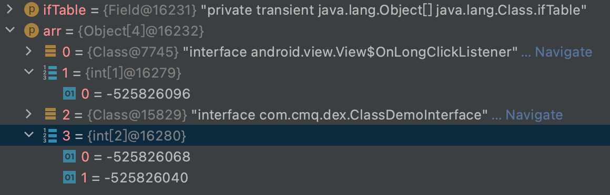

### 反射

* Class
* Method
* Android9开始禁止@hide标记API反射

#### Class

```c
//1.art/runtime/mirror/class.cc
//2.art/runtime/native/java_lang_Class.cc
//3.java.lang.Class
//1与3互为镜像，1是native层类的实现，3是1在Java层的引用，2是3通过jni的方式实现功能的桥梁。
```

###### ifTable

```java
private transient Object[] ifTable;

public interface ClassDemoInterface {
    void one();
    void two();
}

public class ClassDemo implements View.OnLongClickListener, ClassDemoInterface {
    @Override
    public void one() {
    }

    @Override
    public void two() {
    }

    @Override
    public boolean onLongClick(View v) {
        return false;
    }
}

Field ifTable = Class.class.getDeclaredField("ifTable");
ifTable.setAccessible(true);
Object[] arr = (Object[]) ifTable.get(ClassDemo.class);
for (Object o:arr){
  Log.i("-----iftable",o.toString());
}
```



> ifTable排列方式，偶数是接口类，奇数是接口方法数组对象。

#### Method

```java
public class Base {
    private void isPrivate(){}
    protected void isProtected(){}
    public void isPublic(){}
    void isPackage(){}
}
public class Child extends Base{
    public void isChildPublic(){}
    protected void isChildProtected(){}
    private void isChildPrivate(){}
    void isChildPackage(){}
}
```

###### getMethods

```java
 public static void main(String[] args) {
        Method[] methods = Child.class.getMethods();
        for (Method method:methods){
            //public标志
            int modifiers = method.getModifiers() & 0x0001;
            System.out.println(String.format("--method->%s--access->%d",method.getName(),modifiers));
        }
    }
/*
--method->isChildPublic--access->1
--method->isPublic--access->1
--method->wait--access->1
--method->wait--access->1
--method->wait--access->1
--method->equals--access->1
--method->toString--access->1
--method->hashCode--access->1
--method->getClass--access->1
--method->notify--access->1
--method->notifyAll--access->1
*/
```

> getMethods只能获取所以public方法或字段包括父类的。

###### getDeclaredMethods

```java
public static void main(String[] args) {
    Method[] methods = Child.class.getDeclaredMethods();
    for (Method method:methods){
        int modifiers = method.getModifiers();
        System.out.println(String.format("--method->%s--access->%d",method.getName(),modifiers));
    }
}
/*
--method->isChildPublic--access->1
--method->isChildProtected--access->4
--method->isChildPrivate--access->2
--method->isChildPackage--access->0
*/
```

> getDeclaredMethods只能获取本类声明的所有方法包括重写或字段。不能获取父类的方法或字段。
>
> 如果获取父类非public方法或字段，子类遍历父类获取。

