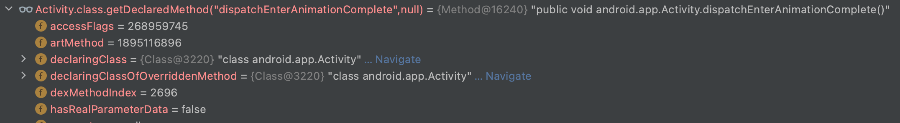

### Android反射限制

`Android9开始@hide禁止反射，需要系统签名或者加入白名单才可以反射hide方法。`

`jetpack中的@hide并不受此限制。`

> 当前Android10源码

```java
//Activity
/**
 * @hide
 */
public void dispatchEnterAnimationComplete() {
    mEnterAnimationComplete = true;
    mInstrumentation.onEnterAnimationComplete();
    onEnterAnimationComplete();
    if (getWindow() != null && getWindow().getDecorView() != null) {
        View decorView = getWindow().getDecorView();
        decorView.getViewTreeObserver().dispatchOnEnterAnimationComplete();
    }
}
```


> 上图是通过正常反射无法获取该函数。



> 上图通过[FreeReflection](https://github.com/tiann/FreeReflection.git)绕过限制可以获得该函数。

#### 限制原理

```c++
//art/runtime/native/java_lang_Class.cc
static jobject Class_getDeclaredMethodInternal(JNIEnv* env, jobject javaThis,
                                               jstring name, jobjectArray args) {
  //...
  Handle<mirror::Method> result = hs.NewHandle(
      mirror::Class::GetDeclaredMethodInternal<kRuntimePointerSize>(
          soa.Self(),
          klass,
          soa.Decode<mirror::String>(name),
          soa.Decode<mirror::ObjectArray<mirror::Class>>(args),
          GetHiddenapiAccessContextFunction(soa.Self())));
  //如果ShouldDenyAccessToMember返回true则限制方法反射
  if (result == nullptr || ShouldDenyAccessToMember(result->GetArtMethod(), soa.Self())) {
    return nullptr;
  }
  return soa.AddLocalReference<jobject>(result.Get());
}
// Returns true if the first non-ClassClass caller up the stack should not be
// allowed access to `member`.
template<typename T>
ALWAYS_INLINE static bool ShouldDenyAccessToMember(T* member, Thread* self)
    REQUIRES_SHARED(Locks::mutator_lock_) {
  return hiddenapi::ShouldDenyAccessToMember(member,
                                             GetHiddenapiAccessContextFunction(self),
                                             hiddenapi::AccessMethod::kReflection);
}
static std::function<hiddenapi::AccessContext()> GetHiddenapiAccessContextFunction(Thread* self) {
  return [=]() REQUIRES_SHARED(Locks::mutator_lock_) { return GetReflectionCaller(self); };
}
static hiddenapi::AccessContext GetReflectionCaller(Thread* self)
    REQUIRES_SHARED(Locks::mutator_lock_) {
  struct FirstExternalCallerVisitor : public StackVisitor {
    explicit FirstExternalCallerVisitor(Thread* thread)
        : StackVisitor(thread, nullptr, StackVisitor::StackWalkKind::kIncludeInlinedFrames),
          caller(nullptr) {
    }
    bool VisitFrame() override REQUIRES_SHARED(Locks::mutator_lock_) {
      ArtMethod *m = GetMethod();
   		//...
      ObjPtr<mirror::Class> declaring_class = m->GetDeclaringClass();
      if (declaring_class->IsBootStrapClassLoaded()) {
        if (declaring_class->IsClassClass()) {
          return true;
        }
        // Check classes in the java.lang.invoke package. At the time of writing, the
        // classes of interest are MethodHandles and MethodHandles.Lookup, but this
        // is subject to change so conservatively cover the entire package.
        // NB Static initializers within java.lang.invoke are permitted and do not
        // need further stack inspection.
        ObjPtr<mirror::Class> lookup_class = GetClassRoot<mirror::MethodHandlesLookup>();
        if ((declaring_class == lookup_class || declaring_class->IsInSamePackage(lookup_class))
            && !m->IsClassInitializer()) {
          return true;
        }
        //这段代码在android 30删除了，导致不能通过反射元反射方法的方式获取限制api，详见限制破解[反射元反射方法]。
        // Check for classes in the java.lang.reflect package, except for java.lang.reflect.Proxy.
        // java.lang.reflect.Proxy does its own hidden api checks (https://r.android.com/915496),
        // and walking over this frame would cause a null pointer dereference
        // (e.g. in 691-hiddenapi-proxy).
        ObjPtr<mirror::Class> proxy_class = GetClassRoot<mirror::Proxy>();
        if (declaring_class->IsInSamePackage(proxy_class) && declaring_class != proxy_class) {
          if (Runtime::Current()->isChangeEnabled(kPreventMetaReflectionBlocklistAccess)) {
            return true;
          }
        }
      }
      caller = m;
      return false;
    }
    ArtMethod* caller;
  };

  FirstExternalCallerVisitor visitor(self);
  visitor.WalkStack();
  // Construct AccessContext from the calling class found on the stack.
  // If the calling class cannot be determined, e.g. unattached threads,
  // we conservatively assume the caller is trusted.
  ObjPtr<mirror::Class> caller = (visitor.caller == nullptr)
      ? nullptr : visitor.caller->GetDeclaringClass();
  return caller.IsNull() ? hiddenapi::AccessContext(/* is_trusted= */ true)
                         : hiddenapi::AccessContext(caller);
}

//art/runtime/hidden_api.h
explicit AccessContext(ObjPtr<mirror::Class> klass)
  REQUIRES_SHARED(Locks::mutator_lock_)
  : klass_(klass),
	dex_file_(GetDexFileFromDexCache(klass->GetDexCache())),
	domain_(ComputeDomain(klass, dex_file_)) {}

static Domain ComputeDomain(ObjPtr<mirror::Class> klass, const DexFile* dex_file)
  REQUIRES_SHARED(Locks::mutator_lock_) {
  // Check other aspects of the context.
  Domain domain = ComputeDomain(klass->GetClassLoader(), dex_file);
  return domain;
}
static Domain ComputeDomain(ObjPtr<mirror::ClassLoader> class_loader, const DexFile* dex_file) {
  if (dex_file == nullptr) {
    return ComputeDomain(/* is_trusted= */ class_loader.IsNull());
  }
  return dex_file->GetHiddenapiDomain();
}
```

```c++
//art/runtime/hidden_api.h
// Returns true if access to `member` should be denied in the given context.
// The decision is based on whether the caller is in a trusted context or not.
// Because determining the access context can be expensive, a lambda function
// "fn_get_access_context" is lazily invoked after other criteria have been
// considered.
// This function might print warnings into the log if the member is hidden.
template<typename T>
inline bool ShouldDenyAccessToMember(T* member,
                                     const std::function<AccessContext()>& fn_get_access_context,
                                     AccessMethod access_method)REQUIRES_SHARED(Locks::mutator_lock_) {

  // Get the runtime flags encoded in member's access flags.
  // Note: this works for proxy methods because they inherit access flags from their
  // respective interface methods.
  const uint32_t runtime_flags = GetRuntimeFlags(member);
	//如果member的运行时标志是kAccPublicApi则不限制，
  //TODO：是否这里修改返回运行时标志？只能拿到了才能修改，因为拿不到所以修改不来
  // Exit early if member is public API. This flag is also set for non-boot class
  // path fields/methods.
  //kAccPublicApi =       0x1000 0000
  //kAccCorePlatformApi = 0x2000 0000
  //kAccHiddenapiBits = kAccPublicApi | kAccCorePlatformApi
  if ((runtime_flags & kAccPublicApi) != 0) {
    return false;
  }

  // Determine which domain the caller and callee belong to.
  // This can be *very* expensive. This is why ShouldDenyAccessToMember
  // should not be called on every individual access.
  const AccessContext caller_context = fn_get_access_context();
  const AccessContext callee_context(member->GetDeclaringClass());
	//1.检查调用方是否总是被允许访问被调用方上下文中的成员。
  // Check if the caller is always allowed to access members in the callee context.
  if (caller_context.CanAlwaysAccess(callee_context)) {
    return false;
  }
  switch (caller_context.GetDomain()) {
    //2.不修改如果caller_context的domain。
    case Domain::kApplication: {
      // Exit early if access checks are completely disabled.
      //2.1如果运行时hide函数的执行策略是关闭的。
      EnforcementPolicy policy = Runtime::Current()->GetHiddenApiEnforcementPolicy();
      if (policy == EnforcementPolicy::kDisabled) {
        return false;
      }
      // If this is a proxy method, look at the interface method instead.
      member = detail::GetInterfaceMemberIfProxy(member);
      // Decode hidden API access flags from the dex file.
      // This is an O(N) operation scaling with the number of fields/methods
      // in the class. Only do this on slow path and only do it once.
      ApiList api_list(detail::GetDexFlags(member));

      // Member is hidden and caller is not exempted. Enter slow path.
      return detail::ShouldDenyAccessToMemberImpl(member, api_list, access_method);
    }
    //3.如果caller_context.GetDomain()是kPlatform，那么基本上不做限制
    case Domain::kPlatform: {
      // Member is part of core platform API. Accessing it is allowed.
      if ((runtime_flags & kAccCorePlatformApi) != 0) {
        return false;
      }
      // Allow access if access checks are disabled.
      EnforcementPolicy policy = Runtime::Current()->GetCorePlatformApiEnforcementPolicy();
      if (policy == EnforcementPolicy::kDisabled) {
        return false;
      }
      // If this is a proxy method, look at the interface method instead.
      member = detail::GetInterfaceMemberIfProxy(member);
      // Access checks are not disabled, report the violation.
      // This may also add kAccCorePlatformApi to the access flags of `member`
      // so as to not warn again on next access.
      //返回false
      return detail::HandleCorePlatformApiViolation(member,caller_context,access_method,policy);
    }
  }
}

//-----------------------------1------------------------------//
//art/runtime/hidden_api.cc
bool CanAlwaysAccess(const AccessContext& callee) const {
  return IsDomainMoreTrustedThan(domain_, callee.domain_);
}
//art/libartbase/base/hiddenapi_domain.h
enum class Domain : char {
  kCorePlatform = 0,
  kPlatform,
  kApplication,
};
inline bool IsDomainMoreTrustedThan(Domain domainA, Domain domainB) {
  return static_cast<char>(domainA) <= static_cast<char>(domainB);
}
//-----------------------------2------------------------------//
//art/runtime/hidden_api.cc
template<typename T>
bool ShouldDenyAccessToMemberImpl(T* member, ApiList api_list, AccessMethod access_method) {
  Runtime* runtime = Runtime::Current();
  EnforcementPolicy hiddenApiPolicy = runtime->GetHiddenApiEnforcementPolicy();
  MemberSignature member_signature(member);
	//2.2检查豁免的api
  // Check for an exemption first. Exempted APIs are treated as SDK.
  if (member_signature.DoesPrefixMatchAny(runtime->GetHiddenApiExemptions())) {
    // Avoid re-examining the exemption list next time.
    // Note this results in no warning for the member, which seems like what one would expect.
    // Exemptions effectively adds new members to the public API list.
    MaybeUpdateAccessFlags(runtime, member, kAccPublicApi);
    return false;
  }

  EnforcementPolicy testApiPolicy = runtime->GetTestApiEnforcementPolicy();
  bool deny_access = false;
  //2.3.targetSdkVersion检查
  if (hiddenApiPolicy == EnforcementPolicy::kEnabled) {
    if (testApiPolicy == EnforcementPolicy::kDisabled && api_list.IsTestApi()) {
      deny_access = false;
    } else {
      switch (api_list.GetMaxAllowedSdkVersion()) {
        case SdkVersion::kP://android 9 28
          deny_access = runtime->isChangeEnabled(kHideMaxtargetsdkPHiddenApis);
          break;
        case SdkVersion::kQ://android 10 29
          deny_access = runtime->isChangeEnabled(kHideMaxtargetsdkQHiddenApis);
          break;
        default://其他，如果targetSdSVersion小于GetMaxAllowedSdkVersion，不做限制
          deny_access = IsSdkVersionSetAndMoreThan(runtime->GetTargetSdkVersion(),
                                                         api_list.GetMaxAllowedSdkVersion());
      }
    }
  }
  return deny_access;
}
//-----------------------------2.2-----------------------------//
//art/runtime/hidden_api.cc
bool MemberSignature::DoesPrefixMatchAny(const std::vector<std::string>& exemptions) {
  for (const std::string& exemption : exemptions) {
    if (DoesPrefixMatch(exemption)) {
      return true;
    }
  }
  return false;
}
bool MemberSignature::DoesPrefixMatch(const std::string& prefix) const {
  size_t pos = 0;
  for (const char* part : GetSignatureParts()) {
    size_t count = std::min(prefix.length() - pos, strlen(part));
    if (prefix.compare(pos, count, part, 0, count) == 0) {
      pos += count;
    } else {
      return false;
    }
  }
  // We have a complete match if all parts match (we exit the loop without
  // returning) AND we've matched the whole prefix.
  return pos == prefix.length();
}
inline std::vector<const char*> MemberSignature::GetSignatureParts() const {
  if (type_ == kField) {
    return { class_name_.c_str(), "->", member_name_.c_str(), ":", type_signature_.c_str() };
  } else {
    DCHECK_EQ(type_, kMethod);
    return { class_name_.c_str(), "->", member_name_.c_str(), type_signature_.c_str() };
  }
}
//-----------------------------2.3-----------------------------//
//art/libartbase/base/sdk_version.h
inline bool IsSdkVersionSetAndMoreThan(uint32_t lhs, SdkVersion rhs) {
  return lhs != static_cast<uint32_t>(SdkVersion::kUnset) && lhs > static_cast<uint32_t>(rhs);
}
//-----------------------------3------------------------------//
//art/runtime/runtime.h
hiddenapi::EnforcementPolicy GetCorePlatformApiEnforcementPolicy() const {
  return core_platform_api_policy_;
}
//art/runtime/runtime.cc
//默认是关闭的，但可以通过runtime_options.GetOrDefault(Opt::CorePlatformApiPolicy)来设置
core_platform_api_policy_(hiddenapi::EnforcementPolicy::kDisabled),
//art/runtime/hidden_api.cc
template<typename T>
bool HandleCorePlatformApiViolation(T* member,const AccessContext& caller_context,
                                    AccessMethod access_method, EnforcementPolicy policy) {
  // Deny access if enforcement is enabled.
  return policy == EnforcementPolicy::kEnabled;
}
```

> 反射获取方法时，有以下地方可以放行：
>
> 1. 检查调用方是否总是被允许访问被调用方上下文中的成员。
> 2. 如果caller_context.GetDomain()是kApplication
>    1. 如果运行时hide函数的执行策略是关闭的。
>    2. 修改豁免条件。
>    3. 5.targetSdkVersion检查。
> 3. 如果caller_context.GetDomain()是kPlatform，那么基本上不做限制。

#### 限制破解

##### 降低目标版本

`根据2-3中对targetSdkVersion的检查，只有小于28，即可绕过对反射@hide的方法限制。`


> 上图可见通过降低targetSdkVersion仍然可以反射@hide方法。

##### 反射元反射方法

 [demo](hidereflection)

`根据1中如果调用放和被调用方同处于一个上下文，即可避免限制。`

* targetSdkVersion < 30(android 11)

```java
public static Method reflect(Class clazz, String name, Class... param) throws Exception {
    if (Build.VERSION.SDK_INT < 28) return clazz.getDeclaredMethod(name, param);
    else if (Build.VERSION.SDK_INT < 30) {
        Method getDeclaredMethod = Class.class.getDeclaredMethod("getDeclaredMethod", String.class, Class[].class);
        return (Method) getDeclaredMethod.invoke(clazz, name, param);
    }
    return (Method) REFLECT.invoke(null, clazz, name, param);
}
```


> 上述代码使用targetSdkVersion为28、29两个版本，如果30以上仍然会失败，请看GetReflectionCaller方法。

* targetSdkVersion >= 30

```java

//reflection dex
public static Method reflect(Class clazz,String name,Class... param)throws Exception{
    Method getDeclaredMethod = Class.class.getDeclaredMethod("getDeclaredMethod",String.class,Class[].class);
    return (Method) getDeclaredMethod.invoke(clazz,name,param);
}
```

```java
private static void reflection(Context application) throws Exception {
    File dir = new File(application.getFilesDir(), "hot");
    if (!dir.exists()) dir.mkdir();
    File dex = new File(dir, "reflection.dex");
    if (!dex.exists()) {
      InputStream inputStream = application.getAssets().open("reflection.dex");
      dex.createNewFile();
      FileOutputStream fos = new FileOutputStream(dex);
      byte[] buffer = new byte[1024];
      int length = -1;
      while ((length = inputStream.read(buffer)) != -1) {
        fos.write(buffer, 0, length);
      }
      fos.close();
      inputStream.close();
    }
    DexFile dexFile = new DexFile(dex);
    Class aClass = dexFile.loadClass("com.cmq.dex.HideReflection", null);
    REFLECT = aClass.getDeclaredMethod("reflect", Class.class, String.class, Class[].class);
}
```


> 通过DexFile的loadClass不传ClassLoader去加载类，那么类的ClassLoader为null，通常这种情况下，被认为是BootstrapClassLoader加载的。
>
> 加载类的AccessContext 的Domain是kPlatform。

* 根据2-2修改豁免条件

```java
//dalvik.system
public final class VMRuntime {
/**
     * Sets the list of exemptions from hidden API access enforcement.
     *
     * @param signaturePrefixes
     *         A list of signature prefixes. Each item in the list is a prefix match on the type
     *         signature of a blacklisted API. All matching APIs are treated as if they were on
     *         the whitelist: access permitted, and no logging..
     */
    @libcore.api.CorePlatformApi
    public native void setHiddenApiExemptions(String[] signaturePrefixes);
}
```

```c++
//art/runtime/native/dalvik_system_VMRuntime.cc
static void VMRuntime_setHiddenApiExemptions(JNIEnv* env,jclass,jobjectArray exemptions) {
  std::vector<std::string> exemptions_vec;
  int exemptions_length = env->GetArrayLength(exemptions);
  for (int i = 0; i < exemptions_length; i++) {
    jstring exemption = reinterpret_cast<jstring>(env->GetObjectArrayElement(exemptions, i));
    const char* raw_exemption = env->GetStringUTFChars(exemption, nullptr);
    exemptions_vec.push_back(raw_exemption);
    env->ReleaseStringUTFChars(exemption, raw_exemption);
  }

  Runtime::Current()->SetHiddenApiExemptions(exemptions_vec);
}
//art/runtime/runtime.h
void SetHiddenApiExemptions(const std::vector<std::string>& exemptions) {
   hidden_api_exemptions_ = exemptions;
}
const std::vector<std::string>& GetHiddenApiExemptions() {
    return hidden_api_exemptions_;
}
```

```java
Method forName = Class.class.getDeclaredMethod("forName", String.class);
Method getDeclaredMethod = Class.class.getDeclaredMethod("getDeclaredMethod", String.class, Class[].class);
Class<?> vmRuntimeClass = (Class<?>) forName.invoke(null, "dalvik.system.VMRuntime");
Method getRuntime = (Method) getDeclaredMethod.invoke(vmRuntimeClass, "getRuntime", null);
Method setHiddenApiExemptions = (Method) getDeclaredMethod.invoke(vmRuntimeClass, "setHiddenApiExemptions", new Class[]{String[].class});
Object sVmRuntime = getRuntime.invoke(null);
setHiddenApiExemptions.invoke(sVmRuntime, new Object[]{new String[]{"L"}});
```

> 豁免条件通过VMRuntime暴露到Java层，"L"是方法签名的开头。

##### 通过类加载器

`根据1中如果调用者的domain<=被调用者的domain，即可访问。而dexfile的可以设置domain，这个接口暴露到java层，但是无法直接访问，但可以通过BaseDexClassLoader构建isTrusted的dexfile，然后合并到应用类加载器中，即可绕过限制。`

```java
//dalvik.system.BaseDexClassLoader
/**
  * @hide
  */
@UnsupportedAppUsage
public BaseDexClassLoader(String dexPath, File optimizedDirectory,
        String librarySearchPath, ClassLoader parent, boolean isTrusted) {
    this(dexPath, librarySearchPath, parent, null, isTrusted);
}
public BaseDexClassLoader(String dexPath,
                          String librarySearchPath, ClassLoader parent, ClassLoader[] sharedLibraryLoaders,
                          boolean isTrusted) {
    super(parent);
    this.pathList = new DexPathList(this, dexPath, librarySearchPath, null, isTrusted);
}

//dalvik.system.DexPathList
DexPathList(ClassLoader definingContext, String dexPath,
            String librarySearchPath, File optimizedDirectory, boolean isTrusted) {
  this.dexElements = makeDexElements(splitDexPath(dexPath), optimizedDirectory,
                                     suppressedExceptions, definingContext, isTrusted);
}
private static Element[] makeDexElements(List<File> files, File optimizedDirectory,
            List<IOException> suppressedExceptions, ClassLoader loader, boolean isTrusted) {
  for (File file : files) {
    if (file.isDirectory()) {
      // We support directories for looking up resources. Looking up resources in
      // directories is useful for running libcore tests.
      elements[elementsPos++] = new Element(file);
    } else if (file.isFile()) {
      DexFile dex = null;
			//...构造dex
      if (dex != null && isTrusted) {
        dex.setTrusted();
      }
    } 
  }
  return elements;
}

//dalvik.system.DexFile
/*
 * Set the dex file as trusted: it can access hidden APIs of the platform.
 */
/*package*/ 
void setTrusted() {
  setTrusted(mCookie);
}
private static native void setTrusted(Object cookie);

//art/runtime/native/dalvik_system_DexFile.cc
static void DexFile_setTrusted(JNIEnv* env, jclass, jobject j_cookie) {
  Runtime* runtime = Runtime::Current();
  ScopedObjectAccess soa(env);
  std::vector<const DexFile*> dex_files;
  // Assign core platform domain as the dex files are allowed to access all the other domains.
  for (const DexFile* dex_file : dex_files) {
    const_cast<DexFile*>(dex_file)->SetHiddenapiDomain(hiddenapi::Domain::kCorePlatform);
  }
}

//art/libdexfile/dex/dex_file.h
//hiddenapi_domain_(hiddenapi::Domain::kApplication)构造函数的默认访问域
hiddenapi::Domain GetHiddenapiDomain() const { return hiddenapi_domain_; }
void SetHiddenapiDomain(hiddenapi::Domain value) const { hiddenapi_domain_ = value; }
```

`虽然BaseDexClassLoader被标记为@hide，但仍然可以被反射。`

> 调用者(应用加载器加载的DexFile)的访问域默认是Domain::kApplication的，通过BaseDexClassLoader的构造函数传入isTrusted，可以设置所加载的DexFile的访问域为Domain::kCorePlatform。而通过GetReflectionCaller获取DexFile里的Class的访问域是返回DexFile的Domain。而一般被调用者的访问域是Domain::kCorePlatform，所以1中比较调用者和被调用者的Domain时，满足条件，可直接放行。


```java
//将该类打成dex文件
public class LoaderReflect {
    public static Method main(){
        try {
            return Activity.class.getDeclaredMethod("dispatchEnterAnimationComplete", null);
        } catch (NoSuchMethodException e) {
            e.printStackTrace();
        }
        return null;
    }
}
//通过BaseDexClassLoader加载该类，或者获取Element数组添加到应用默认的类加载器中
Field parent = ClassLoader.class.getDeclaredField("parent");
parent.setAccessible(true);
Object o = parent.get(getApplication().getClassLoader());
Constructor<BaseDexClassLoader> constructor = BaseDexClassLoader.class.getConstructor(String.class, File.class, String.class, ClassLoader.class, boolean.class);
BaseDexClassLoader classLoader = constructor.newInstance(dex.getPath(), null, null,o , true);
Class<?> aClass = classLoader.loadClass("com.cmq.dex.LoaderReflect");
Method main = aClass.getDeclaredMethod("main", null);
main.invoke(null, null);
```


##### 修改Runtime

 [demo(从FreeReflection中复制)](hidereflection)

> 阅读反射限制原理，可知通过native层修改以下函数的返回值，可以绕过限制。
>
> 1. runtime->GetHiddenApiEnforcementPolicy()
>
>    如果该函数的反正值是EnforcementPolicy::kDisabled，则直接绕过限制。FreeReflection即是这种方式。
>
> 2. runtime->GetHiddenApiExemptions()
>
>    在限制原理2.2中可知，可以通过修改豁免条件来绕过限制。
>
>    反射元反射方法的方式避免限制，但是每次都需要这种方式，调用复杂。可以通过暴露到Java层的VMRuntime的方法setHiddenApiExemptions修改豁免条件来绕过限制。


